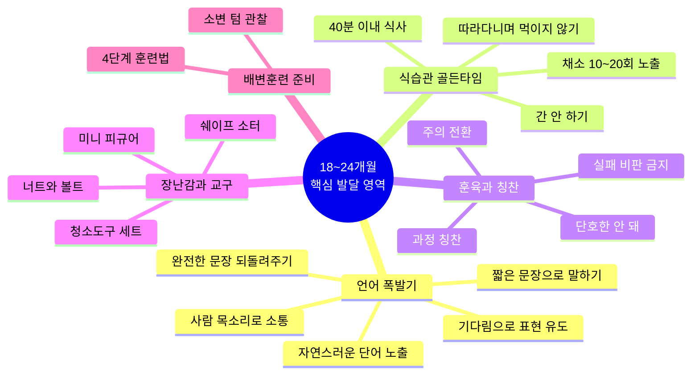
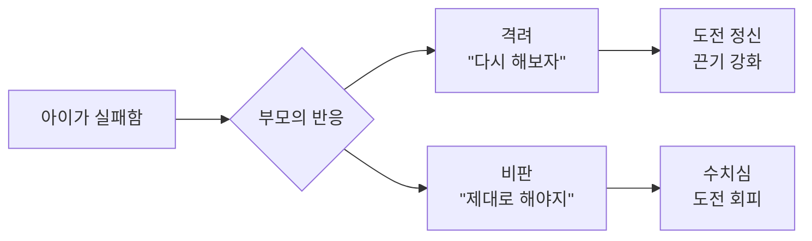
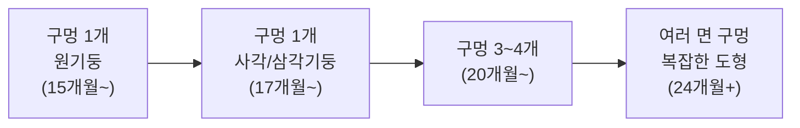
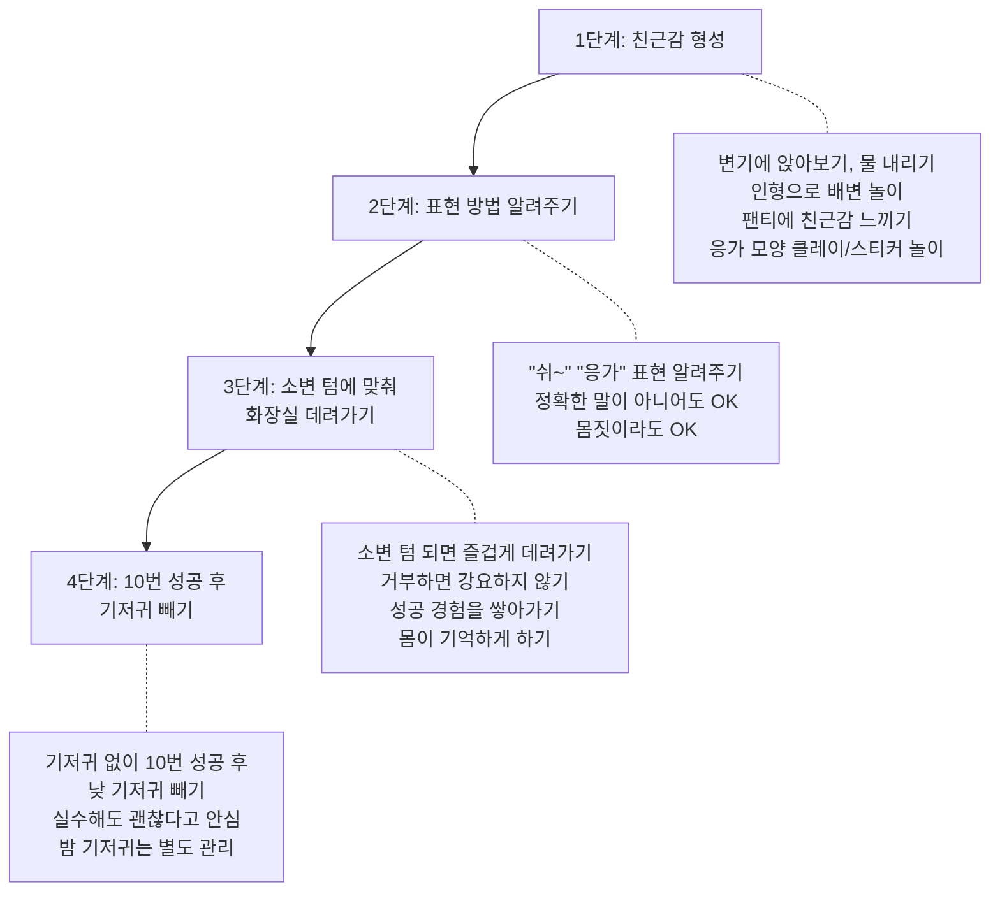

18~24개월은 아이의 인생에서 가장 극적인 변화가 일어나는 시기입니다. 말문이 트이기 시작하고, 자아가 형성되면서 "싫어!"를 외치고, 두 돌까지 형성된 식습관이 성인기까지 이어집니다. 변연계(감정 조절 뇌 영역) 발달이 활발한 시기이기도 해서, 감정 조절 능력의 기초가 바로 이때 만들어집니다.

이 시기를 어떻게 보내느냐에 따라 아이의 언어 능력, 식습관, 자기 조절력, 자존감의 기초가 결정됩니다. 전문가들의 조언을 바탕으로, 부모가 지금 당장 실천할 수 있는 구체적인 방법들을 정리했습니다.



---

## 언어 폭발기: 말문이 트이는 시기

18~24개월은 아이의 언어 발달이 폭발적으로 일어나는 시기입니다. 후반으로 갈수록 2개 이상의 단어를 조합할 수 있게 되며, "엄마 물", "아빠 가" 같은 두 단어 문장이 등장합니다.

이민주 육아상담소의 이민주 상담사는 이렇게 조언합니다.

> "말빠른 토끼보다 소통하는 거북이가 낫다. 말이 언제 트는지, 몇 개의 단어를 정확하게 발음할 수 있는지 평가하기보다는 아이가 자기 표현이나 감정 표현, 타인과의 소통이 얼마나 잘 되고 있는지를 먼저 관찰해 주시는 것이 중요합니다."

### 언어 촉진 5가지 방법

**1. 일상 대화에서 자연스럽게 단어를 노출하세요**

"바나나 해봐", "엄마 보고 따라해 봐" 식으로 반복해서 시키면 아이가 스트레스를 받습니다. 테스트를 받는 느낌이 들면 말하는 것 자체에 거부감이 생깁니다.

대신 아이의 놀이 안으로 들어가서 자연스럽게 단어를 연결하세요.

| 상황 | DO | DON'T |
|------|-----|-------|
| 아이가 전화놀이 중 | 엄마도 전화기 들고 "여보세요~ 누구세요? 아빠 안녕! 바나나 사오세요~" | "여보세요 해봐. 따라해 봐. 여-보-세-요" |
| 아이가 자동차 놀이 중 | "빵빵! 자동차가 달리네~ 부릉부릉" | "자동차 말해봐. 자-동-차" |
| 아이가 공놀이 중 | "어! 강아지가 쳐다보네~ 강아지도 공놀이 하고 싶나 봐" | (아무 말 없이 지켜보기만) |

핵심은 아이가 쉽게 모방할 수 있는 "네네네", "안녕", "빠방" 같은 익숙한 단어를 놀이 속에서 반복적으로 들려주는 것입니다. 평가자가 아니라 놀이 상대가 되어주세요.

**2. 기다림으로 표현 기회를 주세요**

엄마는 아이의 눈빛만 봐도 뭘 원하는지 알지만, 아무 상호작용 없이 바로 해결해주면 언어 발달에 도움이 되지 않습니다.

아이가 냉장고를 가리키며 울면, 모르는 척 잠시 기다려 주세요. 단, 처음부터 "우유 주세요"를 정확하게 말하라고 요구하면 안 됩니다.

```
단계별 기다림 전략:

1단계: 아이가 손으로 가리키며 "우유" 한 마디 → 충분!
2단계: "우유"도 어려우면 → "우유 줄까? 깎아(사과) 줄까?" 선택지 제공
3단계: 정확한 소리가 아니더라도 "까" 또는 "우" 정도 → "아~ 우유 먹고 싶어?" 반응
4단계: 입모양만 벌려도 → "알겠어! 우유 먹고 싶구나!"
```

> "말을 하지 않아도 부모가 알아서 먼저 다 해 줘 버리면, 아이는 말을 해야 할 필요성을 느끼지 못하게 됩니다." -- 이민주 상담사

**3. 짧고 간결한 문장으로 말하세요**

구체적이고 자세하게 설명해주는 것이 좋다고 생각하기 쉽지만, 아직 말이 트지 않은 아이에게 긴 문장은 의미를 이해하기 어렵습니다.

| DON'T (너무 긴 문장) | DO (짧은 문장) |
|-----|-----|
| "우리가 강아지 옆에서 공놀이를 하고 있으니까 강아지가 같이 하고 싶어서 쳐다보고 있네" | "어! 강아지가 쳐다보네~ 강아지도 공놀이 하고 싶나 봐" |
| "엄마가 지금 물을 가져다줄 건데 좀 기다려야 해" | "물 줄게. 기다려" |

**한 문장 안에 한 가지 의미만** 담고, 다양한 억양과 강세를 넣으면 아이의 귀에 쏙쏙 들어갑니다.

**4. 미디어가 아닌 사람의 목소리로 소통하세요**

영상을 많이 틀어주면 말이 빨리 트일 거라 생각할 수 있지만, 그렇지 않습니다. 사람의 목소리로 소통할 때 자극되는 뇌의 부분과 미디어를 통해 일방향으로 시청각 자극을 받는 뇌의 부분이 완전히 다릅니다.

말수가 적은 부모라면 **아이가 보이는 행동을 말로 옮기는 것**부터 시작하세요. 아이가 그림을 그리고 있다면 "빨간색으로 그리고 있네~ 어, 동그라미도 그렸구나! 세모도 그렸네!" 어떤 말을 해야 될까 고민하지 않아도 할 수 있는 말이 많아집니다.

**5. 아이가 표현한 말을 완전한 문장으로 되돌려주세요**

| 아이의 표현 | 부모의 되돌림 |
|------------|-------------|
| "엄마 삐뽀삐뽀" | "소방차가 삐뽀삐뽀 소리 내지~ 소방차 놀이 하고 싶었어?" |
| "맘마" (밥을 가리키며) | "밥 먹고 싶구나! 맛있는 밥 먹자" |
| "까까" (과자를 가리키며) | "과자 먹고 싶어? 과자 여기 있네" |

아이가 표현한 불완전한 말을 완전한 문장으로 한 번 더 정리해 주는 느낌으로 말해주세요. 이것이 아이의 언어 확장에 큰 도움이 됩니다.

---

## 식습관 형성의 골든타임

### 18~24개월이 왜 골든타임인가

두 돌 이전에 형성된 식습관은 평생 지속되는 경향이 있습니다. 이 시기의 아이는 새로운 식재료를 더 잘 받아들이는 특성이 있어서, 지금 다양한 음식을 경험시켜주면 평생 건강한 식습관의 기초를 만들 수 있습니다.

2018년 한국 영양 통계에 따르면, 돌에서 두 돌 사이 아이들 중 비타민 A가 부족한 비율이 12.6%, 비타민 C가 부족한 비율은 46.8%에 달했습니다. 과일이나 채소를 충분히 먹지 못하고 있다는 의미입니다.

### 채소 거부 시 10~20회 노출 전략

아기가 채소를 싫어하는 것은 아주 자연스러운 현상입니다. 입에 익숙하지 않은 음식의 맛이나 향을 거부하는 것은 본능이기 때문입니다. 하지만 금방 포기하지 마세요.

베싸TV에서 소개한 연구에 따르면, 이유식을 막 시작하는 시기의 아기들에게 **8일 동안 매일 그린빈 퓨레를 먹였을 때**, 처음 먹었을 때 95%의 아기가 눈을 찌푸리며 싫어했지만, 8일째 되는 날에는 평균적으로 **처음 먹었던 날의 3배**를 먹었습니다.

**채소 노출 실전 전략:**

| 전략 | 구체적 방법 | 근거 |
|------|-----------|------|
| 꾸준한 노출 | 매 식사마다 소량의 채소를 접시에 올려놓기 (10~20회) | 반복 노출로 수용도 증가 |
| 과일과 함께 | 브로콜리+사과, 시금치+배 조합 | 과일의 에너지 밀도가 채소에 긍정적 인식 형성 |
| 다양한 채소 조합 | 녹색+황색 채소를 함께 (브로콜리+당근) | 식감과 맛이 다른 채소 함께 제공이 더 효과적 |
| 익숙한 것+새로운 것 | 이미 먹어본 채소와 새 채소를 함께 | 새 채소 수용률 향상 |

> "아기가 음식을 싫어하는 것 같다고 해서 금방 포기하지도, 억지로 먹이려고 하지도 마세요. 한 숟갈씩이라도 꾸준히 먹여준다면 언젠가는 받아들이게 될 거예요." -- 베싸TV

**간 안 하기의 중요성**: 두 돌까지는 음식에 별도 간을 하지 않는 것이 권고됩니다. 이 시기에 짠맛에 익숙해지면 이후 나트륨 과다 섭취로 이어질 수 있습니다.

**통곡물 섭취**: 곡물 섭취의 절반을 통곡물(현미, 통밀빵, 오트밀)로 먹이세요. 6개월 이상의 아기가 통곡물을 소화하기 어렵다는 근거는 별로 없으며, 정제 곡물 대비 식이섬유, 비타민, 미네랄이 훨씬 풍부합니다.

**유제품**: 하루에 유제품 2회분(우유 기준 약 2컵)을 먹이세요. 한국 아기들은 평균적으로 필요량의 절반밖에 섭취하지 않아 칼슘(58.5% 부족), 칼륨(75% 부족), 지방(38% 부족)이 결핍되는 경우가 많습니다. 단, 하루 480ml 이상은 권장되지 않습니다.

### 밥 먹일 때 하지 말아야 하는 5가지

이민주 상담사는 "이 5가지는 오늘, 지금 이 영상을 보는 순간부터 바로 실천해야 합니다"라고 강조합니다. 식습관 교육은 **10개월 이상 걸릴 수 있으니** 한두 달 해보고 안 되는 아이라고 여기지 마세요.

**1. 따라다니면서 먹이지 않기**

돌아다니면서 먹는 아이를 쫓아가며 밥을 먹이면, 아이는 그 행동이 잘못되었다는 것을 알 수 없습니다. "돌아다니면서 먹는 거 아니야. 여기가 식사하는 자리야. 이리 와서 앉아서 먹어." 엄마 아빠가 식사 자리에서 함께 밥을 먹으며 모델링을 보여주세요.

**2. 식사 전후 간식 주지 않기**

뱃고래가 작고 먹는 것에 흥미가 없는 아이라면 특히 주의하세요. 식사 전 2시간은 간식과 우유를 주지 않아야 배가 고픈 상태로 밥을 맛있게 먹을 수 있습니다. 밥을 제대로 못 먹었다면 우유 보충 대신 **다음 식사를 1시간 당겨주세요**.

```
권장 식사/간식 스케줄:

08:00  아침 식사 (+ 과일/간식 함께 제공)
       ↓ 간식 없이 활동
11:30  점심 식사 (배고픈 상태로!)
       ↓ 낮잠
14:30  낮잠 후 간식
       ↓ 간식 없이 활동
18:00  저녁 식사 (+ 과일/간식 소량)
```

**3. 영상 보여주며 떠먹여주지 않기**

영상에 집중하는 동안 숟가락을 입에 넣어주면 매일 한 그릇을 비울 수는 있습니다. 하지만 아이가 자기 숟가락으로 스스로 밥을 떠서 먹는 훈련은 전혀 이루어지지 않습니다. 영상 없이 앉아서, 자기 숟가락으로, 스스로 먹는 과정이 식습관 형성의 핵심입니다.

**4. 식사 시간 40분을 넘기지 않기**

식사에 관심이 없는 아이에게 1시간 넘게 밥을 먹이면, 식사 시간 자체가 부정적으로 인식됩니다. 40분을 정하고 다 못 먹어도 치우세요. 그리고 아이에게 지나치게 집중하며 전전긍긍하지 마세요. "이거 진짜 맛있는 건데, 이만큼밖에 안 남았어~" 하며 한 조각을 뺏어 먹는 것이, "한 숟가락만 더 먹자"고 애원하는 것보다 효과적입니다.

**5. 모든 양육자가 일관된 태도 유지하기**

엄마가 아무리 규칙을 지켜도 할머니가 허용해주면, 아이는 "이건 엄마가 정한 규칙이구나, 잘못된 행동은 아니구나"라고 여기게 됩니다. 식습관이든 수면이든 훈육이든, 모든 양육자가 같은 규칙을 지키는 것이 가장 중요합니다.

---

## 올바른 칭찬법

칭찬은 좋은 것이니 많이 해주면 된다고 단순하게 생각하기 쉽지만, 연구에 따르면 칭찬의 방식에 따라 아이에게 좋은 영향을 줄 수도, 나쁜 영향을 줄 수도 있습니다. 핵심은 **아이의 발달 단계에 맞는 칭찬**을 하는 것입니다.

### 20개월 이전: 내용보다 표정이 중요

20개월 이전의 아기는 "잘했다"는 개념 자체를 이해하지 못합니다. 이 시기의 아기는 어떤 인과관계를 만들어냈다는 데 즐거움을 느끼지, 성공이나 실패를 인식하지 않습니다.

그러므로 **칭찬의 내용보다 긍정적인 표정, 말투, 제스처(박수 등)가 더 중요합니다**. 아이가 의자에 앉으면 환하게 웃으며 박수를 치세요. 아이는 "잘했다"는 평가를 이해한 것이 아니라, 엄마의 긍정적인 반응과 "의자에 앉기"라는 행동을 연결하게 됩니다.

### 20~30개월: 과정 칭찬의 시작

이 시기의 아이들은 어떤 과제를 성공했을 때 어른의 반응을 살피기 시작합니다. 부모의 반응을 보고 "내가 잘 한 거구나"를 판단하는 기준을 내면화하는 중입니다. 이 시기에 칭찬이 특히 중요한 이유입니다.

| 구분 | 사람 칭찬 (DON'T) | 과정 칭찬 (DO) |
|------|----------------|--------------|
| 예시 | "우리 아이 정말 똑똑하네!" | "혼자 양말 신었구나! 스스로 해냈네!" |
| 효과 | 나는 똑똑해 → 실패하면 나는 멍청해 | 열심히 하면 할 수 있어 → 더 도전 |
| 사고방식 | 능력 귀인 (타고난 것) | 노력 귀인 (내가 한 것) |

연구에 따르면, 24개월 때 부모가 어려운 과제를 수행하는 과정에서 **아이의 자율적인 노력을 칭찬**하면, 36개월 때 어떤 스킬을 마스터하려는 동기가 더 강하고 어렵더라도 포기하지 않는 끈기를 보였습니다.

> "혼자 해냈네! 엄마가 도와주지도 않았는데 알아서 잘 했네!" 같은 칭찬이 특히 효과적입니다." -- 베싸TV

### 실패에 대한 비판 주의

반대로, 아이가 뭔가를 못하거나 쏟거나 깨뜨렸을 때 **"그렇게 하는 거 아니야", "제대로 해야지"라는 비판을 습관적으로 하면**, 아이는 실패했을 때 스스로 부끄러워하는 수치심이 생기고, 실패할 만한 어려운 과제에는 도전하지 않으려 합니다.



특히 비판이 짜증 섞인 말투, 한심하다는 표정 등 부정적인 사회적 신호와 결합했을 때 영향이 더 강합니다.

**실천 원칙:**
- 칭찬할 만한 행동: 미소, 제스처 듬뿍 담아 아낌없이 칭찬
- 뭔가 해보려고 노력하다 실패: "실수했구나, 다시 한번 해보자" 또는 아무 말 하지 않기
- 해서는 안 되는 행동: 감정 빼고, 짧고 단호하게 "안 돼"

---

## 떼쓰기 상황별 대응법

18~24개월은 자아가 형성되면서 자기주장이 시작되는 시기입니다. 아직 감정을 조절하는 능력이 부족하기 때문에 떼쓰기로 표출되는 것이지, 도덕적으로 잘못된 행동이 아닙니다.

아육톡(아동 전문가들의 육아토크)에서는 두 돌 전 아기 훈육의 핵심 원칙을 이렇게 설명합니다.

> "안 되는 것과 되는 것을 구별해서 단호하게 해주시고, 안 되는 것을 아이가 계속 할 때는 얼른 주의를 전환시켜서 그 상황을 벗어나게 하는 것이 가장 빠른 해결책입니다."

### 주의: "안 돼"는 단호하게

아이가 너무 귀여워서 "아~ 안 되요~ 하면 안 되는 거에요~" 식으로 말하면, 아이는 이것이 안 된다는 메시지를 받지 못합니다. 오히려 재미있는 반응을 유도하는 놀이로 인식합니다. **짧고, 단호한 목소리로 "안 돼. 안 되는 거야."** 그리고 긴 설명 없이 바로 주의를 전환하세요.

### 깨물기/때리기

이 시기의 공격적 행동은 감정을 조절하지 못해서 나타나는 것이므로, 도덕적 잣대로 혼낼 필요는 없습니다.

**대응법:**

1. "때리면 안 돼" / "깨물면 안 돼" -- 짧고 단호하게
2. 긴 설명 없이 바로 다른 장난감이나 활동으로 주의 전환
3. "저기 봐! 이거 뭐지?" 식으로 방향 전환

**형제간 갈등 시:** 동생이 때려도 "동생이 때리면 안 돼, 형아 아파"라고 동생에게 말해주고, 첫째에게도 "속상했구나"로 감정을 읽어주세요. "애기잖아, 참아"라고 하면 첫째가 동생을 미워하게 될 수 있습니다.

### 물건 던지기

아이가 왜 던지는지 상황을 먼저 파악하세요.

| 원인 | 대응법 |
|------|--------|
| **탐색 목적** (어디로 날아가는지 궁금해서) | "블록은 던지는 거 아니야. 그런데 공은 던질 수 있어!" → 공 주고받기 놀이, 바구니에 넣기 놀이 |
| **화가 나서** (블록이 안 끼워져서) | "블록이 안 끼워져서 속상했구나" (감정 읽기) → "그래도 던지면 안 돼" (행동 제재) → "엄마랑 같이 해볼까?" (대안 제시) |
| **대안이 안 통할 때** | 빠르게 다른 장소로 이동하거나 전혀 다른 활동으로 주의 전환 |

### 마트에서 떼쓰기

마트의 화려한 장난감이나 과자에 마음을 빼앗기는 것은 이 시기에 너무나 자연스러운 일입니다.

**대응 단계:**

1. "그거 갖고 싶구나, 신기하구나" -- 감정 읽어주기
2. "근데 오늘은 장난감 사는 날 아니야" -- 단호하게
3. 계속 떼를 쓰면 → 번쩍 안아서 마트 밖으로 나오기
4. **예방이 최선**: 집에서 좋아하는 장난감이나 간식을 미리 챙겨가기
5. **심하다면**: 이 시기에는 잠시 대형 마트를 가지 않는 것도 방법

> "두 돌 전에 아이들이 그렇게 훈육하거나 혼낼 일이 사실 많지는 않잖아요. 가만히 생각해보면 엄마 자체가 체력적으로 정신적으로 많이 힘들고 지칠 때 감정이 올라오고 조절이 잘 안 되는 것 같아요. 체력이 받쳐줘야 다정함도 생기더라구요." -- 아육톡

---

## 18~24개월 장난감/교구

이 시기의 장난감 선택 기준은 **몬테소리의 "컨트롤 오브 에러" 원리**입니다. 아이가 틀렸을 때 부모가 "그거 틀렸어, 여기에 넣어야지" 하지 않아도, 교구 특성상 아이가 스스로 "어? 이거 아니네"를 깨달을 수 있는 장난감이 가장 좋습니다.

### 청소도구 세트

이 시기의 아이들은 자발적으로 청소에 흥미를 보입니다. 엄마가 청소할 때 "같이 해볼까?" 하고 참여시키면, 아이는 일상생활 활동을 통해 자연스럽게 대근육과 집중력을 기릅니다. 멜리사앤더그의 청소도구 세트(빗자루, 쓰레받기, 대걸레, 먼지떨이)를 아이 손이 닿는 곳에 비치해두세요.

### 크기 개념 학습 교구

네스팅(포개기)과 스태킹(쌓기) 장난감, 당근 꽂기 장난감 등으로 크기 개념을 익힐 수 있습니다. 처음부터 많이 주면 어려워하고 흥미를 잃을 수 있으니, **2개로 시작해서 잘 하게 되면 하나씩 추가**하세요.

### 너트와 볼트

한 방향으로 돌리면 잠기고 다른 방향으로 돌리면 풀리는 원리를 경험하고, 정교한 소근육 조작을 연습합니다.

**단계별 진행:**
1. 처음에는 너트를 볼트에 **미리 끼운 상태**로 → 돌려서 넣기만
2. 능숙해지면 → **분리 상태**에서 끼우기부터 시작
3. 시범을 천천히 여러 번 보여주기

브알라, 하페 제품이 국내에서 구입 가능합니다. 공구 세트 장난감을 구입하면 너트와 볼트가 포함되어 있는 경우가 많습니다.

### 미니 피규어 (사파리 Ltd 튜브 시리즈)

작은 피규어들로 풍부한 언어 환경을 만들 수 있습니다. "사자가 소파 위에 올라갔어", "사자가 상자 안에 숨어 있어요", "사자 한 마리와 무당벌레 두 마리를 이쪽으로 옮겼어요" -- 실생활에서 만들어주기 어려운 다양한 문장을 들려줄 수 있습니다.

피규어와 동일한 그림 카드를 매칭하는 놀이로 확장하면, 2D 이미지가 3D 실물에 대응된다는 것을 학습하는 몬테소리 활동이 됩니다. 삼킴 위험이 있으니 반드시 곁에서 지켜보세요.

### 쉐이프 소터 (모양 맞추기)

**단계별 난이도 조절이 핵심입니다.**



선택 시 포인트: 한 면에만 구멍이 나 있고, 아이가 스스로 열고 닫을 수 있는 제품이 이상적입니다. 여러 번 반복해야 하는 시기이므로, 상자를 다시 여는 것이 어려우면 짜증을 내고 집중력을 잃을 수 있습니다.

### 몬테소리 환경 세팅

집 전체를 바꿀 필요는 없습니다. 핵심만 기억하세요.

| 공간 | 세팅 방법 |
|------|----------|
| **놀이 공간** | 낮은 선반(이케아 칼락스 등)에 6~10개 교구를 트레이 위에 깔끔하게 배치. 나머지 장난감은 별도 보관 후 주기적 교체 |
| **주방** | 낮은 서랍에 아이용 식기를 배치. 러닝타워로 조리대/개수대 접근 가능하게 |
| **옷장** | 낮은 서랍에 옷 2~3세트만 구성. 낮은 후크에 외투 걸기 |
| **세면대** | 높은 디딤대(스텝투) + 센서형 비누 디스펜서 |
| **바닥** | 러그를 깔아 활동 공간 설정 |

> "한번에 다 바꿔야지라고 생각하시면 어려울 수도 있는데, 찬찬히 아기와 하루를 보내면서 주변을 둘러보시고 하나하나 바꿔가다 보면 그리 어렵지 않으실 거예요." -- 베싸TV

교구를 배치할 때는 **완성되지 않은 형태**로 놓아두세요. 링 쌓기를 완성된 상태로 놓으면 아이의 관심을 끌기 어렵습니다. 왼쪽에 빈 막대, 오른쪽에 링을 놓으면 아이가 활동을 통해 완성하려는 동기가 유발됩니다.

---

## 배변훈련 준비

### 시작 시기 판단법

배변훈련은 최소 18개월 이후에 시작하되, **아이마다 발달 시기 차이가 크므로 다른 아이와 비교하지 마세요**. 핵심 판단 기준은 **소변 텀**입니다.

- 기저귀 교체 시간을 기록하여 소변 텀을 파악
- 소변 텀이 **1시간~1시간 30분**으로 늘어나면 신체적 준비 완료
- 18~36개월 사이에 아이 발달에 맞춰 시작

> "배변훈련은 단순히 기저귀를 떼거나 팬티를 입는다는 개념이 아닙니다. 아이가 세상에 태어나서 처음으로 자신의 몸을 스스로 조절해 보고 도전하는 과제입니다. 이 과정이 아이의 자신감에 영향을 줄 수 있어요." -- 이민주 상담사

### 4단계 훈련법



**주의사항 4가지:**

| 주의사항 | 이유 |
|---------|------|
| **벗겨놓지 않기** | 실수를 반복하며 좌절감을 느끼고, 응가를 보고 두려움을 느낄 수 있음 |
| **젖은 기저귀 오래 방치하지 않기** | 찝찝함을 느끼지 못하면 배변훈련 준비가 늦어짐 |
| **밤 기저귀는 따로** | 자고 일어나서 기저귀가 안 젖은 날이 10일 지속되면 빼기 |
| **스트레스 주지 않기** | 재촉, 비교, 강압은 자존감과 정서 발달에 악영향 |

훈련 완료까지 며칠 만에 되는 아이도 있고 6개월 이상 걸리는 아이도 있습니다. 천천히, 즐겁게 진행하세요.

---

## 18~24개월 체크리스트

매주 한 번씩 점검해보세요.

### 언어
- [ ] 아이의 놀이에 들어가서 자연스럽게 단어를 노출하고 있는가
- [ ] 아이가 원하는 것을 바로 해결해주지 않고 표현 기회를 주는가
- [ ] 짧은 문장으로 말하고 있는가
- [ ] 영상이 아닌 사람의 목소리로 충분히 소통하고 있는가
- [ ] 아이의 말을 완전한 문장으로 되돌려주고 있는가

### 식습관
- [ ] 식사 전 2시간은 간식을 주지 않는가
- [ ] 따라다니면서 먹이지 않는가
- [ ] 영상 없이 스스로 먹을 기회를 주는가
- [ ] 40분 이내에 식사를 마치는가
- [ ] 채소를 거부해도 매 식사마다 소량 제공하고 있는가
- [ ] 모든 양육자가 같은 규칙을 지키고 있는가

### 칭찬과 훈육
- [ ] "똑똑하네" 대신 "스스로 해냈네!" 과정을 칭찬하고 있는가
- [ ] 실패했을 때 비판하지 않는가
- [ ] "안 돼"는 짧고 단호하게 말하고 있는가
- [ ] 떼쓸 때 주의 전환으로 대응하고 있는가

### 환경과 놀이
- [ ] 낮은 선반에 6~10개 교구를 깔끔하게 배치했는가
- [ ] 아이가 스스로 할 수 있는 부분을 만들어주고 있는가 (식기 꺼내기, 옷 고르기 등)
- [ ] 교구를 완성되지 않은 형태로 놓아두는가

### 배변훈련
- [ ] 소변 텀을 기록하고 있는가
- [ ] 변기와 친해지는 놀이를 하고 있는가
- [ ] 응가 표현 방법을 알려주고 있는가
