6~12개월은 아기의 뇌가 가장 폭발적으로 발달하는 시기입니다. 이 시기에 제공하는 자극의 질이 36개월 이후의 인지 능력과 직접적인 상관관계가 있다는 연구 결과가 있을 만큼, 부모가 무엇을 어떻게 해주느냐가 중요합니다. 그렇다고 특별한 교육 프로그램이 필요한 것은 아닙니다. 까꿍놀이, 제스처 모델링, 적절한 장난감, 충분한 대근육 활동 등 일상 속에서 할 수 있는 것들이 핵심입니다.

이 글에서는 여러 전문가들의 조언을 바탕으로, **6~12개월 아기에게 구체적으로 무엇을 어떻게 해줘야 하는지** 실천 방법 위주로 정리했습니다.

---

## 까꿍놀이와 대상영속성

7~8개월 무렵, 아기는 까꿍놀이에 깔깔 웃기 시작합니다. 이것은 단순히 재미있어서가 아닙니다. 이 시기 아기의 뇌에서 **대상영속성**(눈앞에 보이지 않는 물체도 여전히 존재한다는 인식)이 발달하기 시작하면서, "사라졌다가 다시 나타나는" 현상 자체가 뇌에 강력한 자극을 주기 때문입니다.

아기가 까꿍놀이에 보이는 반응은 본능적인 것으로, **아이가 좋아하는 것을 따라가는 것이 곧 최적의 뇌 자극**입니다. 아기가 깔깔 웃으며 반응하면 그것이 바로 지금 이 아이에게 필요한 자극이라는 신호입니다.

### 구체적으로 이렇게 해주세요

**다양한 변형으로 반복해주기:**
- **손으로 얼굴 가리기**: 가장 기본적인 방법. 양손으로 얼굴을 가렸다가 "까꿍!" 하며 나타나기
- **천으로 장난감 덮기**: 아기가 보는 앞에서 장난감을 천으로 덮고 "어디 갔지?" 하고 물은 뒤, 천을 걷으며 "여기 있었네!"
- **문 뒤에서 나타나기**: 방문이나 소파 뒤에 숨었다가 나타나기
- **컵으로 숨기기**: 컵 안에 작은 물건을 넣고 "짠!" 하고 보여주기

**DO:**
- 아기가 웃으면 같은 방식을 여러 번 반복해줍니다 (아기는 반복을 좋아합니다)
- 아기의 반응을 관찰하면서 흥미를 보이는 변형을 찾아줍니다
- 하루에 여러 차례, 짧게짧게 해줍니다

**DON'T:**
- 아기가 흥미를 잃거나 고개를 돌리면 억지로 반복하지 않습니다
- 너무 갑작스럽게 나타나서 아기를 놀라게 하지 않습니다 (웃음이 아닌 울음이 나오면 강도를 줄여주세요)

---

## 제스처 교육: 언어발달의 예측 인자

많은 부모가 제스처와 언어발달을 별개로 생각합니다. 하지만 소아 언어발달 전문가들은 **제스처가 언어 이전에 나타나는 가장 중요한 의사소통 수단**이라고 강조합니다.

> "실제로 9개월에서 16개월까지의 제스처 사용이 이후 2년간의 언어발달을 예측하는 인자가 된다고 합니다. 왜냐하면 말이 나오기 전에 제스처가 울음 다음으로 하는 의사소통의 수단이 되기 때문입니다."
> -- 우리동네 어린이병원

아기가 "안아줘" 제스처를 하면 엄마가 안아주고, "주세요"를 하면 물건을 건네주는 경험. 이것이 **"내가 표현하면 상대가 반응한다"**는 의사소통의 기본 원리를 아기에게 가르쳐줍니다. 이 경험이 쌓여야 나중에 말로 의사소통하려는 동기가 생깁니다.

### 8~9개월부터 시작하는 제스처 모델링

제스처를 가르칠 때 가장 중요한 것은 **모델링**, 즉 부모가 직접 보여주는 것입니다.

> "제스처를 가르칠 때는 무조건 모델링해야 합니다. 직접 가르쳐주는 것이 중요합니다."
> -- 우리동네 어린이병원

**매달 2개씩 새 제스처를 추가하는 방법:**

| 월령 | 추천 제스처 | 상황 | 모델링 방법 |
|------|-----------|------|------------|
| 8~9개월 | 안아줘, 잘 가 | 아이를 안아줄 때, 누군가 나갈 때 | 두 팔을 벌리며 "안아줘", 손을 흔들며 "잘 가~" |
| 9~10개월 | 사랑해, 주세요 | 스킨십할 때, 물건 건넬 때 | 양팔로 X자 만들며 "사랑해", 손바닥 위로 내밀며 "주세요" |
| 10~11개월 | 이쁜 짓, 맛있다 | 칭찬할 때, 이유식 먹을 때 | 볼에 양손 대며 "이뻐~", 볼에 손 대고 좌우로 흔들며 "맛있다~" |
| 11~12개월 | 싫어, 더 줘 | 거부할 때, 더 원할 때 | 고개 가로저으며 "싫어", 양손 모아 올리며 "더 줘" |

### 모델링의 핵심 원칙

1. **매일 반복되는 상황에서 동작과 말을 함께** 보여줍니다. 예를 들어, 아이를 안아줄 때마다 매번 두 팔을 벌리며 "안아줘"라고 말해주세요.
2. **아이가 따라하지 않아도 1~2주간 꾸준히** 반복합니다. 아이는 축적된 입력이 일정량을 넘어야 출력으로 나타납니다. 어느 날 갑자기 따라하는 순간이 옵니다.
3. **아이가 제스처를 하면 반드시 반응**해줍니다. 아이가 "안아줘" 제스처를 어설프게라도 하면 즉시 안아주세요. "내가 표현하면 반응이 온다"는 경험이 언어 동기의 핵심입니다.

> "이렇게 손을 흔드니까 저쪽에서도 손을 흔드네? 내가 무언가 의사 표현을 했더니 반응이 오는 것입니다."
> -- 우리동네 어린이병원

### 일상이 곧 언어 교실

비싼 교구보다 훨씬 효과적인 것은 **일상생활 속 언어 자극**입니다.

> "사실 교구나 도구가 중요하기보다는 그것을 어떻게 활용하느냐가 더 중요합니다. 일상생활 속에서 자극을 준다고 생각하면 됩니다. 뚜껑 딸 때도 그냥 따지 마시고 '우와~ 열었다'라고 말하며 반복하면 좋습니다."
> -- 우리동네 어린이병원

**이렇게 실천하세요:**
- 아침에 아기가 일어나면: "일어났네! 좋은 아침~"
- 기저귀 갈 때: "쉬 했구나~ 깨끗하게 해줄게"
- 뚜껑 열 때: "뚜껑 열자~ 우와 열었다!"
- 물을 줄 때: "물~ 물 마시자"
- 밖을 볼 때: "나무! 나무가 있네~ 바람이 분다 쉬이~"

**의성어/의태어를 적극 활용하세요:**
- 자동차를 보면 "빠방~", 고양이를 보면 "야옹~", 공이 굴러가면 "데굴데굴~"
- 이런 단어들이 아기가 처음 말하는 단어가 됩니다 (맘마, 빠빠, 까까 등이 첫 단어로 나오는 이유가 여기에 있습니다)

> "언어발달은 모음부터 발달하고 그다음에 자음이 발달합니다. 자음 중에서도 양순음, 즉 ㅁ, ㅂ을 발음합니다. 그래서 '엄마'를 일찍 말하는 것입니다."
> -- 우리동네 어린이병원

### 외국어 노출에 대해

생후 12개월 이전에는 아기의 뇌가 모국어 신경 네트워크를 형성하는 시기입니다. 이 시기에 외국어에도 노출되면, 모국어와 외국어 패치가 함께 진행되어 나중에 외국어를 배울 때 유리한 "부스터 효과"를 얻을 수 있습니다. 단, 이때 반드시 지켜야 할 조건이 있습니다.

**DO:**
- **실제 사람이 직접 말해주는 것**만 효과가 있습니다 (영상이나 녹음은 효과 없음)
- 총 6시간 정도의 단기 노출만으로도 해당 외국어 소리 구분 능력이 형성될 수 있습니다

**DON'T:**
- TV나 영상으로 영어를 틀어주는 것은 아무 효과가 없습니다
- 24개월 때 TV 1시간 이상 시청한 아이들은 만 4세 추적 관찰에서 언어 발달이 지연된 연구 결과가 있습니다
- 만 1세 때 2시간 이상 미디어에 노출된 아이가 만 3세 때 자폐 판정을 받은 비율이 높았다는 연구도 있습니다

---

## 월령별 추천 장난감

6~12개월 아기에게 좋은 장난감의 기본 원칙은 **배터리 없이, 다양한 방식으로 놀 수 있는 열린 장난감**입니다. 심플해 보이지만 활용법에 따라 여러 가지 발달을 자극할 수 있는 장난감이 이 시기 아기에게 가장 적합합니다.

```mermaid
gantt
    title 월령별 장난감 도입 시기
    dateFormat X
    axisFormat %s개월
    section 장난감
    컵쌓기         :6, 13
    링쌓기         :6, 13
    원목 블록       :7, 13
    톡톡 벤치       :8, 13
    팝업 토이       :9, 13
    꼭지 퍼즐       :9, 13
    작은 자동차     :10, 13
    푸시앤풀 장난감  :12, 18
```

### 6개월~ : 컵쌓기

**추천 브랜드**: 이케아 뮬라, 키즈 스마트 컵쌓기

컵쌓기는 심플해 보이지만 아기의 성장에 따라 다양하게 활용할 수 있는 대표적인 열린 장난감입니다. 이케아 뮬라는 가격이 매우 저렴하면서도 비스페놀프리 소재이고, 물놀이까지 가능합니다.

**월령별 놀이법:**
- **6개월**: 두 컵을 잡고 부딪히기, 엄마가 쌓아주면 넘어뜨리기
- **6~9개월**: 컵 안에 작은 물건 넣고 "짠!" 하며 대상영속성 놀이, 목욕 중 물놀이, 퓨레나 쌀을 떠보는 놀이
- **돌 이후**: 직접 쌓기 시작

### 6개월~ : 링쌓기

**추천 브랜드**: 피셔프라이스 링쌓기, 셋시(Sassy) 링쌓기

링 안에 비즈가 들어 있어 흔들면 소리가 나고, 아기 손에 잡기 좋은 형태입니다. 링의 가장자리가 **둥근 형태**인 것을 선택해야 9개월 미만 아기도 쉽게 빼낼 수 있습니다.

**월령별 놀이법:**
- **6개월**: 링을 잡고 흔들기, 서로 부딪히기
- **9개월**: 고리에 끼워진 링 빼기 시작
- **돌 이후**: 직접 쌓기

컵쌓기와 링쌓기 모두 **눈-손 코디네이션(Eye-Hand Coordination)**을 발달시킵니다. 어른에게는 너무나 쉬운 일이지만, 아기에게는 눈으로 본 위치에 정확하게 손을 가져가 끼우거나 쌓는 것이 엄청난 집중력을 요하는 작업입니다. 이 과정에서 감각들이 서로 연결되면서 뇌가 발달합니다.

### 7개월~ : 원목 블록

**추천 브랜드**: 가이드크래프트(Guidecraft) 레인보우 블록 시리즈 (모네, 샌드 버전)

일반 원목 블록도 좋지만, 반짝이는 물이 들어 있는 모네(Monet) 버전이나 색깔 모래가 들어 있는 샌드(Sand) 버전은 흔들면서 움직이는 모습을 관찰하는 추가적인 자극을 줄 수 있습니다.

**월령별 놀이법:**
- **7개월**: 블록을 흔들어 안의 물/모래가 움직이는 것 관찰, 두 개 잡고 부딪히기
- **7~9개월**: 엄마가 쌓아주면 넘어뜨리기, 기본 색깔과 모양 감각 익히기
- **돌 이후**: 오리지널 버전으로 색깔 겹쳐서 새 색깔 만들기, 색안경처럼 세상 보기, 다른 블록과 함께 쌓기놀이

### 8개월~ : 톡톡 벤치 (Hape 하페)

집에 실로폰이 없다면 특히 좋은 아이템입니다. 살짝 낀 공을 망치로 때려서 빠뜨리면 밑에 있는 실로폰 소리가 나는 구조입니다.

**월령별 놀이법:**
- **8개월**: 나무 공만 가지고도 충분히 놉니다. 공이 바닥을 구르면서 내는 소리, 멀리 굴러가는 모습을 유심히 관찰합니다. 공 두 개를 잡고 부딪히기도 좋아합니다.
- **8~10개월**: 엄마가 망치로 공을 때려서 실로폰 소리가 나는 것을 보여줍니다. 아기가 공을 잡고 휘두르다 어쩌다 실로폰을 쳐서 소리가 나면, 스스로 다시 맞을 때까지 반복합니다.
- **돌 이후**: 직접 망치를 잡고 공을 때려 빠뜨리고, 실로폰도 별도로 연주

### 9개월~ : 팝업 토이

밑에 스프링이 있어서 눌렀다가 손을 떼면 "뿅!" 하고 튀어나오는 장난감입니다. 성공한 아기들이 깔깔대며 웃는 것을 볼 수 있습니다.

**월령별 놀이법:**
- **9개월**: 주로 막대를 뽑으면서 놉니다. 엄마가 눌렀다가 튀어나온 것을 구경하면서 놉니다.
- **11개월**: 상당한 집중력으로 구멍에 막대를 꽂으려고 시도합니다.
- **돌 이후**: 눌렀다가 튀어나오게 하기, 엄지가 아닌 다른 손가락으로 눌러보기 등 고급 스킬 습득

### 9개월~ : 꼭지 퍼즐

퍼즐이라는 장르의 첫 관문입니다. 하나의 정답을 찾아가는 과정에서 **집중력과 목표 지향성**이 발달합니다. 9개월 무렵이면 엄지와 검지로 작은 물건을 집는 **핀서 그립(Pincer Grasp)**이 가능해지기 시작합니다.

**놀이법:**
- **9~11개월**: 퍼즐을 떼어내면서 놉니다. 이때 엄마가 퍼즐에 해당하는 대상의 이름을 말해주면 언어 인풋이 됩니다. (예: 강아지 퍼즐을 떼어내면 "강아지! 멍멍~")
- **돌 이후**: 직접 끼워 넣기 시작

사운드가 나오는 꼭지 퍼즐도 괜찮습니다. 퍼즐에서 나오는 동물 울음소리, 자기가 떼어낸 동물의 모양, 엄마가 말해주는 동물 이름을 **연관 학습**할 수 있습니다.

### 10개월~ : 작은 자동차

**추천 브랜드**: 멜리사앤더그 베이비 동물 자동차, 브랜드비(B.) 스마일 풀백 소프트카

사회성이 발달하기 시작한 아기들은 **얼굴이 그려진 장난감**을 좋아합니다. 말랑말랑한 고무 재질이고 크기가 아기 손에 잡기 적당한 것을 선택하세요.

**놀이법:**
- **10개월~**: 밀기, 굴리기, 차기, 당겼다가 놓기
- **돌 이후**: 점차 역할 놀이로 확장

---

## 대근육 발달이 학습 능력을 좌우한다

소근육 장난감에 관심이 쏠리기 쉽지만, 사실 이 시기에 **가장 중요한 것은 대근육 발달**입니다. 그 이유는 뇌의 구조에 있습니다.

> "아기의 움직임을 관장하는 뇌의 영역이 뇌 전체 뉴런의 50%를 담고 있으며, 이 뉴런들은 대부분 학습을 담당하는 뇌의 다른 부분들로 연결된다고 합니다. 그래서 어릴 때 많이 움직이는 활동을 한 아기들이 대체로 나중에 학업 성적도 좋다고 해요."
> -- 베싸TV

또한 소아과 전문의들도 대근육 발달의 중요성을 강조합니다.

> "돌전에 그 어린 시기에 가장 좋은 놀이는 그냥 엎드려서 바둥거리면서 노는 거예요. 단단한 바닥에서 터미타임을 하면서 대근육 발달이 이루어지게 되거든요. 균형감도 생기고 걷는 것도 조금 빨라진다고 되어 있어요. 터미타임을 한 친구들이 안 한 친구들보다 걷는 게 한 2개월 정도 빨랐다고 합니다."
> -- 압구정 호산병원

### 구체적 대근육 활동

**하루 중 반드시 확보해야 할 활동 시간:**

| 활동 | 방법 | 발달 효과 |
|------|------|----------|
| 터미타임(엎드리기) | 단단한 바닥에서 엎드려 놓기. 눈높이에 장난감 두기 | 목/등/팔 근육, 균형감 |
| 기어다니기 | 안전한 공간에서 자유롭게 | 사지 협응력, 공간 인지 |
| 소파 기어오르기 | 낮은 소파나 쿠션 위로 올라가기 | 전신 근력, 문제해결 |
| 붙잡고 서기 | 낮은 테이블이나 소파 잡고 서기 | 다리 근력, 균형감 |
| 손잡고 걷기 | 부모 손을 잡고 집안 걸어다니기 | 보행 연습, 균형감 |

**DO:**
- 보행기보다 바닥에서 자유롭게 움직이는 것이 대근육 발달에 훨씬 효과적입니다
- 점퍼루나 붕붕카보다 독립적으로 몸을 쓰는 시간을 확보해주세요 (점퍼루는 스스로 걷거나 기어오르는 것에 비해 근육 사용량이 적습니다)
- 날씨 좋은 날에는 야외 활동을 충분히 해주세요

**DON'T:**
- 손싸개를 오래 씌워두지 마세요. 아기가 손으로 느끼고 빨면서 뇌 발달이 이루어집니다
- 속싸개(스와들링)는 2개월 이후에는 해제하는 것을 권장합니다. 팔다리를 못 움직이면 감각 체험과 운동 능력 발달이 제한됩니다
- 아기의 자유로운 움직임을 지나치게 제한하지 마세요

> "아기가 사실 손으로 느끼고 하면서 뇌 발달이 되고 배워야 되는데, 손을 막고 있으니까 발달을 할 수가 없는 거예요. 얘가 자기 손도 빨고 자기 발도 빨고 이러면서 뇌 발달이 되는 거거든요."
> -- 압구정 호산병원

---

## 영양: 이유식 중기~후기

### 소고기: 뇌 발달의 핵심 영양소

소고기에 포함된 **철분과 아연**은 뇌 발달에 필수적인 영양소입니다. 이 시기 아기에게 충분한 소고기 섭취는 매우 중요합니다.

| 시기 | 소고기 양 (1회 기준) | 형태 |
|------|---------------------|------|
| 이유식 중기 (7~8개월) | 20~30g | 곱게 다진 형태 |
| 이유식 후기 (9~11개월) | 30~40g | 잘게 다진 형태 |
| 돌 무렵 | 40g 이상 | 작은 덩어리 |

빈혈이 있는 아기는 수면 중 다리를 끊임없이 움직이는 하지불안증후군이 나타날 수 있으며, 이는 수면의 질을 떨어뜨려 뇌 발달에 간접적으로 영향을 줄 수 있습니다. 철분 공급이 이런 증상을 완화시킵니다.

### 달걀: 매일 1개

달걀을 매일 하나씩 꾸준히 먹이면 성장 촉진(발육부진 47% 감소)과 뇌 발달에 효과적이라는 연구 결과가 있습니다. 알레르기 반응이 없다면 매일 이유식에 포함시켜주세요.

### 통곡물 시작

6개월 이상 아기는 통곡물 소화에 문제가 없습니다. 곡물 섭취의 **절반 정도를 통곡물로** 대체해보세요. 현미, 오트밀 등을 이유식에 점진적으로 섞어줍니다.

---

## 건강 관리

### 고열과 열성경련에 대한 오해

아기가 감기에 걸려 고열이 나면 "머리가 나빠지지 않을까" 걱정하는 부모가 많습니다. 하지만 이에 대해 소아과 전문의는 명확히 말합니다.

> "감기가 걸렸는데 우리 아이가 열 때문에 머리가 나빠지지 않을까 걱정하시는 분들이 정말 많으세요. 하지만 그건 전혀 영향이 없어요. 우리 아이가 세균이나 바이러스랑 싸우면서 열이 나게 되는 열은 되게 나쁘지만은 않은 그런 것이거든요."
> -- 압구정 호산병원

**고열로 뇌손상이 오는 경우는 두 가지뿐입니다:**
1. **이상 고온(열사병)**: 주변 환경이 너무 뜨거워서 체온이 42도 이상 올라가는 경우 (감기 열과는 완전히 다름)
2. **뇌염**: 세균/바이러스가 뇌로 직접 간 경우 (열 자체가 아니라 감염이 뇌 손상의 원인)

**열성경련도 마찬가지입니다:**

> "열성 경련하고 뇌손상이나 어떤 지능에 문제가 된다는 근거는 전혀 없고, 괜찮은 걸로 연구가 많이 되어 있어요."
> -- 압구정 호산병원

열성경련은 만 5세 미만에서 열이 많이 나면 발생할 수 있으며, 전신을 떨면서 입술이 파래지는 등 매우 무섭게 보이지만, 15분 이내로 끝나는 단순 열성경련은 뇌 발달에 영향을 주지 않습니다.

### 항생제 처방 시 꼭 확인할 것

> "24개월 미만 항생제 처방률이 99%에 달한다고 합니다. 꼭 먹지 않아도 되는 것 같은데 의사선생님께서 처방해 주신다면 부모님이 잘 판단하실 필요가 있다고 생각해요."
> -- 베싸TV

항생제는 세균을 죽이는 약이지, 바이러스를 죽이는 약이 아닙니다. 감기의 대부분은 바이러스성이므로 항생제가 효과가 없습니다. 그런데도 "혹시 모르니까" 예방적으로 처방되는 경우가 많습니다.

**항생제의 부작용:**
- 장내 미생물 생태계에 나쁜 영향 (한 종의 장내 미생물을 완전히 박멸할 수 있음)
- 장내 미생물 균형이 면역력과 직결

**소아과에서 항생제를 처방받았을 때 이렇게 하세요:**

1. **"이 항생제가 꼭 필요한 상황인가요?"** 라고 한 번 물어봅니다
2. 증상이 심각하지 않다면 **"며칠 더 경과를 보고 나아지지 않으면 그때 먹어도 될까요?"** 라고 요청합니다
3. 용기가 나지 않으면 **소아과를 2~3곳** 방문해보세요. 세 곳 모두 동일하게 항생제를 처방하면 꼭 필요한 상황일 가능성이 높습니다
4. 항생제 복용이 필요한 경우, **유산균을 함께** 섭취하여 장내 미생물 회복을 돕습니다

**항생제가 반드시 필요한 경우 (이때는 거부하면 안 됩니다):**
- 세균성 감염이 확인된 경우
- 축농증 증상이 10일 이상 지속되거나, 나아지다가 갑자기 나빠지는 경우
- 열이 3~4일 이상 지속되는 경우
- 두통이나 코 쪽에 심한 통증이 있는 경우

---

## 책육아: 놀이의 하나로

이 시기 책육아의 핵심은 **"책을 읽어주는 것"이 아니라 "책을 놀이의 하나로 인식시켜 주는 것"**입니다. 아기를 품에 안고 스킨십하면서, 엄마 아빠의 목소리로 매일 책을 읽어주는 것 자체가 오감 자극이 되고 뇌 발달을 돕습니다.

### 월령별 책 종류

| 시기 | 추천 책 종류 | 이유 |
|------|------------|------|
| 목 가누기 전 | 초점 책, 그림 1~2개의 심플한 책 | 시각 발달 단계에 맞춤 |
| 6~7개월 | 촉감책, 헝겊책 | 손/발로 다양하게 느끼기 |
| 소근육 발달 후 (8개월~) | 조작책, 사운드북, 자연관찰책 | 손가락으로 조작하며 탐색 |

### 대원칙: 아기의 방식을 따라가기

아기는 책에 발을 대기도 하고, 깔고 앉기도 하고, 입에 넣기도 하고, 같은 페이지만 반복해서 보려 하기도 합니다. **이 모든 것이 정상이고, 이것이 이 시기의 책육아입니다.** 한 권을 처음부터 끝까지 읽어주려고 애쓸 필요 없습니다. 아기가 관심을 보이는 페이지에서 이야기를 나눠주세요.

**DO:**
- 매일 짧게라도 일관되게 (양보다 일관성)
- 아기가 책을 가져오면 하던 일 중단하고 읽어주기
- 보드북과 페이퍼북을 섞어서 노출 (보드북만 보면 나중에 페이퍼북에 적응이 어려움)

**DON'T:**
- "하루 10권"처럼 양에 집착하지 마세요
- 아기가 싫어하면 억지로 읽어주지 마세요
- 책육아에 대근육 놀이 시간을 빼앗기지 마세요

---

## 이 시기 체크리스트

### 매일 해야 할 것

- [ ] 아기가 관심 보이는 것에 언어로 반응하기 (일상 속 언어 자극)
- [ ] 대근육 활동 시간 확보 (바닥에서 자유롭게 기기, 서기, 기어오르기)
- [ ] 이유식에 소고기 20~30g 이상 포함
- [ ] 짧게라도 책 읽어주기
- [ ] 까꿍놀이 등 상호작용 놀이

### 월 단위로 체크할 것

- [ ] 새 제스처 2개 모델링 시작 (8~9개월부터)
- [ ] 월령에 맞는 장난감 도입/교체
- [ ] 아기가 따라하기 시작한 제스처 기록

### 하지 말아야 할 것

- [ ] TV/미디어 노출 (두 돌 전까지 최소화)
- [ ] 손싸개/속싸개 장시간 사용 (2개월 이후)
- [ ] 월령에 맞지 않는 과제 요구 (단어 암기 등)
- [ ] 다른 아기와 발달 비교에 집착 ("4개월에 뒤집나 6개월에 뒤집나 똑같다")
- [ ] 항생제 무조건 복용 (꼭 필요한지 한 번 더 확인)

### 마음가짐

> "아기의 뇌발달에 대해서 너무 복잡하게 생각하실 건 없는 거 같아요. 이미 다 잘하고 계신 것들이고, 아이가 태어나서 적절한 영양 공급을 해주고, 적절한 수면 환경 만들어주고, 적절히 반응만 잘 해주시면 크게 문제가 없고요. 가장 문제가 되는 거는 그걸 너무 과하게 생각하셔서 한 살도 안 된 아기에게 단어 암기를 시키려 한다든지, 그 나이 때에 맞지 않는 과제들을 자꾸 요구하는 겁니다."
> -- 압구정 호산병원

적절한 영양, 충분한 수면, 따뜻한 반응. 이 세 가지가 기본이고, 여기에 이 글에서 소개한 실천 방법들을 하나씩 더해가면 됩니다. 완벽할 필요 없습니다. 아기의 관심을 따라가며, 일상 속에서 꾸준히 해주는 것이 가장 좋은 육아입니다.
