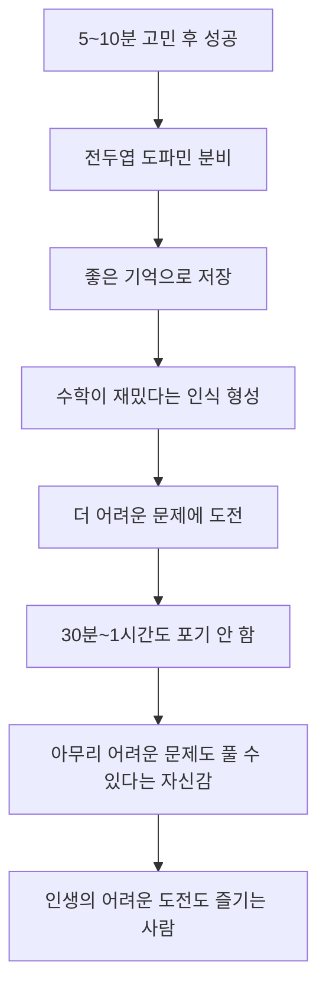
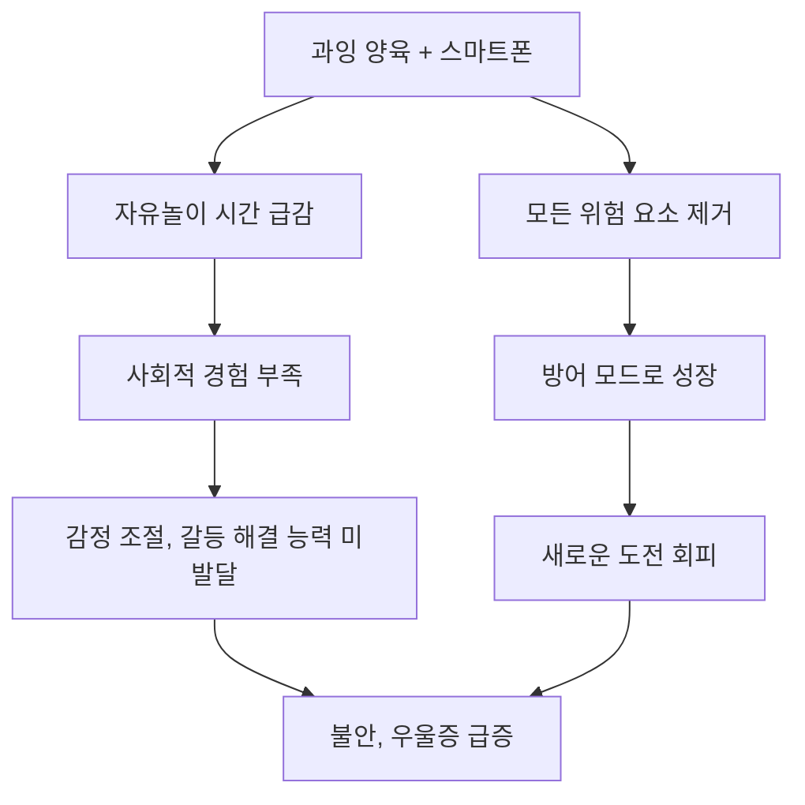
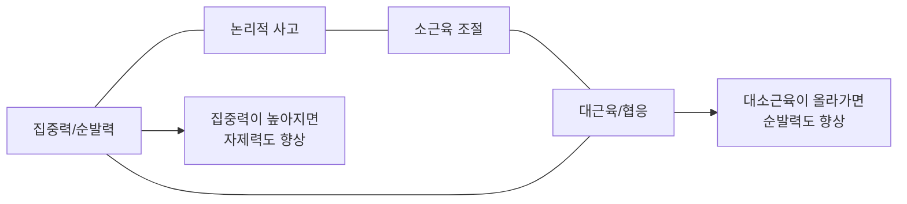

만 3세부터 아이의 뇌는 전혀 다른 단계에 진입합니다. 만 3세에 뇌의 80%, 만 5세에 90%가 발달을 완료하며, 특히 **전두엽(인지/사고력)은 사춘기까지 계속 발달**합니다. AI가 인류의 지식을 학습해 대부분의 지적 작업을 대신하는 시대가 왔습니다. 서울대 황농문 교수는 "AI가 알고 있는 지식의 경계에서 한 발 더 나가는 힘, 그것이 창의성"이라고 말합니다. 이 능력의 출발점은 어릴 때 **스스로 생각하는 경험**을 반복하는 것입니다.

이 글에서는 "~가 중요하다"에서 멈추지 않고, **매일 구체적으로 무엇을 어떻게 해야 하는지**를 정리했습니다.

---

## 전두엽 발달: 자극적 콘텐츠 vs 생산적 도파민

### 전두엽 도파민과 측좌핵 도파민의 차이

서울대 황농문 교수에 따르면, 도파민에는 질적으로 전혀 다른 두 가지 회로가 있습니다.

| 구분 | 측좌핵 도파민 | 전두엽 도파민 |
|------|-------------|-------------|
| **발생 조건** | 게임, 쇼츠, 맛있는 음식, 쇼핑 | 어려운 문제를 끙끙대다 스스로 해결했을 때 |
| **보상 시점** | 즉각적 보상 | 지연된 보상 |
| **성격** | 소모적, 파멸적일 수 있음 | 생산적, 성취감으로 이어짐 |
| **결과** | 반복할수록 더 강한 자극 필요 | 반복할수록 도전 자체를 즐기게 됨 |
| **비유** | 마약/도박과 같은 메커니즘 | 과학자가 연구에 빠져드는 즐거움 |

핵심은 **전두엽 도파민 맛을 본 아이는 자극적인 것에 끌리지 않는다**는 점입니다. 스스로 문제를 해결한 경험이 쌓이면, 다시 생각해도 기분이 좋고 자랑스러운 성취감으로 저장됩니다. 반면 게임은 그 순간만 재밌고 끝나는 소모적 즐거움입니다.

### 쇼츠와 게임이 전두엽을 망가뜨리는 메커니즘

자극적 콘텐츠(쇼츠, 틱톡, 게임)는 편도체(감정의 뇌)만 계속 활성화시킵니다. fMRI 촬영을 해보면 스마트폰을 많이 사용한 사람의 전두엽은 **비활성화(파란색)** 상태로 나타납니다. 뇌에는 "Use it or Lose it" 법칙이 있어서, 사용하지 않는 기능은 퇴화합니다.

전두엽이 퇴화하면 벌어지는 일:
- 집중력, 기획력, 실천 능력 저하
- 감정 통제 능력 약화 (우울증 위험 증가)
- 만족 지연 능력, 끈기, 회복 탄력성 저하
- 소위 "멘탈이 약한" 사람으로 성장

**구체적 실천법:**

- 유튜브 쇼츠, 틱톡 등 빠르게 전환되는 자극적 콘텐츠를 보여주지 않는다
- 영상을 볼 때는 전개가 느리고 현실 세계를 반영하는 영상을 선택한다
- 시청 후 반드시 "어떤 내용이었어?" 하고 대화를 나눈다
- 가장 좋은 영상은 가족이 함께 찍은 영상이다
- 인터넷이 차단된 공부폰(예: 노란마켓)도 고려해볼 수 있다

> **DO**: 아이가 영상을 볼 때 "왜 보는 거야?"를 먼저 물어보고, 시청 시간을 아이와 함께 협상해서 정한다. 강압적으로 하면 반발심에 더 보려고 한다.
>
> **DON'T**: 아이에게 유튜브 보지 말라고 하면서 부모 자신은 스마트폰만 보는 것. 아이와 함께 있는 시간만큼은 스마트폰을 다른 곳에 둔다.

### 멀티태스킹의 함정

뇌과학자들의 연구에 따르면 멀티태스킹이라는 것은 존재하지 않습니다. 우리 뇌는 두 가지를 동시에 처리하는 것이 아니라 **빠르게 스위칭**하고 있을 뿐입니다. 이 스위칭 비용 때문에 효율이 크게 떨어지고, 각 과제에 대한 장기 기억 활성화가 제대로 이루어지지 않습니다.

**구체적 실천법:**

- 학원 4~5개를 동시에 보내는 것보다, **한 과목에 장기간 집중**시키는 것이 훨씬 효과적이다
- 국어 실력이 부족하면 한 달 동안 독서만 시킨다
- 수학이 약하면 방학 때 수학만 시킨다
- 처음에는 재미없지만, 난이도를 잘 조정하면 몰입의 불이 붙고, 그 후에는 아이가 스스로 좋아서 한다

---

## 슬로우 싱킹: 창의적 문제 해결력 키우기

### 아직 배우지 않은 문제를 스스로 고민하게 하라

황농문 교수가 소개하는 핵심 방법은 놀랍도록 간단합니다. **아이에게 아직 배우지 않은 문제를 주고, 편하게 생각하게 하는 것**입니다.

예를 들어 사각형의 넓이를 배운 아이에게 "높이 4cm, 밑변 5cm인 직각삼각형의 넓이를 구해봐"라고 문제를 내는 것입니다. 아이는 "아직 안 배웠는데요"라고 하겠지만, "아직 안 배운 거 아는데, 한번 도전해봐"라고 하면 됩니다.

이것이 바로 **지식의 한계를 넘는 경험**입니다. AI가 이미 학습한 지식의 영역에서는 인간이 AI를 이길 수 없습니다. 그러나 미지의 영역에서 한 발 더 나가는 것, 이것이 창의성이며 가장 부가가치가 높은 능력입니다.

### 실전: 5~10분 편하게 고민하기

핵심은 **슬로우 싱킹(Slow Thinking)**입니다. 대부분의 아이(그리고 어른)는 생각할 때 머리를 쥐어짜며 조급해합니다. 이것이 가장 큰 걸림돌입니다.

**단계별 실천법:**

1. **문제 선택**: 아이의 현재 수준에서 5~10분이면 풀 수 있는 난이도의 문제를 준다. 처음부터 몇 시간짜리 문제를 내면 공부를 싫어하게 된다
2. **분위기 조성**: "이 문제 평생 이것 하나만 푼다고 생각해. 시간 제한 없어"라고 말한다. 시간 압박을 없애는 것이 핵심이다
3. **펜을 내려놓게 한다**: 풀이를 쓰는 것은 생각이 아니라 시행착오다. 펜을 놓고 "이 문제가 뭘 물어보는 거지? 내가 왜 모르지?"를 머릿속으로만 생각하게 한다
4. **아이디어가 떠오르면 그때 펜을 든다**: 생각만으로 아이디어가 나왔을 때 비로소 적기 시작한다
5. **성공 경험 쌓기**: 아이가 스스로 풀면 "네 힘으로 해냈네!"라고 칭찬한다. 그리고 "아빠한테 물어봐서 아빠가 해주는 게 좋았니, 네가 스스로 한 게 좋았니?"라고 물어본다. 100% 자기가 한 게 더 좋다고 답한다

**성공 경험이 쌓이면 일어나는 변화:**

황농문 교수의 지도학생 사례가 이를 증명합니다. 같은 서울대생, 같은 학점(3.6), 같은 동아리 소속인데, 대학원 연구 능력에서 하늘과 땅 차이가 났습니다. 뛰어난 학생은 어릴 때 아버지로부터 "모르는 문제가 나오면 절대 해답을 보지 말라"는 교육을 받았고, 초등학교 때부터 대학까지 해설을 본 적이 한 번도 없었습니다.

### 자기주도 선행학습

집에서 아이에게 시켜야 할 가장 효과적인 활동은 **다음에 배울 내용을 교과서로 미리 읽고 이해하는 것**입니다.

**구체적 실천법:**

- 교과서만큼 잘 쓴 책은 없다. 가장 공을 들여서 만든 책이 교과서다
- 아이가 교과서를 읽고, 생각하고, 문제를 풀어보게 한다
- 부모는 **가르치지 않고 가이드만** 한다: "여기 읽었니?", "무슨 말인지 알겠니?"
- 몇 번 읽어도 모르면 일단 넘어간다
- 이 과정에서 아이는 **스스로 모르는 것을 공부해서 자기 지식으로 만드는 능력**을 기른다
- 미국 명문 사립학교(필립스 아카데미 등)가 이런 방식의 교육을 한다

> **DO**: 학원 대신 교과서 선행을 가이드한다. 아이의 소화 속도에 맞춰 천천히 진행한다.
>
> **DON'T**: 선행학습을 빠른 진도로 착각하는 것. 핵심은 속도가 아니라 "스스로 이해하는 과정"이다.

---

## 문해력과 사고력 키우는 대화법

인지심리학자 김태훈 교수에 따르면, 문해력은 단순히 읽고 이해하는 것을 넘어 **다른 사람에게 설명하고 소통할 수 있는 능력**까지를 포함합니다. 독서만으로는 문해력이 완성되지 않습니다.

### "왜?" "어떻게?" 질문법

아이가 부모에게 가장 많이 하는 질문이 "왜?"입니다. 이것을 그대로 되돌려 주면 됩니다.

**구체적 실천법:**

- 아이가 그림을 그리면 "잘 그렸네!" 대신 **"어떻게 한 거야?", "어떻게 이런 생각을 했어?", "이건 뭘 그린 거야?"**라고 육하원칙 기반으로 질문한다
- 아이가 할 말이 갑자기 많아지고, 부모와의 대화가 풍성해진다
- 아이가 자신의 과정을 설명하면서 **"내가 어떤 과정을 거쳐서 이런 좋은 결과를 얻었는지"**를 스스로 고민하게 된다

**주의사항:**

- "왜?"를 나무라는 톤으로 하면 아이는 혼나는 것으로 착각한다
- "왜 이런 거야?" 대신 **"우리 한번 같이 이유를 찾아볼까?"**로 바꾼다
- 결과 칭찬("잘했네!")으로 끝내면 아이는 더 이상 말할 것이 없다
- 과정 질문("어떻게 준비한 거야?")을 하면 대화가 확장된다

### 프레임의 다양성 인정하기

아이가 틀린 말을 해도 즉시 교정하지 마세요. 아이는 자기가 보고 경험한 것에 대해 **과잉 확신**을 가집니다.

**구체적 실천법:**

- 아이가 "하늘은 초록색이야!"라고 해도 "아니야, 파란색이야"라고 즉시 교정하지 않는다
- **"아빠 눈에는 파란색으로 보이는데, 네가 본 건 어떤 모양이야?"**라고 대화를 이어간다
- 아이의 시선과 부모의 시선이 다른 것은 정상이라는 것을 알려준다
- 이 과정에서 비판적 사고력이 길러진다
- 직접 나무라면 "아빠/엄마는 내 생각을 싫어하는구나"라는 오해를 만들 수 있다

> **DO**: "너는 이렇게 봤구나. 아빠는 이렇게 봤는데, 생각이 다를 수 있지?"로 접근한다.
>
> **DON'T**: "그건 틀렸어, 이렇게 해야 맞는 거야"로 즉시 교정하는 것.

### 마인드맵 활용하기

디지털 기기에 익숙한 아이들은 정보를 점프하면서 얻는 데 익숙합니다. 검색하다가 링크를 따라가고, 또 다른 링크를 따라가다 보면 처음에 뭐가 궁금했는지 잊어버립니다.

**구체적 실천법:**

- 큰 종이를 펼쳐놓고 "지금까지 공부한 것을 한번 써보자"라고 한다
- 아이가 쓴 내용들이 어떻게 연결되는지 함께 그려본다
- 구조가 형성되면서 "내가 뭘 공부하고 있고, 세부 내용은 뭔지" 정리가 된다
- 이것이 **깊은 생각**의 기반이 된다

### 유튜브 시청 지도법

유튜브를 보는 것 자체가 문제는 아닙니다. 정보를 습득하는 채널이 다양해진 것일 뿐입니다.

**구체적 실천법:**

- "유튜브 보지 마!"가 아니라 **"지금 이거 보고 있는데, 왜 보는 거야?"**를 먼저 물어본다
- 아이의 이야기를 듣고 "아빠/엄마 생각에는 이 정도만 하는 게 어떨까 싶은데, 너는 어떻게 생각해?"라고 묻는다
- 거의 대부분의 아이들은 자기가 어느 정도 봐야 되는지 사실 알고 있다
- 강압적으로 하면 반발심에 더 보려고 한다
- **부모와 아이가 함께 시청 시간을 협상**하는 과정을 반복한다

### 경험 기반 학습의 힘

영상으로 보는 것과 직접 경험하는 것은 학습 효과에서 근본적인 차이가 있습니다.

**구체적 사례:**

- 자석의 원리를 영상으로 보여주면 "아, 그렇구나"로 끝난다
- 그러나 문방구에서 자석을 사서 집안 곳곳을 돌아다니며 붙여보면 아이가 스스로 "이건 왜 안 붙어?"라고 질문한다
- 직접 경험이 어렵다면 **"어떻게 된다는 거야?"라고 아이에게 설명하도록 유도**하는 것만으로도 효과가 있다
- 모든 것을 직접 체험시킬 수 없더라도, 두세 가지라도 시간을 내서 함께 해보는 것이 중요하다

---

## 심부름과 독립적 경험

### 레트 그로(Let Grow) 프로젝트

미국의 레트 그로(Let Grow) 프로젝트는 아이들에게 **혼자서 해본 적 없는 일을 해보게** 하는 프로그램입니다. 실행 결과 아이들의 불안 수준이 크게 떨어졌고, 아이의 정체성에도 변화가 생겼습니다.

동생을 스쿨버스에 배웅한 아이는 이렇게 말했습니다: "동생이 탄 버스가 떠나는 걸 보는 순간, **내가 누군가에게 중요한 사람이라는 느낌이 들었어요.**" 남의 도움이 필요한 사람에서 남에게 도움을 줄 수 있는 사람으로 정체성이 바뀐 것입니다.

**구체적 실천법:**

- "냉장고에서 우유 좀 가져다 줄래?", "현관에서 아빠 슬리퍼 좀 가져다 줄래?" 등 간단한 심부름부터 시작한다
- 성공하면 **"도와줘서 고마워!"**라고 인정해준다
- "남에게 도움을 줄 수 있는 사람"이라는 정체성을 형성시킨다
- 점차 혼자 마트 가기, 요리 돕기, 낯선 사람에게 말 걸기 등 범위를 넓혀간다

### 적절한 위험의 필요성

놀이를 통해 아이들은 상처를 참고, 감정을 조절하고, 갈등을 해결하고, 승부를 겨루는 법을 배웁니다. **다칠 수 있는 상황을 알아야 다치지 않는 법을 배울 수 있습니다.**

뉴욕의 한 놀이터에는 안전한 놀이기구 대신 **타이어, 물통, 밧줄 등 온갖 물건**이 널려 있습니다. 이 "정크 놀이터"는 아이들의 상상력을 자극합니다. 실제로 한 학교에서 운동장 안전 규칙을 줄이고 아이들에게 알아서 결정하게 한 결과, **행복과 신체 안정도는 증가하고, 부상과 기물파손과 집단 괴롭힘은 오히려 감소**했습니다.

**구체적 실천법:**

- 놀이터에서 아이가 높은 곳에 올라가려 할 때 즉시 "위험해!" 하고 막지 않는다
- 가까이에서 지켜보며 "할 수 있을 것 같아?" 하고 물어본다
- 아이가 "할 수 있어!"라고 하면 뒤에서 대기한다
- 안전 위주 놀이기구보다 타이어, 밧줄 등 **상상력을 자극하는 놀이 환경**이 더 효과적이다
- 아이가 놀 때 부모는 최대한 간섭하지 않는다

### 과잉 양육의 문제

1990년대부터 부모들이 자녀와 대부분의 시간을 보내며 집중 양육을 시작했습니다. 아이에게 세상은 위험한 곳이라고 가르치고, 삶에서 위험 요소를 제거하려 노력한 결과, 아이들은 **방어 모드로 자라게 됐습니다.** 새로운 경험을 추구하기보다 늘 위협을 경계하는, 취약하고 두려움에 사로잡힌 어른으로 성장한 것입니다.

2010년대 아이들의 불안과 우울증이 동시에 급증했고, 자살율은 2010년부터 2021년까지 **167% 증가**했습니다.

> **DO**: 아이들에게 책임을 부여한다. 책임이 주어졌을 때 아이들은 어른에게 의존하는 대신 스스로 그 책임을 지려고 한다.
>
> **DON'T**: 현실 세계에서의 과잉 보호와 가상 세계(스마트폰)에서의 과소 보호를 동시에 하는 것.

---

## 하루 20분 교구 놀이

아동 전문가 원민우 교수에 따르면, 아이의 두뇌 발달에는 네 가지 핵심 포인트가 있으며, 이것들은 따로따로 발달하는 것이 아니라 **서로 연결**되어 있습니다. 하루 20분 교구 놀이로 통합적 두뇌 발달이 가능합니다.

### 4가지 교구와 놀이법

**1. 구슬치기 게임 -- 집중력/순발력**

- 색깔 카드를 받고, 구슬이 나올 때마다 내게 필요한 색인지 확인해서 벨을 먼저 누른다
- 실수하면 벌칙이 있어서 신중함도 배운다
- **부모 팁**: 처음에는 천천히 생각할 시간을 주고, 점점 속도를 높이면서 "네가 정말 빨라졌구나!"라고 성취감을 느끼게 한다
- **효과**: 순간 판단력 훈련, 일상에서의 집중력 향상

**2. 슬라이드 퍼즐 -- 논리적 사고**

- LED 화면에 나오는 배치대로 조각을 놓고, 빨간 큰 조각을 출구까지 슬라이딩으로 이동시킨다
- 500가지 이상 단계별 문제가 있어 아이 수준에 맞춰 진행 가능
- **부모 팁**: "이 조각을 먼저 움직이면 어떻게 될까?"라고 질문을 던져준다. 아이가 스스로 답을 찾는 과정이 가장 중요
- **효과**: 수학적 사고, 공간 감각, 체계적 문제 해결 능력

**3. 자석 벨 게임 -- 소근육/자제력**

- 자석 막대로 자기 색깔 벨만 정확히 꺼내야 한다
- 다른 색이 섞이면 모두 다시 넣어야 한다
- **부모 팁**: 처음엔 실수해도 괜찮다고 격려하고, "이번엔 몇 개나 성공할 수 있을까?"라고 도전 의식을 키운다
- **효과**: 손목 힘 조절, 충동 억제력, 글씨 쓰기/색칠하기 등 소근육 활동 향상

**4. 던지기 스포츠 세트 -- 대근육/성취감**

- 링 던지기와 블록 던지기 두 가지 방식
- 단순히 던지는 것이 아니라 거리, 힘, 방향 조절을 모두 고려
- **부모 팁**: 가족 토너먼트를 열어 "다음엔 더 잘할 수 있을 거야"라는 도전 정신과 "아쉽다, 하지만 재밌었어"라는 긍정적 경험을 동시에 준다
- **효과**: 신체 조절, 집중력, 성공과 실패를 건강하게 받아들이는 마음

### 4주 확장법

| 주차 | 방법 | 목적 |
|------|------|------|
| 1주차 | 교구 1가지만 | 충분히 익숙해지기 |
| 2주차 | 교구 2가지 번갈아 | 전환 능력 훈련 |
| 3주차 | 교구 3가지 | 통합 놀이 |
| 4주차 | 교구 4가지 전부 | 자유 선택 + 전략 학습 |

**핵심 포인트:**

- **하루 딱 20분만** 놀아준다. 무조건 양적으로 많이 놀아주는 것보다 훨씬 효율적이다
- 20분에서 끊으면 아이에게 **아쉬움과 다음 놀이에 대한 기대감**이 생긴다
- 아이의 반응을 관찰한다. 어떤 교구를 더 즐기는지, 어떤 것을 어려워하는지 파악해서 전략적으로 조정한다

---

## 외국어: 원어민 발음을 위한 마지막 시기

다양한 논문을 종합하면, 외국어 학습 시기에 관해 두 가지 핵심 결론이 있습니다.

| 목표 | 시작 시기 | 근거 |
|------|----------|------|
| 외국어 유창하게 구사 | 늦어도 10~12세 | 17.4세에 언어 구조 습득의 결정적 시기가 닫힘 |
| **원어민 수준 발음/억양** | **6세 이전** | 6세 이전 노출 시 대부분 외국인스럽지 않은 발음 구사 |

**만 3~6세는 원어민 수준 발음을 위한 마지막 기회입니다.**

6세 이전에 노출된 아이들은 대부분 외국인스럽지 않은 발음과 억양을 구사하는 경향이 있습니다. 12세 이후에 노출되면 거의 대부분 외국인스러운 발음이 됩니다. 6~12세 사이는 개인차가 큽니다.

**구체적 실천법:**

- 5세 이전 아이들은 **노출(자연스러운 환경)을 통해 언어를 습득**한다. 어른처럼 수업으로 배우는 것이 아니다
- 영상이나 녹음이 아닌 **실제 사람과의 상호작용**이 효과적이다. 녹음/영상만으로는 뇌의 변화가 일어나지 않는다
- 12개월 이전에는 총 6시간 정도의 단기 노출만으로도 외국어 배치(패턴 인식 기반 형성)가 가능하다
- 5세 이후부터는 **모국어와 외국어의 노출 비중 밸런스**에 신경 쓴다
- 강압적인 영어 수업은 역효과를 낼 수 있다. 아이가 싫어하면 실패 확률이 높다

> **DO**: 영어를 할 줄 아는 사람(원어민 시터, 영어유치원 등)과의 자연스러운 상호작용 환경을 만들어준다.
>
> **DON'T**: 영상/음원만 틀어놓고 "영어에 노출시키고 있다"고 생각하는 것. 사람과의 라이브 상호작용이 없으면 효과가 제한적이다.

---

## 안짱다리 관리

안짱다리는 만 9세까지 자연 교정되지만, **방치하면 성장 문제(키가 크지 않음), 골반 틀어짐, 척추 만곡증** 같은 이차적 질환으로 이어질 수 있습니다.

### 의심 신호

- 아이가 자주 안아달라고 한다 (다리가 쉽게 피로해짐)
- 자기 발에 걸려 자주 넘어진다
- 발목을 자주 접질린다

### 연령대별 3가지 유형과 운동법

**유형 1: 경골 내전 (1~3세)**

확인법: 바르게 누운 상태에서 안쪽 복숭아뼈가 보이지 않으면 의심

- **스트레칭 1**: 양쪽 무릎 밑에 쿠션을 대고, 양발목을 잡아 발레 모양으로 쭉 벌려 3초 유지 x 10회
- **스트레칭 2**: 뒤꿈치를 맞대고, 발목을 바깥쪽 15도로 돌려 3초 유지 x 10회

**유형 2: 중족골 내전 (3~4세)**

확인법: 아이의 발을 들어 엄지와 검지 사이가 벌어지고, 발 중간 부위가 안쪽으로 휘어져 있으면 의심

- **스트레칭**: 아이를 눕히고 한쪽 발을 들어, 엄지발가락을 뒤로 최대한 젖혀 3초 유지 x 10회
- **놀이 운동**: 네발 기기 놀이 (양쪽 무릎이 바닥에 닿지 않도록!) -- 특정 위치를 정해놓고 누가 빨리 갔다 오나 경쟁

**유형 3: 대퇴골 전경 (4~8세)**

확인법: 엎드려서 양쪽 무릎을 붙이고 발을 세운 상태에서 옆으로 벌렸을 때 과하게 벌어지면 의심

- **풍선 제기차기**: 풍선을 띄워놓고 제기차기 (발 바깥쪽 사용을 유도)
- **짐볼 개구리 자세**: 짐볼 위에 엎드려 개구리 자세로 다리를 벌리고 콩콩 이동

**공통 주의사항:**

- 매일 놀이 형식으로 꾸준히 한다
- 아빠만 하지 말고 엄마도 같이 한다
- 만 9세까지 자연 교정되는 경우가 많지만, 놀이 형식의 스트레칭을 병행하면 더 효과적이다

---

## 그림책 선택의 변화

만 3세를 기점으로 그림책 선택 기준이 바뀝니다.

| 기준 | 만 3세 미만 | 만 3세 이상 |
|------|-----------|-----------|
| **그림 사실성** | 사진이나 사실적 그림 위주 | 다양한 표현 가능 |
| **내용 현실성** | 아이의 일상과 닮은 현실적 내용 | 환상적 요소도 괜찮음 |
| **등장인물** | 사람 중심 (의인화된 동물 주의) | 제한 적음 |
| **복잡도** | 한 페이지에 그림 1개, 물체 적게 | 더 복잡한 구성 가능 |
| **아이 반응** | 현실적 책에 더 집중 | **환상적 책을 더 선호하고 말을 더 많이 함** |

만 3~5세 아이들은 환상적인 그림책을 더 선호하는 경향이 있으며, 사실적인 그림책에 비해 환상적인 그림책을 읽을 때 **아이들이 말을 더 많이 하는 경향**이 있습니다.

**구체적 실천법:**

- 아이가 환상적인 책만 좋아해도 걱정할 필요 없다
- 현실적인 책을 읽으라고 강요하지 않는다
- **아이가 즐겁게 자발적으로 몰입하여 참여할 수 있는 것이 원칙**이다
- 환상적 요소가 많은 책을 읽더라도, 읽은 후에 "왜 이렇게 했을까?" 질문을 통해 사고를 확장시킨다
- 어른의 상상력으로 쓰여진 환상적 책을 읽는다고 아이의 창의력이 증진되는 것은 아니다

---

## 체크리스트

### 매일 실천

- [ ] 자극적 콘텐츠(쇼츠, 틱톡) 차단하기
- [ ] 교구 놀이 20분 (4가지 교구 중 선택)
- [ ] "왜?", "어떻게?" 질문 최소 3번 하기
- [ ] 간단한 심부름 1가지 시키기
- [ ] 그림책 읽고 대화 나누기

### 매주 실천

- [ ] 아직 배우지 않은 문제 1개 주고 편하게 고민하게 하기 (슬로우 싱킹)
- [ ] 직접 체험할 수 있는 활동 1가지 해보기 (자석 붙여보기, 요리 돕기 등)
- [ ] 마인드맵으로 배운 것 정리해보기
- [ ] 외국어 상호작용 기회 만들기

### 안짱다리 관리 (해당 연령대에 따라)

- [ ] 3~4세: 엄지발가락 스트레칭 + 네발 기기 놀이 (매일)
- [ ] 4~8세: 풍선 제기차기 + 짐볼 개구리 자세 (매일)

### 하지 말아야 할 것

- [ ] 쇼츠/틱톡/게임을 보상으로 사용하지 않기
- [ ] 모르는 문제의 답을 바로 알려주지 않기
- [ ] 아이의 생각이 틀렸을 때 즉시 교정하지 않기
- [ ] 놀이터에서 "위험해!" 먼저 외치지 않기
- [ ] 여러 학원을 동시에 보내지 않기 (한 과목에 집중)
