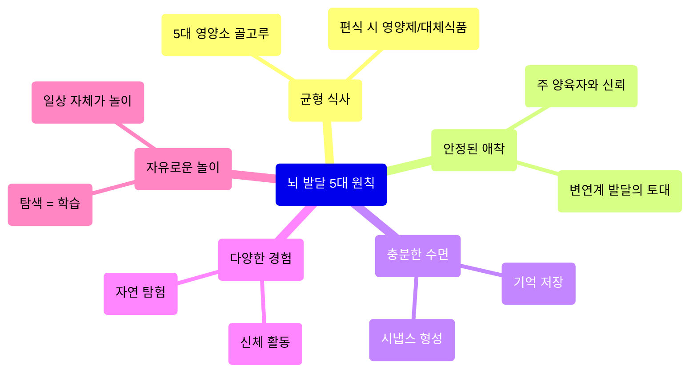
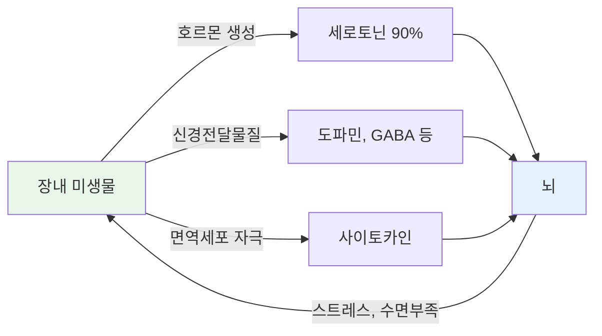
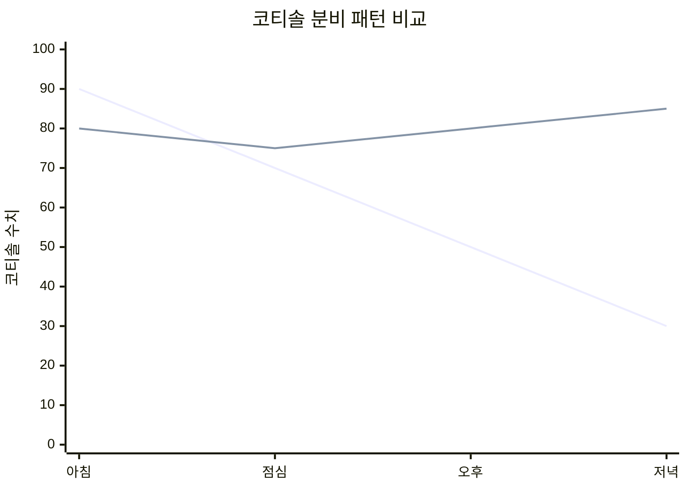

아이를 키우다 보면 "몇 개월에 뭘 해야 하지?"라는 연령별 고민이 많지만, 사실 **나이와 상관없이 꾸준히 지켜야 할 기본 원칙**들이 있다. 뇌 발달 연구에서 반복적으로 확인된 5대 기본 원칙은 다음과 같다.

1. **균형 잡힌 식사** -- 특정 "뇌에 좋은 음식"보다 5대 영양소(곡류, 어육류, 채소, 과일, 유제품)를 골고루 섭취하는 것이 핵심
2. **안정된 애착** -- 주 양육자와의 신뢰 관계가 모든 발달의 출발점
3. **충분한 수면** -- 시냅스 형성과 기억 저장이 수면 중 가장 활발
4. **다양한 경험** -- 신체 활동, 자연 탐험, 사회적 교류 등을 골고루
5. **자유로운 놀이** -- 놀이는 아이의 본능이자 인지 발달의 핵심 과정

> 특별한 교육 프로그램보다 이 5가지 기본이 더 중요하다. 매일 체크리스트로 점검해보자: (1) 균형 잡힌 식사를 했는가 (2) 아이와 따뜻하게 교감하는 시간이 있었는가 (3) 충분한 수면시간을 확보했는가 (4) 새로운 경험이 있었는가 (5) 자유롭게 놀 시간이 있었는가.

---

## 수면: 뇌가 자라는 시간

뇌의 시냅스는 아이가 **잠을 자는 동안 가장 활발하게 형성**된다. 깨어 있는 동안 경험한 것들을 기억으로 저장하는 과정도 수면 중에 일어난다. 연구에 따르면 충분히 잠을 잔 아이들이 그렇지 않은 아이들에 비해 인지 능력, 착색 능력, 집중력이 모두 높았다.

### 연령별 권장 수면시간

| 연령 | 권장 총수면시간 (낮잠 포함) |
|------|---------------------------|
| 신생아 | 14시간 이상 |
| 1~2세 | 11~14시간 |
| 3~5세 | 10~13시간 |
| 6~12세 | 9~12시간 |

### 수면 환경 만들기: DO / DON'T

**DO (해야 할 것)**
- 취침 30분 전 조명을 어둡게 하고 TV/스마트폰을 끈다
- 매일 같은 시간에 "이 닦기 - 잠옷 입기 - 책 읽기 - 불 끄기" 수면 의식을 반복한다
- 낮잠 시간과 밤 취침 시간을 일정하게 유지한다
- 침실을 어둡고 시원하게(18~22도) 유지한다

**DON'T (하지 말아야 할 것)**
- 잠자기 직전까지 과도한 자극(격렬한 놀이, 밝은 화면)을 주지 않는다
- 매일 다른 시간, 다른 장소에서 재우지 않는다
- 아이가 낮에 너무 아무것도 하지 않았거나, 반대로 너무 과도하게 흥분한 상태에서 재우지 않는다

### 수면 방해 요인 체크

아이가 자면서 자주 뒤척이거나, 코를 심하게 골거나, 다리를 차는 증상이 있으면 소아과 상담이 필요하다.

| 증상 | 의심 질환 | 수면에 미치는 영향 |
|------|----------|-------------------|
| 다리를 차고 뒤척임 | 빈혈(하지불안증후군) | 철분 부족으로 다리 불편감 |
| 코골이, 입 벌리고 잠 | 아데노이드 비대 | 수면무호흡, 깊은 수면 방해 |
| 가려워서 자주 깸 | 아토피 피부염 | 수면의 질 저하 |

---

## 영상 시청 완전 가이드

### 미국 vs 영국 가이드라인

영상이 아이의 뇌에 직접적인 악영향을 준다는 명확한 근거는 아직 부족하다. 그러나 두 가지 접근이 존재한다.

| | 미국 소아과 협회(AAP, 2016) | 영국 왕립 보건 소아과 학회(RCPCH, 2019) |
|---|---|---|
| 입장 | 보수적: 혹시 모를 리스크에 집중 | 유연: 과하게 걱정/죄책감 불필요 |
| 18개월 미만 | 영상 시청 자체를 피할 것 | 각 가족 상황에 맞게 유연하게 대처 |
| 18~24개월 | 부모와 함께 짧게 시청 | 가족 상황에 맞게 대처 |
| 2~5세 | 하루 1시간 이내, 양질의 프로그램만 | 명확한 시간 제한 근거 부족 |

> 핵심 메시지: 영상 자체가 뇌를 망가뜨린다는 확실한 근거는 없다. 그러나 **영상 시청으로 인해 부모와의 상호작용 시간이 줄어드는 것**이 진짜 문제다.

### 트랜스퍼 디피시트(Transfer Deficit)

24개월 미만의 아이들은 **2D 화면(영상)에서 배운 것을 현실 세계에 적용하기 어렵다.** 영상 속 세계와 현실이 별개라고 인지하기 때문이다.

실험 결과: 24개월 아이들에게 장난감을 숨기는 모습을 보여줬을 때, 비디오로 본 그룹은 대부분 장난감을 못 찾았지만, 실제로 본 그룹은 대부분 잘 찾았다.

- 18개월 이후부터는 영상을 통해 학습할 수 있지만, 현실 세계 학습보다 효율이 훨씬 떨어진다
- 24개월 미만은 녹음된 영상이나 소리를 통해서는 학습을 거의 하지 못한다

### 쌀밥 비유: 핵심 문제는 영상이 아니라 상호작용 감소

> 영상은 패스트푸드가 아니라 **쌀밥**이다. 쌀밥 자체는 몸에 나쁘지 않지만, 쌀밥만 너무 많이 먹으면 배가 불러서 영양소가 풍부한 다른 반찬(=부모와의 상호작용)을 못 먹게 된다.

12개월 아이의 하루를 예시로 들면, 엄마와 제대로 상호작용할 수 있는 시간은 약 6시간 정도다. 하루 1시간만 영상에 쓰면 상호작용 시간이 약 17% 줄어든다. 1년이면 2.4개월치 차이가 난다.

### 좋은 영상의 4가지 조건 (18개월 이상)

| 조건 | 설명 | 예시 |
|------|------|------|
| **사회적 큐가 풍부** | 표정, 몸짓, 눈맞춤이 과장되게 표현 | 캐릭터가 시청자에게 직접 눈맞춤하며 말을 거는 영상 |
| **배경/캐릭터 반복** | 하나의 시리즈를 반복 시청 | 텔레토비처럼 매 에피소드 같은 배경/캐릭터 |
| **상호작용 유도** | 시청자에게 질문하고 잠깐 여유를 줌 | 도라 디 익스플로러, 블루스 클루스 |
| **배경음악 최소** | 배경음악이 적고, 노래는 학습내용 복습용 | 말이 주가 되고, 노래로 핵심 내용을 반복하는 영상 |

### 영상 시청 실천 원칙: DO / DON'T

**DO (해야 할 것)**
- 18개월 이상 시청 시, 부모가 옆에서 함께 보며 대화한다 ("지금 뭐 하고 있어?", "왜 그랬을까?")
- 하나의 시리즈를 반복적으로 시청하게 한다 (배경/캐릭터에 익숙해져야 학습 효율이 올라감)
- 돌~세돌 사이에는 전개가 느리고 현실 세계를 반영하는 영상 위주로 보여준다
- 가장 좋은 영상은 **가족 영상**(아이가 나오는 홈비디오 등)이다

**DON'T (하지 말아야 할 것)**
- 자극적인 영상(쇼츠, 빠른 전환, 화려한 이펙트)을 먼저 보여주지 않는다 -- 한번 자극적 영상에 익숙해지면 교육적 영상에 흥미를 잃는다
- "영상 시간 = 부모 휴식 시간"으로 방치하지 않는다
- 두 돌 전에는 가급적 미디어를 보여주지 않는다

---

## 장내 미생물: 3년이 평생을 좌우한다

### 장-뇌 축(Gut-Brain Axis)

장과 뇌는 호르몬, 신경 다발, 면역 세포를 통해 서로 연결되어 있다. 이를 **장-뇌 축(Gut-Brain Axis)**이라 한다.

놀라운 사실: **세로토닌(행복 호르몬)의 90%는 뇌가 아닌 소화기관의 장내 미생물에 의해 만들어진다.** 장내 미생물은 세로토닌 외에도 도파민, 엔도르핀, GABA 등 행복, 불안, 집중, 보상, 동기와 관련된 여러 신경전달물질의 생성에 관여한다.

### 장내 미생물이 아이에게 미치는 6가지 영향

| 영역 | 연구 결과 |
|------|----------|
| **우울감/감정** | 삶의 질이 낮은 사람의 장에서 좋은 세균 부족, 나쁜 세균 증가 확인 |
| **스트레스 취약성** | 스트레스에 취약한 쥐의 장에서 염증 유발 세균 증가 |
| **성격** | 외향적이고 사교적인 18~27개월 아이들이 더 다양한 장내 미생물 보유 |
| **인지능력** | 좋은 세균이 많은 아이들이 만 2세 때 언어발달 등 인지능력이 더 높음 |
| **문제행동** | 특정 장내 미생물의 변화가 불안, 우울, 충동 조절 어려움과 상관관계 |
| **수면** | 장내 미생물 다양성이 높은 성인일수록 수면의 질이 좋음 |

> 부모와 아이 간의 애착관계가 잘 형성되어 있으면, 장내 미생물 구성이 나쁘더라도 문제행동이 완화될 수 있다는 연구 결과도 있다. **애착과 장내 미생물, 둘 다 중요하다.**

### 장내 미생물은 생후 3년까지가 승부

장내 미생물은 **생후 3년까지 활발하게 자리잡고, 그 이후에는 비교적 크게 변하지 않는다.** 면역력이 성숙해지면서 외부 세균들이 장까지 도달하기 전에 죽기 때문이다. 아이들이 어릴 때 아무거나 입에 넣는 것, 면역력이 비교적 약한 이유가 바로 이 장내 미생물 조성 기간에 더 많은 세균이 몸 속으로 들어오게 하기 위해 그렇게 진화했다는 설명이 있다.

### GOOD 리스트: 장내 미생물에 좋은 것

| 항목 | 구체적 실천법 |
|------|-------------|
| **자연 환경 노출** | 매일 야외 활동(공원, 흙, 풀밭). 농장 근처에 살았던 아이들의 장내 미생물이 더 다양. 숲유치원도 좋은 옵션 |
| **다양한 사람/동물 접촉** | 문화 센터, 조부모 만남, 애견카페 방문. 형제자매가 많거나 반려동물과 함께 사는 아기의 장내 미생물이 더 다양 |
| **식이섬유(통곡물, 채소)** | 이유식에 흰쌀 대신 현미/잡곡밥 사용. 오트밀, 통밀빵, 통밀 파스타. 과일은 즙 말고 통째로 갈기(섬유질 보존) |
| **발효 식품** | 요거트, 치즈, 김치, 된장. 간식으로 요거트를 주면 유산균 섭취에 도움 |
| **오메가3** | 생선(연어 등) 오메가3 풍부한 음식. 장내 좋은 세균의 활동에 영향 |
| **폴리페놀(베리류)** | 블루베리, 사과, 올리브유. 특히 베리류가 좋은 세균 증식에 영향 |
| **유산균(프로바이오틱스)** | 확실한 장기 효과는 미검증이나 부작용 보고 없음. 아토피/알레르기 가족력이 있거나, 제왕절개/분유수유인 경우 더 신경 |
| **다양한 음식** | 전반적으로 다양한 음식을 먹는 것이 장내 미생물 다양성에 도움. 이유식 재료를 자주 바꿔가며 시도 |

### BAD 리스트: 장내 미생물에 나쁜 것

| 항목 | 구체적 주의법 |
|------|-------------|
| **설탕/액상과당** | 탄산음료, 젤리, 아이스크림 등 액상과당이 많은 제품 주의. 요리/요거트에는 설탕 대신 **프락토올리고당** 사용(모유에도 들어있는 올리고당의 일종, 좋은 세균의 먹이) |
| **초가공식품** | 설탕과 트랜스지방이 과도한 가공식품은 3세 미만에게 특히 자제 |
| **과도한 포화지방** | 동물성 지방은 적정량 필요하지만 과도하면 장내 미생물 환경 악화 |
| **과도한 살균** | 살균제를 주 1회 이상 사용하는 가정의 아기에서 비만 유발 세균이 더 많았음. 바닥 살균제 사용은 최소화 |
| **불필요한 항생제** | 항생제는 꼭 필요한 경우에만 복용. 복용 후 유산균 보충 |

### 프락토올리고당 활용 팁

프락토올리고당은 모유에도 들어있는 올리고당의 한 종류로, 장내 좋은 세균의 먹이가 된다. 마트에서 저렴하게 구입할 수 있으며, **설탕 대용**으로 요리나 요거트에 넣어 사용하면 좋다.

주의: 구입 시 성분표를 확인할 것. 일부 제품은 올리고당 함량이 적고 나머지가 설탕으로 채워져 있다.

---

## 아빠의 역할: 옥시토신이 답이다

아빠가 육아에 적극적으로 참여하면 아이의 발달에 큰 도움이 된다. 그런데 아빠를 적극적으로 만드는 과학적 열쇠가 있다: **옥시토신(행복 호르몬)**.

옥시토신 수치가 높으면 편안하고 행복한 상태가 되어, 남성호르몬인 테스토스테론이 낮아지고 아이와의 교감에 더 적극적이 된다. 실제로 아빠에게 옥시토신 스프레이를 뿌렸더니 아이와 더 열심히 놀아주고 교감하는 행동이 증가했다는 연구 결과가 있다.

### 옥시토신 높이는 5가지 방법

**1. 부부 스킨십 강화 -- 매일 아빠를 따뜻하게 안아주기**

따뜻한 피부 접촉은 옥시토신 생성을 크게 촉진한다. 아기는 매일 안아주면서 아빠는 안 안아주고 있진 않은가? 부끄러워서 싫어하는 척을 할 수는 있어도, 꼭 껴안는 것을 싫어하는 사람은 없다.

**2. 아빠 스타일의 놀이 존중하기**

엄마는 애정어린 스킨십 후에 옥시토신이 올라가고, 아빠는 **아빠 스타일(신체 자극, 박 뒤집기, 활동적 탐색 놀이)로 놀 때** 옥시토신이 더 크게 올라간다. 아빠가 아이와 씩씩하게 놀 때 기겁하지 말고 그 방식을 존중해주자. 또한 **엄마가 같은 공간에 없을 때** 아빠가 아이에게 더 집중하고 활발하게 상호작용한다는 연구 결과가 있다.

**3. 목욕과 마사지는 아빠에게 맡기기**

매일 저녁 아빠가 아이 목욕을 담당하고, 목욕 후 **15분간 베이비 로션을 바르며 마사지**해준다. 연구에서 매일 15분 마사지를 한 아빠들이 한 달 뒤 아이와 더 즐겁고 따뜻하게 놀아주는 것으로 확인되었다.

**4. 영양소 챙기기**

마그네슘, 비타민 D가 결핍되면 옥시토신이 부족해질 수 있다. 또한 쥐 대상 연구에서 **락토바실러스 루테리**(유산균의 한 종류) 섭취가 옥시토신 분비에 영향을 줬다.

**5. 연애하는 마음으로 대하기**

육아 스트레스로 서운함이 쌓여 아빠에게 퉁명스럽게 대하면, 아빠는 가정을 불편하고 긴장되는 공간으로 인식하게 된다. 옥시토신 분비가 줄고 테스토스테론이 올라가, 결과적으로 육아에 덜 적극적인 아빠가 된다.

### 1~2년 기다림의 중요성

엄마는 출산, 모유수유, 하루종일 아이를 안으면서 이미 강한 애착이 형성된다. 반면 **아빠가 아이에게 강한 애착을 느끼는 데는 1~2년이 걸릴 수 있다.** 아기의 울음소리를 들려줬을 때, 1~2년 이상 경험한 아빠들에게서 엄마와 비슷한 뇌 반응이 관찰되었다.

> 아직 어린 아이를 가진 아빠가 엄마만큼 육아에 관심이 없다고 절망하지 말 것. 그 사이에 아빠-아이 간 옥시토신 넘치는 순간들을 경험하면, 점차 더 적극적으로 변해가는 모습을 볼 수 있다.

---

## 어린이집: 36개월 미만의 코티솔 문제

### 코티솔(스트레스 호르몬)의 이상 패턴

보통 사람은 아침에 코티솔이 가장 높고, 저녁까지 서서히 떨어진다. 그런데 양육 시설에 맡겨진 **36개월 미만 아이들**의 경우, 코티솔이 하루 종일 높은 수치로 유지되거나 오히려 증가하는 이상 패턴을 보였다.

이 스트레스의 원인은 크게 두 가지다:
1. **사회적 환경** -- 많은 사람들과 함께 있는 것 자체가 아직 준비되지 않은 나이에 스트레스
2. **엄마와의 분리** -- 엄마가 함께 있으면 코티솔이 적어도 증가하지는 않았으나, 분리 후 시간이 지나며 상승

### NICHD 연구 결과 (미국)

1,000명 이상의 영유아를 장기 추적한 NICHD 연구에 따르면, **만 3세 미만 아이들이 주 30시간 이상** 부모가 아닌 누군가에게 양육되었을 때:
- 폭력성, 공격성, 감정 조절 등 **문제행동**을 보일 가능성이 높았다
- 맡겨지기 시작한 나이가 더 어릴수록 문제행동 가능성도 높아졌다

### 퀘벡 연구 결과 (캐나다)

1997년부터 저렴한 어린이집 정책을 도입한 퀘벡 주의 아이들과 다른 주 아이들을 비교했을 때:
- 퀘벡 주 아이들에게 **과잉행동, 산만함, 정서불안, 공격성** 등 문제행동이 더 나타남
- 만 2세 미만은 독립성/사회성 발달이 늦어지는 경향
- 이러한 문제행동은 학교에 들어간 뒤에도 **지속되거나 더 심각해지는** 경향

### 부득이한 경우 대응법: DO / DON'T

직장 등 다양한 이유로 어린이집을 보내야 하는 상황이라면:

**DO (해야 할 것)**
- 시설에 맡기는 시간을 **주 30시간 미만**으로 최대한 줄인다
- 집에서 하루 최소 **1시간**, 핸드폰과 TV를 완전히 끄고 아이와 집중 놀이를 한다
- 바닥에 함께 앉아 블록 쌓기, 책 읽기, 역할놀이 등 아이가 주도하는 놀이에 참여한다
- **따뜻하고 반응 잘 해주는** 어린이집/선생님을 선택한다 -- 안정적 애착관계가 형성되면 엄마 역할을 어느 정도 대신할 수 있다
- 경제적 여유가 있다면 1:1 베이비시터나 조부모 도움을 병행한다

**DON'T (하지 말아야 할 것)**
- 안 운다고 해서 스트레스를 안 받는 것은 아님 -- 불안정 애착 아이는 엄마 분리에 무심해 보이지만 코티솔은 여전히 높다
- "다들 그렇게 보내니까"라며 당연하게 생각하지 않는다 -- 36개월 미만은 원래 가정 양육에 적합한 나이

---

## 칭찬과 훈육의 원칙

### 칭찬법: 사람이 아닌 과정을 칭찬한다

| DON'T (하지 말 것) | DO (해야 할 것) |
|-------------------|----------------|
| "우리 아기 천재네!" | "끝까지 해냈구나!" |
| "역시 똑똑해!" | "열심히 노력했네!" |
| "잘했어, 우리 애가 최고!" | "혼자 양말 신었구나!" |

사람 칭찬("똑똑해")은 아이가 실패를 두려워하게 만든다. 과정 칭찬("열심히 했네")은 성공의 원인을 능력이 아닌 노력으로 귀인시켜, 장기적으로 더 도전적인 사람이 된다.

아이가 실패했을 때도 중요하다. "제대로 해야지", "왜 이것도 못해?" 대신 **아무 말 하지 않거나, "다시 해볼까?" 정도로만 격려**한다. 짜증 섞인 말투, 한심하다는 표정은 수치심을 강화시켜 어려운 과제에 도전하지 않으려는 아이로 만든다.

### 훈육의 핵심: 일관성

훈육은 "혼내는 것"이 아니라 **사회 규범을 가르치는 과정**이다.

1. **양육자 전원의 일관성**: 훈육 시작 전 엄마, 아빠, 조부모 등이 모여 "되는 것/안 되는 것" 목록을 합의한다. 엄마가 안 된다고 한 것을 할머니가 허용하면 아이는 혼란스러워진다.
2. **감정이 올라올 때 훈육하지 않는다**: 먼저 심호흡을 하거나 잠시 자리를 비운 뒤, 감정이 가라앉은 상태에서 단호하고 차분한 목소리로 말한다.
3. **양육자 간 의견이 다를 때**: 아이 앞에서 논쟁하지 말고, 나중에 따로 대화한다.

---

## 열린 장난감 철학

### 전자 장난감의 3가지 문제

| 문제 | 설명 |
|------|------|
| 정해진 기능 | 버튼 누르면 소리/불빛이 나오는 등, 놀이 방법이 한정됨 |
| 부모 참여도 저하 | 장난감이 아이를 "돌봐주는" 상황이 되어 부모가 빠지게 됨 |
| 지나친 자극 | 강한 소리/불빛에 익숙해지면 단순한 놀이에 흥미를 잃음 |

### 열린 장난감이란?

기능이 정해지지 않아 다양한 방식으로 놀 수 있는 장난감: 나무 블록, 공, 컵, 모래, 물 등

### 실천법

- 선반에 **6~10개 장난감만** 내놓고 나머지는 보관. 2~3주에 한 번씩 교체하면 새로운 자극이 된다
- 비싼 전문 교구 없이도 일상 도구로 충분: 이케아 칼락스 선반(교구 진열), 빈 용기(쏟기/따르기), 저금통(구멍 넣기)
- 부모가 적극적으로 함께 놀아주며 반응과 피드백을 주는 **1~2시간**이, 장난감 10개를 더 사주는 것보다 효과적

---

## 집안 위생 관리

### 세균 많은 곳 TOP 11

일반적인 생활 세균은 건강한 아기에게 크게 위험하지 않으므로 과도한 걱정은 불필요하다. 다만 세균이 번식하기 좋은 환경은 관리가 필요하다.

| 순위 | 장소 | 관리법 |
|------|------|--------|
| 1 | **수세미** | 매주 교체하거나 전자레인지 1분 가열 소독 |
| 2 | 그릇 건조대 | 뜨거운 비눗물로 자주 닦기, 그릇이 쌓여있지 않게 |
| 3 | 주방 싱크대 | 뜨거운 비눗물로 자주 닦기 |
| 4 | 칫솔 꽂이 | 습기 제거가 어려운 구조, 주기적 세척 |
| 5~11 | 화장실 전반, 반려동물 밥그릇 등 | 주방과 화장실을 신경써서 청소 |

### 물놀이 장난감, 봉제인형 관리

| 장난감 | 문제 | 관리법 |
|--------|------|--------|
| **물놀이 장난감(러버덕 등)** | 내부에 물이 들어가면 곰팡이가 자람 | 안에 물이 들어가는 구조는 버리기. 사용 후 비눗물 헹굼 + 완전 건조. 욕조에 보관하지 않기 |
| **봉제인형** | 침, 땀이 묻고 습기가 머무름 | **주 1회 세탁기에 넣어 세탁** |

> **과도한 살균은 오히려 장내 미생물에 악영향**을 준다는 점을 기억하자. 살균제를 주 1회 이상 사용하는 가정의 아기에서 비만 유발 세균이 더 많았다는 연구 결과가 있다. 적절한 균형이 핵심이다.

---

## 부모 자기 돌봄

체력적/정신적으로 지쳐 있으면 아이에게 다정하게 대하기 어렵다. 부모 자신을 돌보는 시간은 사치가 아니라 **육아의 필수 조건**이다.

**구체적 실천법:**
- 일찍 자기, 좋아하는 음악 듣기, 커피 한 잔의 여유, 짧은 산책 등 자신만을 위한 시간을 매일 확보
- 부부가 번갈아 아이를 봐주며 서로에게 "쉬는 시간"을 만들어준다
- 지친 상태에서 억지로 다정하게 하려면 더 지치므로, **충전이 먼저**

---

## 체크리스트

매일/매주 점검할 수 있는 실천 체크리스트:

### 매일 점검

- [ ] 5대 영양소를 골고루 섭취했는가
- [ ] 아이와 따뜻하게 교감하는 시간이 있었는가
- [ ] 충분한 수면시간(연령별 권장)을 확보했는가
- [ ] 새로운 경험(산책, 물놀이, 새 장소 등)이 있었는가
- [ ] 아이가 자유롭게 놀 시간이 있었는가
- [ ] 아빠가 아이와 놀이/목욕/마사지 시간을 가졌는가
- [ ] 부모 자신의 휴식 시간을 확보했는가

### 매주 점검

- [ ] 봉제인형 세탁을 했는가
- [ ] 물놀이 장난감을 건조했는가
- [ ] 수세미를 교체하거나 소독했는가
- [ ] 야외 활동(공원, 자연)을 충분히 했는가
- [ ] 다양한 식재료를 시도했는가 (이유식 재료 변경 등)
- [ ] 영상 시청 시간이 과도하지 않았는가

### 월간 점검

- [ ] 장난감을 로테이션했는가 (6~10개만 내놓고 교체)
- [ ] 아이의 수면 패턴에 이상은 없는가 (코골이, 뒤척임 등)
- [ ] 양육자 간 훈육 기준에 불일치는 없는가
- [ ] 발효식품(요거트, 김치 등)과 식이섬유를 충분히 섭취하고 있는가
