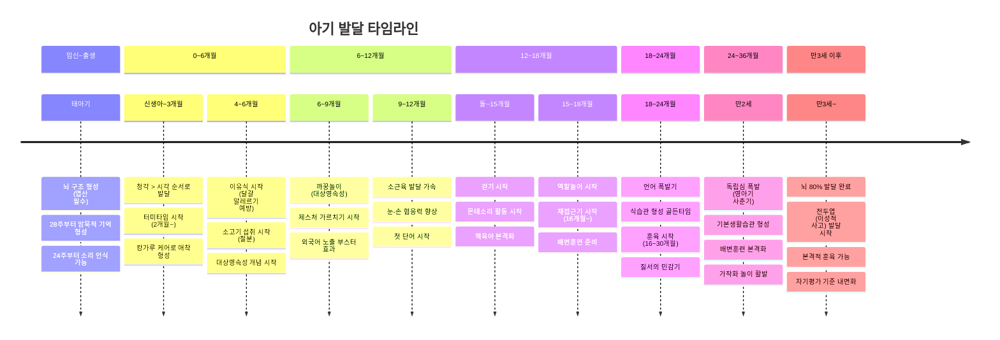
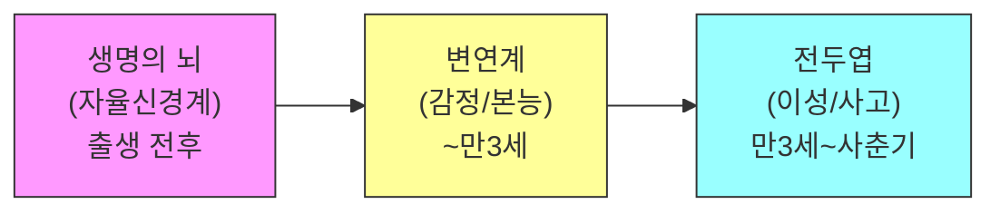

67개 육아 전문가 YouTube 영상을 분석하여, 임신부터 만3세 이후까지 나이별로 챙겨야 할 것들을 정리한 종합 가이드입니다.

> **핵심 원칙**: 만 3세까지 뇌의 80%가 발달하며, 이 시기에 가장 중요한 것은 특별한 교육이 아니라 **균형 잡힌 영양, 안정된 애착, 충분한 수면, 다양한 경험, 자유로운 놀이**입니다.

---

## 전체 발달 타임라인

## 뇌 발달 순서

뇌는 아래에서 위로, 안에서 바깥으로 순서대로 발달합니다. **각 단계가 충분히 발달해야 다음 단계로 건강하게 넘어갑니다.**

변연계가 발달해야 할 시기(~만3세)에 인지 학습(한글, 영어 비디오)을 과도하게 시키면 감정 조절과 상호작용 능력이 저해될 수 있습니다.

---

## 임신~신생아

### 뇌발달

- **태아기에 뇌의 구조가 형성**되므로 엽산 섭취가 필수적입니다.
- 임신 28주부터 암묵적 기억 형성이 가능하며, 24주부터 소리를 들을 수 있습니다.

> 💡 **실천 방법**: 임신 24주 이후부터 매일 같은 시간에 태아에게 말을 걸거나 노래를 불러줍니다. 아빠도 배에 대고 이야기하면 출생 후 아빠 목소리에 안정감을 느끼는 데 도움이 됩니다.

### 영양

- 임신 중 **엽산** 충분히 섭취 (뇌 구조 형성의 핵심 영양소)
- **모유 수유**가 가능하면 최선 -- 모유의 올리고당이 유익균 먹이가 됩니다.
- 임신 중 **달걀** 섭취가 아이의 출생 후 발달에 긍정적 영향 (DHA, 콜린)

> 💡 **실천 방법**: 출산 직후 가능한 빨리 모유 수유를 시작하고, 최소 6개월간 유지를 목표로 합니다. 모유가 어려운 경우에도 유산균 보충으로 장내 미생물 환경을 도울 수 있습니다.

### 애착 형성

- 출생 직후부터 **캉가루 케어**(엄마 가슴에 아기 안기)로 뇌 발달 촉진
- 신생아 때부터 감정조절 기회 제공 -- 울 때 급히 안아 흔드는 대신, 안정된 목소리로 먼저 반응

> 💡 **실천 방법**: 매일 30분~1시간씩 캉가루 케어를 하면 아기의 체온 안정, 심박수 안정, 뇌 발달에 도움이 됩니다. 아기가 울면 "잠깐만, 엄마가 금방 준비할게"라고 말하며 눈을 맞추고, 스스로 감정을 가라앉힐 시간을 준 뒤 안아줍니다.

### 장난감

- **신생아~1개월**: 악기 세트 (청각 자극이 시각보다 먼저 발달)
- **1~3개월**: 자동 회전 모빌 (시력 발달, 추적 연습) -- 눈에서 20~30cm 거리에 설치

### 건강

- 백색소음 사용 시 **50데시벨을 넘지 않도록** 하고, 아기로부터 최소 2m 이상 떨어진 곳에 놓기
- 신생아는 **14시간 이상 수면** 필요
- 2개월 이후에는 손싸개/속싸개를 풀어 감각 발달을 돕기

---

## 0~6개월

### 뇌발달

- 출생~돌까지 **소뇌(운동 조절)** 발달이 집중적으로 이루어집니다.
- 뇌는 경험을 통해 신경망을 형성하므로 **다양한 감각 자극**이 중요합니다.
- **생후 12개월 이전** 실제 사람과의 상호작용으로 외국어에 노출하면 부스터 효과가 있습니다 (영상은 효과 없음).

> 💡 **실천 방법**: 매일 다양한 감각 자극을 골고루 제공합니다 -- 시각(모빌, 흑백/컬러 그림), 청각(악기, 노래), 촉각(다양한 질감의 장난감), 후각(과일 냄새 맡기) 등.

### 영양

- **4~6개월 사이** 이유식 시작, 달걀 흰자를 조기 노출시켜 **알레르기 예방**
- **6개월부터 소고기 섭취 필수** -- 철분 결핍은 IQ 저하와 직접 연관 (6개월 10g부터 시작)
- 이 시기 열량의 25~50%를 **지방**으로 섭취하는 것이 좋습니다 (뇌의 60%가 지방)

> 💡 **실천 방법**: 완숙한 달걀 노른자를 이유식에 섞어 매일 먹입니다. 소고기를 곱게 갈아 쌀미음에 섞어 매일 1회 이상 제공합니다. 아보카도, 올리브오일 등 건강한 지방도 적극 포함시킵니다.

### 언어발달

- **생후 1년이 언어 발달의 결정적 시기** -- 신생아 때부터 언어 자극을 시작해야 합니다.
- 의성어/의태어를 적극 활용하고, 억양을 다양하게 합니다.
- 노래/라디오/TV는 언어 발달에 효과 없음, **실제 대화만 유효**

> 💡 **실천 방법**: 기저귀를 갈 때 "쉬 많이 했네~ 깨끗하게 해줄게", 수유할 때 "맘마 먹자~ 맛있지?" 등 모든 일상 활동에서 아기에게 말을 걸고 표정으로 교감합니다.

### 장난감

- **2~3개월**: 터미타임용 놀이매트 (하루 여러 차례 1~5분씩 엎드리기)
- **2~9개월**: 아기체육관 (물체 잡기, 흔들기, 붙잡고 서기)
- **4개월~**: 말랑말랑 공, 패브릭 블록 등 **열린 장난감**
- **5개월~**: 까꿍놀이 책 (대상영속성 개념 발달)

> 💡 **실천 방법**: 전자 장난감(버튼 누르면 소리 나는 것) 비중을 줄이고, 나무 블록, 공 등 버튼 없는 장난감 중심으로 제공합니다. 부모가 함께 놀며 적극적으로 말을 걸어주는 것이 핵심입니다.

### 애착 형성

- 주 양육자와의 **안정된 애착 형성**이 탐험/호기심의 기반
- 보호자의 **즉각적 반응**이 뇌 발달의 핵심 -- 산후 우울증이 의심되면 반드시 전문의 상담

> 💡 **실천 방법**: 아기가 울거나 불편해할 때 일관되게 반응해줍니다. 부모 자신의 정서 건강이 아기의 뇌 발달에 직접적 영향을 줍니다.

### 건강

- 2개월 이후 터미타임으로 대근육 발달 촉진 (하루 3~5회, 1회 1~5분)
- 6개월~돌 사이에 **빈혈이 매우 흔하게 발생** -- 소고기 등 철분 섭취 필수

### 책육아

- **출생~목 가누기 전**: 흑백 초점책, 여백이 많은 심플한 그림책
- **목 가누고 앉는 시기**: 촉감책, 헝겊책
- 아기 주도로 책 접근 허용 -- 입에 넣거나 깔고 앉아도 괜찮습니다

> 💡 **실천 방법**: 아기를 품에 안고 스킨십하면서 매일 같은 시간에 책을 읽어줍니다. "책 = 엄마 아빠와 함께하는 즐거운 시간"으로 인식하게 하는 것이 핵심입니다.

---

## 6~12개월

### 뇌발달

- **까꿍놀이**는 아이가 본능적으로 좋아하는 뇌 발달 자극 -- 대상영속성 발달
- **신체 활동이 인지 발달과 밀접하게 연관** -- 운동 영역 뉴런이 전체의 50%를 차지하며 학습 영역과 연결

> 💡 **실천 방법**: 손으로 얼굴 가리기, 천으로 장난감 덮기 등 다양한 변형으로 까꿍놀이를 반복합니다. 기어다니기, 붙잡고 서기, 소파 기어오르기 등 대근육 활동을 충분히 할 수 있는 안전한 환경을 만듭니다.

### 영양

- **소고기 섭취량**: 중기 20~30g, 돌 무렵 40g 이상으로 점진적 증가
- 6개월 이상 아기는 **통곡물** 소화에 문제없음
- 달걀을 매일 하나씩 꾸준히 먹이면 발육부진 47% 감소 효과

### 언어발달

- **8~9개월부터 제스처를 가르칩니다**: '안아줘', '사랑해', '주세요' 등을 매달 2개씩 모델링
- 9~16개월 제스처 사용이 이후 2년간의 언어 발달을 예측하는 핵심 인자
- 비싼 교구보다 **일상생활**(기상, 기저귀 교체, 식사)에서 자연스럽게 언어 자극을 반복

> 💡 **실천 방법**: 아이를 안아줄 때마다 두 팔을 벌리며 "안아줘"라고 말하고, 밥 먹기 전에 손을 내밀며 "주세요"를 보여줍니다. 매달 2개씩 새 제스처를 추가해갑니다.

### 장난감

- **6개월~**: 컵쌓기, 링쌓기 (눈-손 코디네이션)
- **7개월~**: 원목 블록 (흔들기, 넘어뜨리기)
- **9개월~**: 팝업 토이, 꼭지 퍼즐 (집중력, 소근육)
- **10개월~**: 작은 자동차 (밀기/굴리기, 역할놀이 시작)

> 💡 **실천 방법**: 보행기보다 바닥에서 자유롭게 움직이는 것이 대근육 발달에 훨씬 효과적입니다. 안전한 공간을 확보하고 아기가 자유롭게 탐색하도록 합니다.

### 훈육

- 돌 전에는 **"신뢰감 대 불신감"** 단계 -- 안전한 환경 조성과 따뜻한 케어에 집중
- 위험한 행동 시 "안 돼"라고 짧고 단호하게 말하는 것은 괜찮습니다

> 💡 **실천 방법**: 위험한 물건을 아예 치우고, 아기가 자유롭게 탐색할 수 있는 공간을 확보합니다. 울음, 웃음, 옹알이에 일관되게 따뜻하게 반응하는 것이 가장 중요합니다.

### 건강

- 감기로 인한 **고열은 뇌 발달에 영향 없으며**, 열성 경련도 뇌손상/지능 저하와 무관
- 항생제 처방 시 "꼭 필요한가요?" 한 번 더 확인 -- 장내 미생물에 악영향

---

## 12~18개월

### 뇌발달

- 돌~3세는 **변연계(감정 조절)** 발달이 집중적으로 이루어지는 시기
- 변연계가 발달해야 할 시기에 한글 카드, 영어 비디오 등 **인지 학습을 과도하게 시키면 감정 조절 능력이 저해**
- 호기심이 폭발적으로 증가하여 무엇이든 만지고 입에 넣고 탐색

> 💡 **실천 방법**: 이 시기에는 학습 교재를 사용하지 않고, 부모와의 정서적 교감(안아주기, 함께 놀기, 감정 읽어주기)에 집중합니다.

### 영양

- 곡물, 채소, 과일, 동물성 단백질, 유제품을 **골고루**
- **비타민 D + 유산균은 필수** 영양제, 나머지는 식단으로 보충
- **생우유**로 충분하며, 하루 500ml 이하로 (철분결핍빈혈 예방)
- 만 2세 이전에는 **저지방이 아닌 일반 우유** 선택
- DHA 부족이 흔함 -- 등푸른 생선(연어, 멸치, 고등어) **주 2회 이상**

> 💡 **실천 방법**: 비타민 D는 하루 600IU를 식후에 보충합니다. 주 2회 이상 연어, 고등어, 멸치 등을 식단에 포함합니다.

### 언어발달

- 한 음절 단어를 사용하기 시작하며, 비언어적 표현이 주된 소통 수단
- 아이가 다 알아듣기 때문에 **따뜻한 언어로 차근차근 설명**해주는 것이 중요

> 💡 **실천 방법**: "이제 밥 먹을 거야. 손 씻고 의자에 앉자"처럼 다음에 할 일을 미리 말로 설명해줍니다.

### 장난감

- **몬테소리 3대 키워드**: 소근육 발달, 눈-손 협응력, 목표 지향성
- 추천: 막대 끼우기, 포스팅(구멍 넣기), 꼭지 퍼즐, 색깔 분류, 자석 낚시놀이
- **러닝타워**: 걸음마 시기부터 4년간 사용, 주방 활동 참여로 맥락 이해와 몰입도 향상
- **18개월부터 역할 놀이**가 지적 자극에 매우 효과적

> 💡 **실천 방법**: 아이가 집중력을 잃으면 피스 수를 줄여 목표 달성 경험을 만들어 주고, 점차 난이도를 높여갑니다. 러닝타워를 싱크대 옆에 놓고, 같은 눈높이에서 요리나 설거지에 참여하게 합니다.

### 훈육

- **재접근기 (16~24개월)**: 독립심과 분리불안이 양가적으로 나타나는 정상 발달 과정
- **16~30개월 훈육 3단계**: (1) 짧고 단호한 의사 전달 (2) 감정 공감 (3) 올바른 표현 방법 반복 알려주기

> 💡 **실천 방법**: 아이가 물건을 던졌을 때 -- (1) "던지면 안 돼" 짧고 단호하게 (2) 진정되면 "물건이 안 맞아서 속상했구나" 감정 읽어주기 (3) "속상하면 '도와줘'라고 말해" 올바른 표현 방법 알려주기. **모든 양육자가 동일 기준으로 일관되게** 실천하는 것이 핵심입니다.

### 책육아

- 돌 이후 그림책 읽기는 **언어, 사회성, 인지발달**에 폭넓게 기여
- 같은 책 **반복 읽기**가 효과적 -- 회차마다 상호작용이 변화하며 선순환
- 만 3세 미만: **단순하고 사실적이며 현실과 맞닿은** 그림책이 가장 효과적

> 💡 **실천 방법**: 그림을 가리키며 "이건 뭘까?"라고 라벨링을 적극적으로 합니다. 책 읽기 시 라벨링 비율이 놀이의 10배에 달하며, 이것이 어휘 습득의 핵심입니다.

### 건강

- 두 돌까지는 음식에 **간을 하지 않는 것이 권고**
- 기저귀 떼기는 **개인차가 매우 크므로** 억지로 강요하지 않습니다

---

## 18~24개월

### 뇌발달

- 변연계(감정 조절) 발달이 활발한 시기 -- 감정 조절 능력의 기초가 형성
- 어른의 행동을 **모방하여 놀이**하는 시기 (전화 주문 흉내, 인형 밥 먹이기)
- 소근육 발달이 빠른 아이가 향후 학습 능력이 더 높은 경향

### 영양 -- 식습관 골든타임

- **18~24개월이 식습관 형성의 골든타임** -- 이 시기 형성된 식습관이 성인기까지 지속
- 채소 거부 시 10~20회 이상 꾸준히 노출하면 점차 수용
- 돌~두돌 사이 **단백질 과다 섭취**는 비만 위험을 높임

> 💡 **실천 방법**: (1) 식사 장소를 정해두고 그곳에서만 먹입니다 (2) 식사 2시간 전부터 간식/우유를 주지 않습니다 (3) TV/스마트폰 없이 아이가 스스로 숟가락으로 먹게 합니다 (4) 40분 안에 끝내고, 다 못 먹어도 치웁니다 (5) 모든 양육자가 같은 규칙을 지킵니다. 식습관 교육은 10개월 이상 걸릴 수 있으니 포기하지 않고 일관되게 실천합니다.

### 언어발달

- 후반으로 갈수록 **2개 이상 단어를 조합** 가능
- 영상이 아닌 **사람의 목소리**로 소통해야 합니다 -- 영상과 실제 대화가 자극하는 뇌 부분이 다릅니다.

**언어 촉진 5가지 방법:**
1. 자연스러운 단어 노출
2. 기다림으로 표현 기회 제공
3. 짧고 간결한 문장
4. 사람 목소리로 소통
5. 아이가 말하면 **완전한 문장으로 되돌려주기** (아이: "엄마 삐뽀삐뽀" → "소방차가 삐뽀삐뽀 소리 내지")

### 장난감

- **청소도구 세트**: 이 시기 아이들은 자발적으로 청소에 흥미 (몬테소리 일상생활 활동)
- **크기 개념 학습**: 도형 맞추기, 당근 꽂기 장난감
- **너트와 볼트**: 돌리면 잠기고/풀리는 원리, 정교한 소근육 조작
- **미니 피규어** (사파리 튜브 시리즈): 이름 말해주기, 카드 매칭으로 확장
- **쉐이프 소터**: 구멍 1개짜리로 시작해 점차 난이도 올리기

> 💡 **실천 방법**: 몬테소리 **"컨트롤 오브 에러"** 원리를 활용합니다 -- 아이가 틀렸을 때 바로 고쳐주지 않고, 스스로 "여기는 안 들어가네?"를 깨달을 시간을 줍니다.

**몬테소리 환경 세팅:**
- 낮은 선반에 6~10개 교구를 트레이 위에 배치
- 주방: 낮은 서랍에 아이용 식기 배치, 물 따르기 연습용 주전자
- 옷장: 아이가 열 수 있는 낮은 서랍에 옷 2~3세트
- 세면대: 디딤대(스텝투), 센서형 비누 디스펜서

### 훈육

- **떼쓰기의 2가지 원인**: 자아 형성기(자기주장 시작)와 가족 내 서열 확인
- 현명하게 대처하면 약 **1주일 내에 안정** -- 일관성이 핵심
- 깨물기/때리기: "안 돼" 짧고 단호하게 + 빠르게 주의 전환
- 물건 던지기: 던져도 되는 것(공)과 안 되는 것 구별 시키기

**칭찬법:**
- 20개월 이전: 긍정적 **표정/말투/제스처**가 중요
- 20~30개월: "스스로 해냈네!" 같은 **자율적 노력 칭찬**이 끈기를 강화
- "똑똑하네" (사람 칭찬) 대신 "혼자 양말 신었구나!" (**과정/노력 칭찬**)

### 배변훈련 준비

소변 텀이 1시간~1시간 30분으로 늘어났을 때 (18~36개월 사이) 시작합니다.

**4단계:**
1. 변기를 놀이 공간 근처에 놓고 친근감 형성
2. "쉬~" "응가" 등 용변 의사 표현 방법 알려주기
3. 소변 텀에 맞춰 "화장실 가볼까?" (거부하면 강요하지 않기)
4. 기저귀 없이 변기에서 10번 성공하면 낮 기저귀 빼기

> 💡 **실천 방법**: 기저귀를 미리 벗겨놓지 마세요 -- 실수 반복으로 좌절감이 유발됩니다. 밤 기저귀는 따로 관리합니다.

---

## 24~36개월 (만2세)

### 뇌발달

- **만 3세에 뇌의 80%가 발달 완료** -- 뇌 발달의 골든타임
- **"영아기의 사춘기"**: 독립심이 크게 증가하고 "내가 할래"를 반복
- 사물의 색깔/모양/질감/기능에 관심이 많아지며 상상 놀이가 활발

### 영양

- 채소를 과일과 함께 꾸준히 노출, 곡물의 절반은 통곡물로
- 설탕/액상과당/초가공식품은 장내 미생물 생태계를 교란

### 언어 폭발기

- 두 단어를 결합한 문장 구사가 가능
- 부정적 감정을 공격적 행동 대신 **언어로 표현하는 방법**을 반복적으로 가르칩니다

> 💡 **실천 방법**: 아이가 때리거나 던지면 "속상하면 '싫어'라고 말해"라고 짧은 언어 표현을 반복 모델링합니다. 100번 1000번 같은 말을 반복해야 습관이 됩니다. 아이가 한 번이라도 말로 표현하면 "말로 잘 이야기했네!" 하고 즉시 긍정 강화합니다.

### 장난감과 놀이

- 실물과 유사한 놀잇감(소꿉놀이 등) 제공, 충분한 탐색 기회 보장
- 소근육 발달로 자발적 **끼적이기**가 나타남 -- 큰 종이와 크레파스 환경 제공
- 매일 30분 이상 **야외 활동**(공원, 놀이터)
- **질서의 민감기**: 만 2세경 질서에 대한 민감도가 최고조

> 💡 **실천 방법**: 아이의 물건을 항상 같은 자리에 둡니다. 외출-귀가, 식사, 수면 등의 루틴을 일정하게 유지합니다. "테러블 투"의 많은 떼쓰기가 사실은 어른이 아이의 **질서 욕구를 이해하지 못해서** 발생합니다.

**집중력 훈련 (몬테소리 방식):**
- 테이블 닦기 예시: 앞치마 입기 → 스프레이 뿌리기 → 천으로 닦기 → 천 정리 → 앞치마 벗기
- 처음에는 2~3단계부터 시작해 점차 단계를 늘립니다
- **아이가 집중하고 있을 때 말을 걸거나 개입하지 않습니다**

### 훈육

- **4가지 발달 과업**: 건강한 자아 인식, 언어 발달/소통, 올바른 생활 습관, 자율성
- "세 살 버릇 여든까지" -- **기본생활습관 초기 설정**이 중요
- 아이에게 **선택지를 제공**하면 통제감을 느끼고 떼쓰기가 줄어듭니다

> 💡 **실천 방법**: "빨간 접시 줄까, 노란 접시 줄까?", "사과 먹을까, 바나나 먹을까?" 등 2가지 중 하나를 고르게 합니다. 지금부터 (1) 정해진 자리에서 TV 없이 식사 (2) 밥 먹고 바로 이 닦기 (3) 같은 시간에 자기 (4) 놀이 후 정리하기를 매일 일관되게 반복합니다.

### 배변훈련 본격화

- 억지로 밀어붙여도, 무작정 기다려도 안 됨 -- **충분한 정보를 주고 스스로 선택하게**
- 밤 기저귀는 따로 -- 자고 일어났을 때 기저귀가 젖지 않은 날이 10일 지속되면 제거

> 💡 **실천 방법**: "팬티에 묻으면 오래 씻어야 해서 놀이 시간이 줄어"처럼 결과를 설명하여 스스로 생각하게 유도합니다. "변기에 앉으면 사탕 줄게" 같은 조건형 보상보다 "변기 사용하는 날 축하 파티하자" 같은 자연스러운 축하가 효과적입니다.

**기질별 대응:**
- 회피성 높은 아이: 변화를 아주 천천히, 한 단계씩
- 감각 예민한 아이: 변기 시트에 따뜻한 커버, 포근한 팬티
- 전환이 어려운 아이: "5분 뒤에 화장실 갈 거야" 미리 예고

---

## 만3세 이후

### 뇌발달

- **만 3세에 뇌 80%, 만 5세에 90% 발달 완료** -- 이성적 사고(전두엽) 발달 시작
- 자극적 콘텐츠(쇼츠, 게임)는 전두엽을 비활성화시키고 편도체만 활성화
- **스스로 생각하고 문제를 해결하는 경험**이 창의성과 집중력의 핵심

> 💡 **실천 방법**: 아직 배우지 않은 문제를 아이에게 주고 5~10분 편하게 고민하게 합니다. 답을 맞히는 것이 목적이 아니라, 스스로 생각하는 과정 자체가 전두엽을 활성화시킵니다. "틀려도 괜찮아, 어떻게 생각했어?"라고 과정을 물어봐 줍니다.

### 언어발달

- "왜"라는 질문으로 사고력 자극 -- "어떻게 한 거야?", "왜 그렇게 생각했어?"
- 경험을 통한 학습이 영상 시청보다 효과적
- 원어민 수준의 발음을 원하면 **6세 이전** 외국어 노출 권장

> 💡 **실천 방법**: 자석의 원리를 알려줄 때, 영상으로 보여주면 "아 그렇구나"로 끝나지만, 직접 자석을 들고 냉장고, 숟가락, 나무 등에 붙여보면 아이가 "이건 왜 안 붙어?" 하고 스스로 질문합니다.

### 놀이와 교구

- **환상적 그림책**도 이제 괜찮습니다 -- 큰 아이들은 환상적 책을 더 선호하고 말을 더 많이 합니다
- 한 과목/활동에 **장기간 집중**하는 것이 여러 가지를 동시에 하는 것보다 효과적
- 아이에게 **심부름**을 시키면 독립심과 자신감이 자랍니다

> 💡 **실천 방법**: "냉장고에서 우유 좀 가져다 줄래?" 등 간단한 심부름부터 시작합니다. 성공하면 "도와줘서 고마워!"라고 인정해주어 "남에게 도움을 줄 수 있는 사람"이라는 정체성을 형성합니다.

**추천 4가지 교구 놀이 (하루 10~20분):**
1. 구슬치기 게임 -- 순간 판단력 훈련
2. 슬라이드 퍼즐 -- 수학적 사고/공간감각
3. 자석 벨 게임 -- 손목 힘 조절/충동 억제력
4. 링 던지기 -- 거리/힘/방향 조절 능력

### 훈육

- "안 돼"라고 단호하게 말하는 **전통적 훈육은 세 돌 이후**에 가능
- 30개월 이후: 자기평가 기준을 내면화 -- 칭찬의 내용에 더 주의
- 과잉 양육(모든 위험 제거)은 아이의 성장을 방해

> 💡 **실천 방법**: 아이가 틀렸을 때 "아빠는 이렇게 봤는데 너는 어떻게 생각해?"로 접근합니다. 놀이터에서 높은 곳에 올라가려 할 때, 즉시 막기보다 가까이에서 지켜보며 스스로 도전하게 합니다.

### 건강

- **안짱다리 관리**: 엄지발가락 스트레칭(3초 유지 x 10회), 네발 기기 놀이, 풍선 제기차기
- 만 9세까지 자연 교정되나, 방치하면 성장 문제/골반 틀어짐 위험이 있으므로 놀이 형식의 스트레칭을 꾸준히

---

## 공통 사항 -- 나이와 무관하게 중요한 것들

### 수면

시냅스 형성과 기억 저장이 수면 중 가장 활발하게 이루어집니다.

| 나이 | 권장 수면시간 |
|------|------------|
| 신생아 | 14시간 이상 |
| 1~2세 | 11~14시간 |
| 3~5세 | 10~13시간 |
| 6~12세 | 9~12시간 |

> 💡 **실천 방법**: (1) 취침 30분 전 조명을 어둡게 하고 TV/스마트폰을 끕니다 (2) 매일 같은 시간에 "이 닦기 → 잠옷 입기 → 책 읽기 → 불 끄기"의 수면 의식을 반복합니다 (3) 침실을 어둡고 시원하게(18~22도) 유지합니다.

빈혈(하지불안증후군), 아데노이드 비대(수면무호흡), 아토피(가려움증) 등이 수면을 방해할 수 있으므로, 자면서 자주 뒤척이거나 코를 심하게 골면 소아과 상담을 받습니다.

### 영상 시청 가이드

- **두 돌 전**: 미디어를 보여주지 않는 것이 권장
- **세 돌 이후**: 하루 30분 이내, 반드시 부모와 함께 시청 후 대화
- 24개월 미만은 2D 화면에서 배운 지식을 현실에 적용하기 어렵습니다 (트랜스퍼 디피시트)
- 영상의 핵심 문제: 영상 자체가 아니라, **부모와의 상호작용 시간이 줄어드는 것**

> 💡 **실천 방법**: 자극적 영상(쇼츠, 게임)을 먼저 보여주지 마세요 -- 한번 자극적 영상에 익숙해지면 교육적 영상에 흥미를 잃습니다. 가장 좋은 영상은 **가족이 함께 찍은 영상**입니다.

### 장내 미생물 관리

**생후 3년까지가 장내 미생물 조성의 핵심 시기**이며, 이후 크게 변하지 않습니다. 장내 미생물은 뇌 발달, 감정, 성격, 인지능력, 수면에까지 영향을 줍니다.

**좋은 것 (GOOD):**
- 야외에서 흙 만지기, 공원 놀이
- 반려동물 접촉
- 요거트/김치 등 발효 식품
- 통곡물, 채소, 베리류 (식이섬유)

**나쁜 것 (BAD):**
- 설탕/액상과당/초가공식품
- 과도한 살균제 사용 (주 1회 이상 사용 가정의 아기에서 비만 유발 세균이 더 많았음)
- 불필요한 항생제

### 칭찬과 훈육 원칙

- **사람이 아닌 과정과 노력을 칭찬**: "우리 아기 천재네!" 대신 "끝까지 해냈구나!"
- 실패에 대한 비판 주의 -- 수치심을 느끼면 어려운 과제에 도전하지 않으려 합니다
- **모든 양육자의 일관성**이 훈육의 핵심
- 훈육은 "혼내는 것"이 아니라 **사회 규범을 가르치는 과정**

> 💡 **실천 방법**: 훈육 시작 전 양육자 전원이 모여 "되는 것/안 되는 것" 목록을 합의합니다. 양육자가 화가 치밀어 오를 때는 훈육을 하지 않습니다. 먼저 심호흡을 하거나 잠시 자리를 비운 뒤, 감정이 가라앉은 상태에서 단호하고 차분하게 말합니다.

### 아빠의 역할

- **목욕과 마사지는 아빠에게** -- 매일 15분 마사지 시 한 달 뒤 아이와 더 따뜻하게 놀아줌
- 아빠의 옥시토신을 높이면 육아 참여도 향상: 부부 스킨십 강화, 아빠만의 놀이 존중
- 아빠가 아이에게 강한 애착을 느끼는 데 1~2년이 걸릴 수 있으므로 조급하지 말 것

> 💡 **실천 방법**: 매일 저녁 아빠가 아이 목욕을 담당하고, 목욕 후 15분간 베이비 로션을 바르며 마사지해줍니다. 아빠 스타일의 활동적인 놀이 방식을 인정하고, 엄마가 같은 공간에 없을 때 둘만의 시간을 갖게 합니다.

### 장난감 철학

- **열린 장난감**(나무 블록, 공 등)이 전자 장난감보다 효과적
- 전자 장난감의 문제: 정해진 기능, 부모 참여도 저하, 지나친 자극
- 장난감이 너무 많을 필요 없음 -- 선반에 6~10개만 내놓고 2~3주에 한 번씩 교체
- 비싼 전문 교구 없이도 **이케아/일상 도구**로 충분히 몬테소리 활동 가능

### 어린이집

- **36개월 미만은 가정 양육이 적합** -- 어린이집에서 코티솔(스트레스 호르몬)이 비정상적으로 높아짐
- 부득이하게 보낼 경우: 주 30시간 미만으로, 집에서 하루 최소 1시간 핸드폰/TV 없이 집중 놀이

> 💡 **실천 방법**: 어린이집에서 돌아온 후 최소 1시간은 핸드폰과 TV를 완전히 끄고 아이와 집중해서 놀아줍니다. 이 1시간이 하루 중 가장 중요한 시간입니다.

### 부모 자기 돌봄

체력적/정신적으로 지쳐 있으면 아이에게 다정하게 대하기 어렵습니다. 부모 자신을 돌보는 시간이 필수입니다.

> 💡 **실천 방법**: 일찍 자기, 좋아하는 음악 듣기, 커피 한 잔의 여유, 짧은 산책 등 부모 자신만을 위한 시간을 매일 확보합니다. 부부가 번갈아 아이를 봐주며 서로에게 "쉬는 시간"을 만들어줍니다. 지친 상태에서 억지로 다정하게 하려면 더 지치므로, **충전이 먼저**입니다.

---

*이 가이드는 67개 육아 전문가 YouTube 영상의 요약을 기반으로 정리되었습니다. 아이마다 발달 속도와 특성이 다르므로, 참고 자료로 활용하되 아이의 개별적인 상황에 맞게 적용하시기 바랍니다.*
