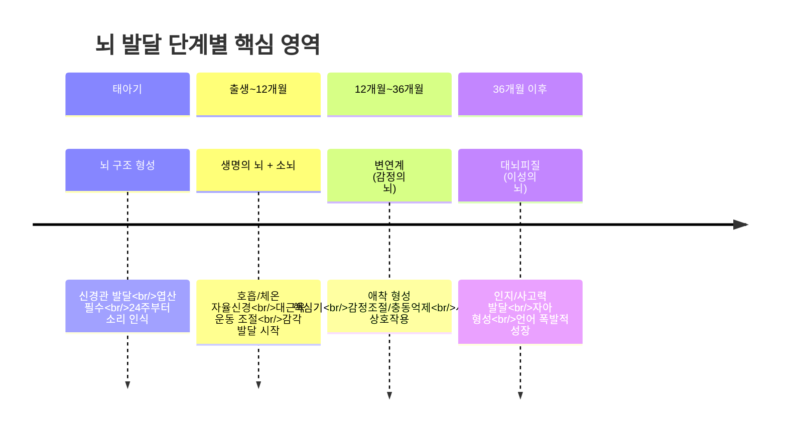
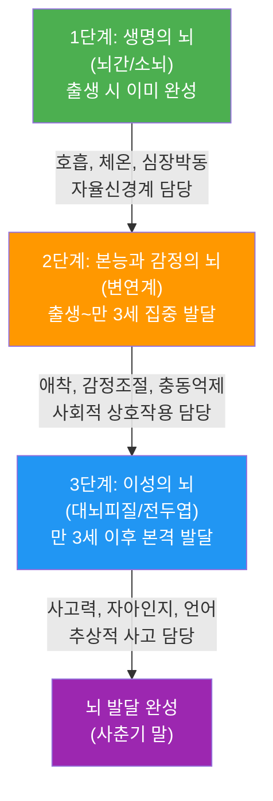

아기의 뇌는 만 3세까지 성인 뇌의 **80%**가 완성됩니다. 만 5세가 되면 90%까지 도달하고, 사춘기가 끝나면 거의 성인과 동일해집니다. 신의진 교수는 이를 이렇게 설명합니다.

> "세 돌까지는 뇌의 구조와 기능이 무지 빨리 바뀝니다. 어린 시절일수록 뇌 발달이 중요한데, 역설적이게도 부모님들은 이상 징후를 빨리 발견하지 못하는 경우가 많습니다."

이 시기가 중요한 이유는 단순히 "빨리 자라서"가 아닙니다. 뇌는 **쓰지 않는 신경망을 잘라버리는** 방식으로 발달합니다. 충분한 자극을 받은 신경망은 살아남고, 자극을 받지 못한 신경망은 연결이 끊어져 세포가 있어도 기능하지 못하게 됩니다. 신의진 교수의 표현을 빌리면 "의자 빼기 게임"과 같습니다. 이것이 바로 환경과 양육이 아이의 뇌를 물리적으로 바꿀 수 있는 원리입니다.

---

## 태아기: 뇌의 기초공사

### 엽산 -- 뇌 기형을 막는 첫 번째 방패

태아기는 뇌 자체가 만들어지는 시기입니다. 신경관이라는 튜브 형태의 구조에서 뇌가 동그랗게 형성되고 척추까지 이어지는 과정이 이때 일어납니다. 호산병원 소아과 전문의는 이 시기를 이렇게 설명합니다.

> "태아 시기는 뇌 자체가 만들어지는 시기예요. 신경관이 제대로 발달하지 못하면 뇌 기형이 일어날 수 있습니다. 특히 엽산 결핍이 이루어지는 경우에는 신경관이 제대로 발달하지 못해서 기형이 생길 수 있어요."

**구체적 실천 방법:**

- **임신 계획 단계부터** 엽산 보충제 복용 시작 (임신 초기 신경관 형성은 수정 후 3~4주에 시작되므로, 임신을 알기 전부터 준비 필요)
- 엽산 권장 섭취량: 하루 **400~800mcg** (의사와 상의하여 개인별 조절)
- 엽산이 풍부한 식품을 식단에 포함: 시금치, 브로콜리, 아스파라거스, 렌틸콩, 아보카도
- 보충제에만 의존하지 말고 **균형 잡힌 식사**를 기본으로 할 것

### 임신 중 영양 -- 탄수화물, 단백질, 지방의 균형

호산병원 전문의는 태아와 영아의 뇌 발달에서 3대 영양소의 역할을 구체적으로 설명합니다.

- **탄수화물**: 뇌가 에너지로 사용하는 핵심 연료. 엄마가 다이어트 습관으로 탄수화물을 지나치게 제한하면 태아의 뇌에 에너지 공급이 부족해질 수 있음
- **단백질 (특히 고기의 철분)**: 만 9개월 때 빈혈 수치가 10 미만이었던 아이들이 이후 IQ 검사에서 빈혈이 없던 아이들보다 **현저히 낮은 점수**를 기록했다는 연구 결과가 있음
- **지방 (특히 오메가3)**: 뇌 신경전달물질에 영향을 주는 핵심 영양소. 등푸른 생선, 새우 등 해산물에 풍부
- **달걀**: 임신 중 하루 달걀 1개를 꾸준히 섭취하면 달걀에 포함된 DHA와 콜린이 태아의 뇌 발달에 기여

**DO:**
- 임신 중 하루 달걀 1개 꾸준히 섭취
- 탄수화물, 단백질, 지방을 골고루 섭취
- 등푸른 생선(연어, 고등어 등)을 주 2~3회 섭취하여 오메가3 보충

**DON'T:**
- 다이어트 목적의 탄수화물 극단적 제한
- 특정 영양소에만 집중하는 편향적 식단

### 태아가 듣는 소리 -- 24주부터 시작되는 교감

뇌과학 교수의 연구에 따르면, 태아는 임신 **24주(약 6개월)** 부터 소리를 들을 수 있습니다. 그리고 임신 **28주**부터는 **암묵적 기억**(의식하지 못하지만 현재 상태에 영향을 주는 기억)이 형성됩니다.

뇌과학 교수는 이렇게 설명합니다.

> "태어나자마자 울던 아기가 엄마 아빠의 목소리를 듣자마자 울음을 멈추는 현상도 태아의 기억과 관련이 있을 수 있습니다. 태어나면서 엄마 품에 안기면 열 명 중 여덟, 아홉 명은 울음을 그칩니다."

또한 혈류 소리("쉬~" 하는 소리)에 아기가 쉽게 안정되는 것도, 뱃속에서 들었던 혈류 흐름 소리를 기억하기 때문이라고 합니다. 교수의 아들도 "뱃속에서 '쏴' 하는 소리가 들렸고 머리카락이 시원했다"고 이야기한 적이 있다고 합니다. 물론 해마가 임신 3기에야 구조가 완성되므로, 명시적 기억은 일부만 보존될 수 있고 왜곡 가능성도 있습니다.

**구체적 실천 방법:**

- **임신 24주 이후**부터 매일 일정한 시간에 태아에게 말 걸기 (예: 매일 저녁 취침 전 10~15분)
- 이름이나 태명을 정해서 **반복적으로** 불러주기 -- 출생 후 그 소리에 안정감을 느낌
- **아빠도** 배에 대고 이야기하기 -- 출생 후 아빠 목소리에도 반응하게 됨
- 차분한 음악이나 자장가를 들려주기 (출생 후 같은 노래에 안정 반응을 보일 수 있음)
- 급격한 큰 소리, 소음 환경은 피하기

> 핵심 포인트: 태아가 소리를 듣는다는 사실은 과학적으로 확인되었습니다. "아기가 뭘 알겠어"라고 생각하지 말고, 24주 이후부터는 적극적으로 말을 걸어주세요.

### 태아 기억의 과학적 근거

아이들이 "뱃속이 따뜻했어요", "헤엄쳤어요"라고 말하는 것이 단순한 상상일까요? 뇌과학 연구에 따르면 완전히 근거 없는 이야기는 아닙니다.

- **5개월 이후**부터 감각 신경망이 만들어지기 시작
- **28주**부터 암묵적 기억 형성 가능
- **임신 3기**(약 28주 이후)에는 해마체의 구조가 완성되어 **명시적 기억도 일부 보존** 가능
- 단, 만 3~4세 이후 해마가 더 성숙하면서 이 기억들은 **가지치기(pruning)**되어 사라짐

이것이 의미하는 바는 명확합니다. 태아기는 "아무것도 모르는 시기"가 아니라, 이미 세상을 **느끼고 기억하기 시작하는** 시기입니다. 임신 중 스트레스 관리, 평화로운 환경, 따뜻한 말 걸기가 중요한 과학적 이유가 여기에 있습니다.

---

## 출생 직후: 첫 교감의 시작

### 캉가루 케어 -- 피부 대 피부 접촉의 힘

육아닥터 김숙자 원장은 캉가루 케어의 중요성을 이렇게 강조합니다.

> "아기를 엄마 가슴에 안아주는 것, 캉가루 케어라고 하는데, 그게 아기한테 교감을 받고 훨씬 잘 자라요. 너무 작게 태어난 아기들도 엄마 가슴을 열고 아기를 거기에 안아주면 상당히 긍정적인 역할을 합니다."

캉가루 케어는 특히 미숙아에게 효과적인 것으로 알려져 있지만, 정상 체중으로 태어난 아기에게도 체온 안정, 심박수 안정, 뇌 발달 촉진 효과가 있습니다.

**구체적 실천 방법:**

1. **출생 직후**: 가능하다면 분만실에서 즉시 아기를 엄마의 맨살 가슴에 올려놓기
2. **매일 실천**: 하루 **30분~1시간** 이상, 아기를 부모의 맨살 가슴 위에 엎드려 안기
3. **아빠도 참여**: 엄마뿐 아니라 아빠의 맨살 위에서도 캉가루 케어 실시 -- 아빠와의 유대감 형성에 큰 도움
4. **자세**: 아기의 머리를 옆으로 돌려 귀가 부모의 심장 위에 오도록 하면, 심장 박동 소리를 들으며 안정감을 느낌
5. **환경**: 조용하고 따뜻한 환경에서, 아기 등에 담요를 덮어 체온 유지

### 애착 형성의 핵심 -- "반응성"

호산병원 전문의는 애착 형성에서 가장 중요한 것은 **반응성**이라고 강조합니다.

> "부모가 아이를 많이 안아주고, 아이가 필요할 때 부모가 달려와서 원하는 걸 해주는 것, 이것들이 굉장히 중요합니다. 예를 들면 귀저기가 젖고 배고픈데 아무도 그걸 해주지 않고 방치되어 있었다면 그게 뇌 발달에 영향을 줄 수 있어요."

특히 충격적인 연구 결과가 있습니다.

> "엄마가 산후우울증으로 아이가 배고프다고 울고 있는데도 즉각적으로 반응을 해주지 않았을 때, 그런 아이들의 뇌 MRI를 찍었더니 뇌가 정상적으로 발달하지 못하고 되게 쪼그라든 작은 뇌로 발달을 한 거예요."

이것은 반응성이 단순한 "정서적 안정" 수준이 아니라, **물리적 뇌 크기**에까지 영향을 미친다는 것을 보여줍니다.

**구체적 실천 방법:**

- 아기가 울면 **가능한 빨리** 원인을 파악하고 대응하기 (배고픔, 기저귀, 불편감 등)
- 기저귀를 갈아줄 때도 **말을 걸면서** 하기 -- "기저귀 갈아주니까 기분이 좋겠구나"
- 아기가 옹알이를 하면 **대화하듯 반응**하기 -- "우리 아기가 뭔가 했네, 기분이 좋은가 보구나"
- 수유 중에도 눈을 맞추고 이야기해주기
- **조용히 키우는 것은 위험**: 김숙자 원장은 "아기가 말 대답 안 한다고 말을 안 하고 조용하게 키우면 안 좋아요"라고 경고

**산후우울증 주의:**
- 산후우울증이 있으면 아기에 대한 반응성이 떨어질 수 있음
- 이는 아기의 뇌 발달에 직접적 영향을 미치므로, 산후우울증 증상이 있다면 **즉시 전문가 도움**을 받을 것
- 가족 구성원이 함께 양육에 참여하여 엄마의 부담을 줄일 것

### 신생아 수면 환경

수면은 뇌 발달에서 빠질 수 없는 요소입니다. 시냅스 형성과 기억 저장이 수면 중 가장 활발하게 일어나기 때문입니다.

**연령별 권장 수면 시간:**

| 연령 | 권장 수면시간 |
|------|-------------|
| 신생아 (0~3개월) | 14~17시간 |
| 영아 (4~11개월) | 12~15시간 |
| 유아 (1~2세) | 11~14시간 |
| 미취학 (3~5세) | 10~13시간 |

**구체적 실천 방법:**

- **낮과 밤 구분**: 낮에는 밝고 활동적인 환경, 밤에는 어둡고 조용한 환경 유지
- **매일 같은 시간, 같은 장소**에서 재우기 -- 수면 루틴 형성
- 잠들기 전 **일관된 수면 의식** 만들기 (예: 목욕 -> 마사지 -> 자장가 -> 취침)
- 수면 환경: 적정 온도 20~22도, 적정 습도 50~60%
- "순한 아기"라고 안심하지 말 것 -- 김숙자 원장은 "옛날에 아기가 순하다고 한 건, 자고 먹기만 하는 건데, 이것이 좋은 것이 아니다"라고 지적

### 백색소음: 효과는 있지만, 안전하게 사용하는 법

백색소음이 아기를 재우는 데 효과적인 것은 사실입니다. 아기가 자궁 안에서 약간 시끄러운 환경(엄마의 혈류 소리, 장기 소리 등)에서 지냈기 때문에, 비슷한 소리를 들으면 안정감을 느끼는 것입니다. 하지만 베싸TV에서는 과학적 연구를 근거로 **장시간 사용의 위험성**을 경고합니다.

**동물 실험 결과 (쥐 대상):**

1. **첫 번째 실험**: 아기 쥐에게 2주간 하루 8시간씩 80dB 백색소음 노출 -> 소리 정보를 기반으로 탐구하는 능력이 손상됨
2. **두 번째 실험**: 백색소음 노출 후 소리 감각에 대한 역치가 높아지고, 자극이 전기 신호로 변환되는 시간이 길어짐. 반면 **성체 쥐에게는 같은 변화가 없었음** -- 발달 중인 뇌에만 영향
3. **세 번째 실험**: 60~70dB 정도의 가벼운 백색소음도 장기 노출 시, 외부 소리를 조합하는 능력이나 배경 소음에서 사람 말소리를 구분해내는 능력이 저하

연구자는 이렇게 경고합니다.

> "백색소음과 같은 랜덤한 정보들을 받을 때 뇌가 부정적인 방향으로 프로그래밍된다는 증거들이 드러나고 있다."

또한 자는 아기에게 백색소음을 들려주었을 때 **수면 중에도 심장 박동이 빨라지는** 현상이 관찰되었습니다.

**안전한 백색소음 사용 가이드:**

| 항목 | 기준 |
|------|------|
| 최대 볼륨 | **50dB 이하** (신생아실 소음 규제 기준) |
| 기기 거리 | 아기로부터 **최소 2m 이상** |
| 사용 시간 | 아기가 잠들면 **30분~1시간 후 끄기** |
| 밤새 사용 | **절대 금지** (수면 중에도 뇌가 소리 정보를 처리함) |
| 소음 종류 | 청소기 소리 유형의 균일한 백색소음 (특정 소리가 튀거나 강조되는 ASMR은 부적합) |

**DO:**
- 스마트폰의 데시벨 측정 앱으로 실제 아기 위치에서의 소음 크기를 반드시 확인
- 백색소음 대신 **엄마/아빠가 직접 자장가를 불러주는 것**도 효과적 (베싸TV 운영자도 자장가 4곡을 돌려가며 부른다고 함)
- 참고로 50dB은 청소기를 켜고 **약 2m** 떨어진 정도의 소리 크기

**DON'T:**
- 아기 바로 옆에 스마트폰을 놓고 백색소음 앱 틀기
- 밤새 백색소음을 켜놓고 재우기
- 어른 기준으로 "이 정도면 괜찮겠지" 하고 볼륨 설정하기 (아기는 어른보다 소음에 민감)

### 휴대폰 전자파 -- 걱정은 하되 공포는 금물

백색소음을 스마트폰으로 틀어줄 때 전자파가 걱정되시나요? 베싸TV의 분석에 따르면:

- 아기는 두개골이 얇고 뇌 조직의 전자파 흡수율이 높아 **어른보다 2배 이상** 흡수
- 그러나 메타분석 논문들에서 인체 유해성의 확정적 근거는 **아직 없음**
- 호주에서 30년간 휴대전화 보급이 급증했지만 뇌종양 발병률은 증가하지 않음
- 전자파 차단 스티커/케이스는 **과학적 효과 없음**

**현실적 대응:** 확실한 해결책은 하나, **거리를 두는 것**입니다. 전자파는 거리에 따라 급격히 감소하므로, 백색소음을 틀어줄 때 스마트폰을 아기 머리에서 최대한 멀리 두면 됩니다.

---

## 감정조절의 씨앗 뿌리기

### 0세 훈육이란 무엇인가

"0세부터 훈육?"이라고 하면 많은 부모가 놀랍니다. 하지만 여기서 말하는 훈육은 "안 돼!"라고 혼내는 것이 아닙니다. 발달심리학자 김수현 박사는 이렇게 정의합니다.

> "0세부터의 훈육이란, 옳고 그름을 가르치는 것이 아니라 **아이의 감정조절 능력을 키워주는 것**입니다. 감정조절 능력이 좋은 아이는 남을 배려하고 타인과도 잘 어울리고, 책임감과 자존감이 높은 사회성이 좋은 성인으로 성장하게 됩니다."

미국 소아정신과 의사이자 전 하버드대 교수인 브래즐턴 박사도 이렇게 말합니다.

> "갓 태어난 신생아도 감정조절 능력을 가지고 태어나고, 태어났을 때부터 스트레스 상황에서의 감정조절 능력을 향상시켜 주어야 한다."

### "작은 자극 vs 강한 자극" -- 아기가 울 때 대응법

이것이 0세 훈육의 핵심입니다. 아기가 울 때 엄마 아빠의 반응을 두 가지로 나눕니다.

**강한 자극 (피해야 할 반응):**
- 아기 울음에 **당황하여** 자신의 호흡도 가다듬지 못한 채 급히 아기를 안아 올림
- 불안한 목소리, 안타까운 목소리로 "어머 왜 그래, 아이고 어떡해" 하며 달래기
- 아기를 세게 흔들면서 달래기

**작은 자극 (실천해야 할 반응):**
- 아기에게 **얼굴을 보여주며** 다가가기
- **안정된 숨소리**를 들려주기
- **다정하고 차분한 목소리**로 안심시키는 말 하기
- 딸랑이 등 장난감을 보여주며 주의 돌리기

**구체적 실천 시나리오 -- 수유 시간:**

1. 아기가 배고파서 울기 시작합니다
2. **즉시 달려가지 않습니다.** 대신 아기에게 다가가 눈을 맞추며 말합니다: "잠깐만 아가야, 기저귀 확인하고 바로 맘마 줄게"
3. 기저귀 상태를 확인합니다
4. 수유 준비를 합니다 (분유를 타든, 직수 준비를 하든)
5. **준비하는 동안에도** 부엌에서 말을 걸어줍니다: "엄마가 지금 준비하고 있어, 금방 갈게"
6. 준비가 되면 **서두르지 않는 페이스로** 돌아와 "자, 이제 준비됐다. 엄마가 맘마 줄게"라고 말하며 수유 시작

이 과정의 핵심은 **아기에게 "잠깐 기다리면 부모가 반드시 해결해준다"는 경험을 반복적으로 제공**하는 것입니다.

로운맘(유튜버)은 둘째 아이에게 이 방법을 실천한 결과를 이렇게 전합니다.

> "김수현 박사님 말씀대로 아기에게 얼굴을 보여주고 '맘마 가져올게'라고 이야기하는 순간부터 울지 않았습니다. 본인도 조금만 기다리면 엄마 아빠가 다시 짠 하고 와서 필요한 것을 해결해준다는 것을 알게 된 거죠."

### 6개월 이후의 변화

김수현 박사에 따르면, 6개월 이후부터는 **이전만큼 빨리 달려가지 않아도 됩니다.** 아기가 엄마 아빠의 **목소리만으로도** "가까이에 있다"는 것을 인지할 수 있을 만큼 인지 능력이 발달하기 때문입니다.

- 6개월 이후: 눈에 보이지 않아도 **목소리**로 부모의 존재를 확인 가능
- 7개월 이후: 간단한 말을 알아듣기 시작 -> "안 돼"라는 메시지를 **말과 목소리**로 전달 가능
- 4개월 이후: 엄마 아빠의 **표정**(좋다/싫다)을 읽을 수 있음 -> 얼굴 표정으로 메시지 전달 가능

### 과잉보호의 위험

많은 부모가 "아기에게 안 된다고 하면 자존감이 떨어지지 않을까?"라는 두려움으로 모든 것을 허용합니다. 하지만 김수현 박사는 이것이 오히려 역효과라고 경고합니다.

> "과잉보호는 아동학대와 마찬가지로 아기가 감정 조절에 어려움을 겪는 결과를 초래하게 됩니다."

**과잉보호의 실제 결과:**
- 아기가 스스로 해볼 기회를 빼앗김 -> 감정조절 능력 발달 저해
- 유치원이나 학교에서 원하는 것을 할 수 없거나 질책을 받았을 때, 그 스트레스를 스스로 감당하지 못함
- 오히려 **자존감이 떨어지는** 결과로 이어짐

**올바른 자존감의 의미:**
- 자존감 = 자신을 사랑하고 존중할 줄 아는 마음
- 사회성 = 상대방을 이해하고 배려할 수 있는 힘
- 이 두 가지는 **적절한 훈육을 통해서** 길러지는 것이지, 모든 것을 허용한다고 생기는 것이 아님

**DO:**
- 아기가 스스로 할 수 있는 것(손 뻗어 잡기, 뒤집기 시도 등)은 직접 해보게 하기
- 시도하다 힘들어하면 **격려하는 목소리**로 응원하고, 끝까지 안 되면 그때 도와주기
- "안 돼"라는 말이 필요한 상황(위험한 행동, 타인에게 해가 되는 행동)에서는 **일관되게** 안 된다는 메시지를 전달

**DON'T:**
- 아기가 할 수 있는 것까지 다 해주기 (이것이 과잉보호)
- "아기니까 다 괜찮아"라며 모든 행동을 허용하기
- 아기가 울면 무조건적으로 원하는 것을 들어주기

> 기억하세요: "우리 아기들은 끊임없이 '나 스스로 할 수 있게 나를 도와주세요'라고 말하고 있다는 사실을요." -- 김수현 박사

---

## 뇌 발달의 순서 -- 왜 순서가 중요한가

신의진 교수는 뇌 발달에는 **정해진 순서**가 있으며, 이 순서를 거스르면 심각한 문제가 생길 수 있다고 강조합니다.

신의진 교수의 경고.

> "한참 본능의 뇌가 발달해야 될 때 인지를 많이 쓰게 시키면, 본능 쪽에 있는 신경망은 없어져 버립니다. 그러면 시는 잘 외우지만 감정 조절도 안 되고, 다른 사람 마음도 읽지 못하고, 상호작용을 못하는 사람이 될 수도 있습니다."

**실제 사례 -- 영상 중독의 위험:**

신의진 교수는 6개월부터 형이 보는 영어 비디오를 하루 9시간씩 본 아이의 뇌 MRI를 보여주었습니다. 정상 아이의 뇌에서는 변연계 부분이 빨갛게 활성화되어 있었지만, 이 아이의 변연계에는 **불이 하나도 들어와 있지 않았습니다.** 시선 접촉도 되지 않고, 말도 못했으며, 처음에는 자폐증이나 심한 정신지체로 의심받았습니다.

다행히 이 아이는 세 돌 때부터 모든 비디오를 끊고 치료를 받아 회복되어 현재 정상적인 대학생으로 살고 있습니다. 하지만 이 사례는 **잘못된 자극이 얼마나 뇌를 바꿀 수 있는지**를 극적으로 보여줍니다.

**핵심 원칙:**
- 0~3세에는 **인지 교육(한글, 영어, 수학 등)보다 정서적 교감과 신체 놀이**가 우선
- 아이가 좋아하는 놀이를 따라가면 됨 -- 아이들은 본인의 뇌 발달에 필요한 것을 **가장 좋아함**
- 7~8개월의 까꿍놀이, 돌 전후의 탐색 놀이 등은 전 세계 아이들이 공통적으로 좋아하는데, 이는 그 시기에 **그 자극이 신경망을 가장 많이 확장시키기 때문**
- 디지털 영상(TV, 태블릿, 스마트폰)은 **중독성이 높아** 뇌의 특정 영역만 과도하게 자극하므로 최대한 제한

---

## 감각 발달을 위한 환경 만들기

### 손싸개/속싸개는 2개월이면 풀어주기

신생아 시기에 손싸개와 속싸개는 아기가 자신의 얼굴을 할퀴는 것을 방지하기 위해 필요합니다. 하지만 **생후 2개월이 되면 반드시 풀어줘야** 합니다. 손의 자유로운 움직임이 촉각 발달의 시작이기 때문입니다.

**구체적 실천 방법:**
- 생후 2개월이 되면 손싸개, 속싸개를 풀어주기
- 다양한 질감의 물체를 아기 손에 쥐어주기 (헝겊, 나무, 실리콘 등)
- 아기가 손을 입에 넣는 것도 탐색 과정이므로 과도하게 제지하지 않기 (단, 위생 관리 필수)

### 청각 자극 -- 시각보다 먼저 발달

신생아의 청각은 시각보다 먼저 발달합니다. 따라서 초기에는 시각적 장난감보다 **소리 나는 장난감**이 더 효과적입니다.

**구체적 실천 방법:**
- **신생아~1개월**: 다양한 악기를 아기 근처에서 부드럽게 흔들어 소리 들려주기. 한 번에 한 가지 악기만 사용하고, 아기의 반응(고개 돌림, 눈 깜빡임)을 관찰하며 소리 방향을 바꿔가며 들려주기
- **1~3개월**: 자동 회전 모빌을 아기 눈에서 20~30cm 거리에 설치. 아기의 시선이 모빌을 따라가는지 관찰하며 시각 추적 능력 발달 확인

---

## 이 시기 필수 체크리스트

### 해야 할 것 (DO)

- **엽산 섭취**: 임신 계획 단계부터 시작, 하루 400~800mcg
- **균형 잡힌 식사**: 탄수화물, 단백질(고기/철분), 지방(오메가3) 고루 섭취
- **달걀**: 임신 중 하루 1개 꾸준히 섭취 (DHA, 콜린)
- **태담**: 임신 24주 이후 매일 일정 시간에 아기에게 말 걸기, 아빠도 참여
- **캉가루 케어**: 출생 직후부터 매일 30분~1시간, 맨살 접촉
- **즉각적 반응**: 아기가 울면 원인을 파악하고 반응하기 (방치 금지)
- **말 걸기**: 아기가 대답하지 못해도 항상 대화하듯 말 걸기
- **감정조절 기회 제공**: 울 때 "작은 자극"으로 먼저 접근, 스스로 진정할 시간 주기
- **충분한 수면**: 신생아 14시간 이상, 낮밤 구분 확실히
- **다양한 감각 자극**: 소리, 촉감, 시각 자극을 골고루 제공
- **머리둘레 측정**: 정기적으로 성장 확인 (뇌 발달의 객관적 지표)
- **모유 수유**: 가능하면 출산 직후부터 시작, 최소 6개월 유지 목표
- **소고기**: 6개월부터 하루 10g, 중기 20~30g, 돌 때 40g 이상 (빈혈 예방)

### 하면 안 되는 것 (DON'T)

- **영상 노출**: 만 2세 이전 TV, 태블릿, 스마트폰 영상 최소화 (특히 장시간 반복 시청 금지)
- **백색소음 과다 사용**: 50dB 초과 금지, 밤새 틀어놓기 금지, 기기는 2m 이상 거리
- **조기 인지 교육**: 0~3세에 한글/영어/수학 등 강요 금지 (변연계 발달 시기에 인지 자극은 오히려 해로움)
- **과잉보호**: 아기가 스스로 해볼 수 있는 것을 대신 해주지 않기
- **방치**: 산후우울증 등으로 아기의 욕구에 반응하지 못하는 상태 방치 금지
- **비교**: 옆집 아이와 발달 속도 비교 금지 (이 시기 발달 속도 격차는 정상)
- **2개월 이후 손싸개/속싸개**: 감각 발달을 방해하므로 풀어줄 것
- **24개월 이전 저지방 우유**: 이 시기에는 지방 공급이 뇌 발달에 중요하므로 일반 우유로
- **아동학대**: 신체적/정신적 학대는 물론, 심한 무관심과 방치도 뇌 발달에 물리적 손상을 줌

---

## 마무리 -- "아이를 따라가라"

신의진 교수는 이렇게 조언합니다.

> "아이들은 본인이 필요한 것을 가장 좋아합니다. 아이들을 따라가라, 이것이 아이의 뇌 발달에 최적의 자극이기도 합니다."

뇌 발달에 특별한 비법은 없습니다. 균형 잡힌 영양, 안정된 애착, 충분한 수면, 다양한 경험, 그리고 놀이. 이 기본에 충실하면 됩니다. "뇌에 좋다"는 마케팅에 흔들리기보다, 아기가 보내는 신호를 읽고, 적시에 반응하고, 아기가 좋아하는 놀이를 함께 해주는 것. 이것이 67개 전문가 영상이 공통적으로 전하는 메시지입니다.

그리고 혹시 발달에 이상이 느껴진다면, 신의진 교수의 당부를 기억하세요.

> "제발 세 돌 전에 오세요. 두 돌 전은 너무 좋습니다. 하지만 세 돌이 지나가면 일부 부분이 완전히 안 돌아올 수도 있습니다."
