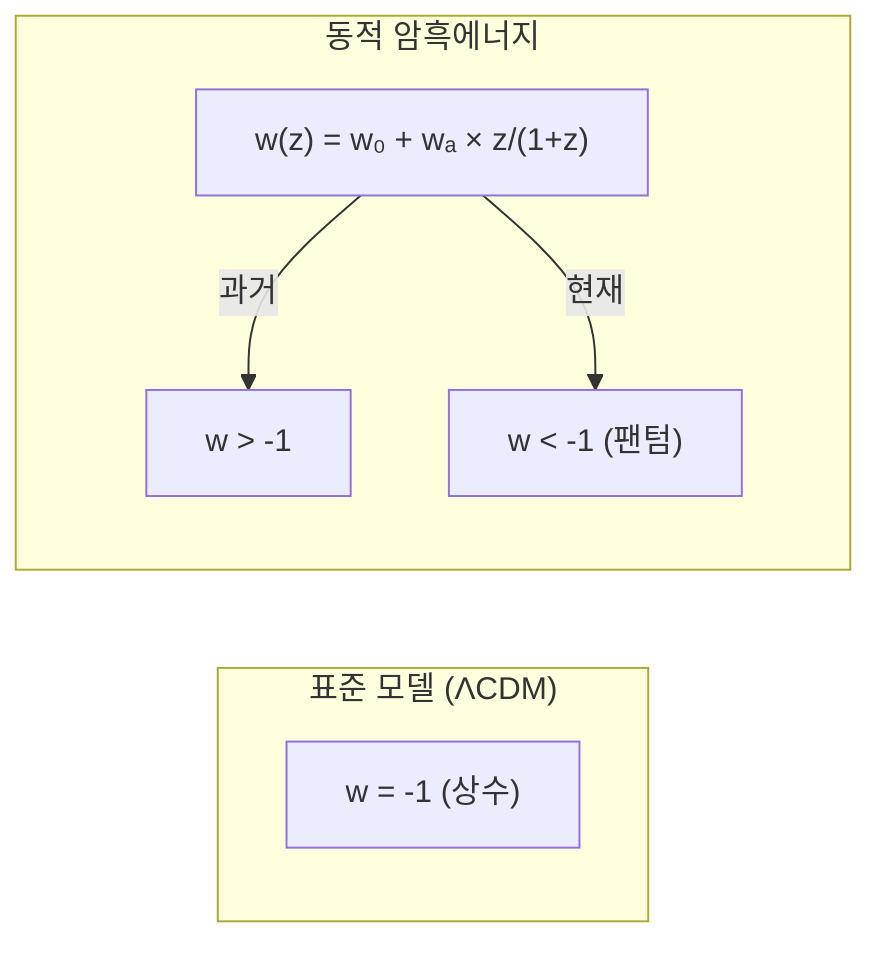

최근 인도 공과대학(IIT) 조드푸르의 연구원이 발표한 논문이 화제가 되고 있다. 우주의 암흑에너지가 마치 **점성 유체처럼** 작용하여 팽창에 "지연 시간"이 존재한다는 주장이다. 일부 과학 유튜브 채널에서는 이를 **"우주의 프레임 드랍"**에 비유하며 시뮬레이션 우주론과 연결짓기도 했다.

이 글에서는 원본 논문을 직접 분석하고, 영상 내용의 정확성을 검증하며, 허블 텐션 문제에 대한 다양한 최신 해석들을 종합적으로 정리한다.

---

## 허블 텐션이란?

**허블 텐션(Hubble Tension)**은 우주의 팽창 속도를 나타내는 **허블 상수(H₀)**가 측정 방법에 따라 다르게 나오는 현상이다.

### 두 가지 측정 방법의 충돌

| 측정 방법 | 허블 상수 (km/s/Mpc) | 관측 대상 |
|----------|---------------------|----------|
| 초기 우주 기반 (Planck) | ~67.4 ± 0.5 | 우주배경복사(CMB) |
| 현재 우주 기반 (SH0ES) | ~73.0 ± 1.0 | Type Ia 초신성, 세페이드 변광성 |

두 값의 차이는 약 **9%**로, 통계적 허용 오차를 한참 넘어선다. 이를 "텐션(긴장)"이라고 부르는데, 최근에는 **"허블 위기(Hubble Crisis)"**로 격상해야 한다는 목소리도 나온다.

```
    초기 우주                          현재 우주
    (138억 년 전)                      (지금)
        │                                │
        │   CMB 관측                     │   초신성 관측
        ▼                                ▼
    H₀ ≈ 67 km/s/Mpc              H₀ ≈ 73 km/s/Mpc
        │                                │
        └────────── 차이 ≈ 9% ──────────┘
                        ↓
                   허블 텐션!
```

> **왜 문제인가?** 우리의 표준 우주론 모델(ΛCDM)이 정확하다면, 어떤 방법으로 측정하든 같은 값이 나와야 한다. 이 불일치는 **새로운 물리학**이 필요할 수도 있음을 시사한다.

---

## 논문 분석: 점성 암흑에너지 모델

### 기본 정보

- **제목**: Spatial Phonons: A Phenomenological Viscous Dark Energy Model for DESI
- **저자**: Muhammad Ghulam Khuwajah Khan (IIT Jodhpur)
- **발표일**: 2025년 11월 20일 (arXiv 프리프린트)
- **논문 링크**: [arXiv:2512.00056](https://arxiv.org/abs/2512.00056)

### 핵심 아이디어

논문은 공간을 **균일한 장력을 가진 탄성 막(elastic membrane)**으로 모델링한다. 이 막 위에서 **공간적 포논(Spatial Phonons)**이라는 음향파가 전파되며, 이것이 암흑에너지의 효과에 영향을 미친다.


### 주요 파라미터

논문에서 도입한 핵심 개념은 **이완 시간 τ(tau)**다:

| 파라미터 | 의미 |
|---------|------|
| τ (tau) | 점성압력이 평형 상태에 도달하는 데 걸리는 특성 시간 |
| H★ | 전이가 일어나는 특성 허블률 (H★/H₀ ≈ 2.1) |
| ε, κ | 시스템 특성을 결정하는 무차원 파라미터 (≈ 1/3) |

### 물리적 해석

- 암흑에너지가 우주를 밀어내는 효과가 **즉시 반영되지 않고 지연**된다
- 이 지연은 허블률에 의존하므로, 우주 역사의 다른 시기에 다르게 나타난다
- H ≈ H★ 근처에서 일시적으로 **팬텀 편차(phantom deviation)**가 발생

> **팬텀 암흑에너지**: 상태방정식 w < -1인 경우. 일반적인 암흑에너지(w = -1)보다 더 강하게 우주를 팽창시킨다.

---

## 영상 내용 팩트체크

해당 [유튜브 영상](https://youtu.be/DjhatlKC5yU)의 내용을 논문과 비교 분석했다.

### 정확한 부분

| 영상 내용 | 판정 | 설명 |
|----------|------|------|
| 인도 공과대학 연구팀 | ✅ 정확 | IIT Jodhpur 소속 |
| DESI 데이터 사용 | ✅ 정확 | 논문은 DESI BAO 측정 데이터 기반 |
| 허블 텐션 설명 | ✅ 대체로 정확 | 기본 개념 설명은 올바름 |
| 우주가 유체처럼 행동 | ✅ 정확 | 논문의 핵심 주장 |

### 오류 및 확대 해석

| 영상 내용 | 판정 | 실제 |
|----------|------|------|
| "타워값" | ⚠️ 발음 오류 | τ(tau)를 "타워"로 발음 |
| "프레임 드랍" 비유 | ⚠️ 영상 제작자의 비유 | 논문에서는 이런 표현 사용 안 함 |
| 시뮬레이션 우주 증거 | ❌ 과대 해석 | 논문은 이런 주장을 하지 않음 |
| "연산 지연" | ⚠️ 비유적 표현 | 실제로는 물리적 이완 시간 |
| "우주 엔진의 렉" | ❌ 과대 해석 | 물리 모델을 게임에 비유한 것일 뿐 |

### 중요한 주의사항

1. **논문은 아직 피어리뷰 전**: arXiv 프리프린트로, 학술지에 정식 게재되지 않았다
2. **"시뮬레이션 우주" 주장과 무관**: 논문은 순수 물리학 모델을 제안한 것이며, 우주가 시뮬레이션이라는 주장을 전혀 하지 않는다
3. **비유와 실제의 차이**: "프레임 드랍"이나 "렉"은 이해를 돕기 위한 비유일 뿐, 실제 물리 현상과 동일시해서는 안 된다

---

## 허블 텐션의 다양한 최신 해석

허블 텐션을 설명하기 위한 여러 이론들이 제안되고 있다.

### 1. 초기 암흑에너지 (Early Dark Energy, EDE)

가장 유력한 후보 중 하나. 빅뱅 직후 잠시 존재했다가 사라지는 새로운 형태의 암흑에너지를 도입한다.

```
시간 →
빅뱅 ─────●───────────────────────────→ 현재
           │
           │ EDE 활성화
           │ (물질-복사 등가 시기)
           │
           ▼
    음향 지평선 감소 → H₀ 증가
```

- **장점**: CMB와 지역 측정 값의 차이를 줄일 수 있음
- **단점**: 새로운 스칼라장 도입 필요, 미세 조정 문제

**참고**: [arXiv:2302.09032 - Early Dark Energy 리뷰](https://arxiv.org/abs/2302.09032)

### 2. 동적 암흑에너지 (Dynamical Dark Energy)

암흑에너지가 상수(Λ)가 아니라 시간에 따라 변한다는 가설.

#### DESI 2025 결과

[DESI DR2 결과](https://www.desi.lbl.gov/2025/03/19/desi-dr2-results-march-19-guide/)에 따르면:

- 암흑에너지의 시간 진화에 대한 증거가 **3.9 sigma** 수준으로 강화됨
- 현재 암흑에너지 밀도가 **감소 중**일 가능성



### 3. 상호작용 암흑에너지 (Interacting Dark Energy)

암흑에너지와 암흑물질 사이에 에너지 교환이 있다는 가설.

| 모델 | 특징 |
|------|------|
| 결합 퀸테센스 | 스칼라장이 암흑물질과 결합 |
| 모멘텀 전이 | 암흑물질이 암흑에너지로부터 운동량 획득 |

### 4. 상대론적 암흑물질 (Relativistic Dark Matter)

초기 우주에 추가적인 상대론적 입자가 존재했다는 가설.

- 초기 우주의 허블률 증가 → 음향 지평선 감소
- **ΔN_eff** (유효 중성미자 개수) 증가로 구현

### 5. 수정 중력 이론 (Modified Gravity)

일반상대성이론을 수정하여 설명하려는 시도.

- f(R) 중력
- 스칼라-텐서 이론
- MOND (수정 뉴턴 역학)

### 6. 시스템 오차 가능성

새로운 물리학이 아닌, 측정 오차의 가능성도 배제할 수 없다.

| 측정 | 잠재적 오차 요인 |
|------|-----------------|
| Type Ia 초신성 | 광도진화 효과, 먼지 흡수 |
| 세페이드 변광성 | 금속함량에 따른 보정 |
| TRGB (적색거성) | 선택 효과 |

---

## ACT 결과: 많은 모델들이 배제됨

[아타카마 우주론 망원경(ACT)](https://www.space.com/astronomy/hubble-tension-is-back-again-as-a-new-cosmic-map-deepens-the-puzzle)의 최신 결과는 허블 텐션을 더욱 견고하게 만들었다:

> "ACT CMB 데이터에서 추론한 허블 상수가 Planck와 일치한다. 온도뿐 아니라 편광 데이터에서도 마찬가지다. 이는 허블 불일치를 더욱 강건하게 만든다."
> — 콜린 힐 (Colin Hill), 우주론자

이 결과로 많은 "확장 모델"들이 배제되었다.

---

## 결론

### 논문에 대하여

IIT 조드푸르의 점성 암흑에너지 모델은 흥미로운 시도지만:

1. **아직 검증되지 않은 가설**이다 (피어리뷰 전)
2. 시뮬레이션 우주와는 **전혀 무관**하다
3. 허블 텐션 해결의 **많은 후보 중 하나**일 뿐이다

### 허블 텐션에 대하여

- **문제는 실재**한다: DESI, ACT 등 최신 관측으로 더욱 확고해짐
- **아직 해결책 없음**: Early Dark Energy가 유력하지만 결정적이지 않음
- **새로운 물리학 가능성**: 표준 모델의 수정이 필요할 수 있음

### 과학 커뮤니케이션에 대하여

- 과학 유튜브의 비유는 이해를 돕지만, **비유와 실제를 혼동하면 안 됨**
- "시뮬레이션 우주"와 같은 자극적 해석은 **원 논문의 주장이 아님**
- 프리프린트와 피어리뷰 논문의 **신뢰도 차이**를 인식해야 함

---

## 참고 자료

### 논문
- [Spatial Phonons: A Phenomenological Viscous Dark Energy Model for DESI (arXiv:2512.00056)](https://arxiv.org/abs/2512.00056)
- [Dynamical Dark Energy and the Unresolved Hubble Tension (arXiv:2512.07281)](https://arxiv.org/abs/2512.07281)
- [Early Dark Energy solutions to the Hubble tension: a review (arXiv:2302.09032)](https://arxiv.org/abs/2302.09032)

### 뉴스 및 해설
- [DESI DR2 Results Guide](https://www.desi.lbl.gov/2025/03/19/desi-dr2-results-march-19-guide/)
- [The Hubble Tension Is Becoming a Hubble Crisis - Scientific American](https://www.scientificamerican.com/article/the-hubble-tension-is-becoming-a-hubble-crisis/)
- [Hubble tension is back again as a new cosmic map deepens the puzzle - Space.com](https://www.space.com/astronomy/hubble-tension-is-back-again-as-a-new-cosmic-map-deepens-the-puzzle)
- [New DESI Results Strengthen Hints That Dark Energy May Evolve - Berkeley Lab](https://newscenter.lbl.gov/2025/03/19/new-desi-results-strengthen-hints-that-dark-energy-may-evolve/)

### 원본 영상
- [YouTube 영상](https://youtu.be/DjhatlKC5yU)

---

*이 글은 해당 YouTube 영상과 원본 논문, 최신 우주론 연구를 종합하여 작성되었습니다. 과학적 주장의 정확성과 맥락을 함께 전달하고자 노력했습니다.*
