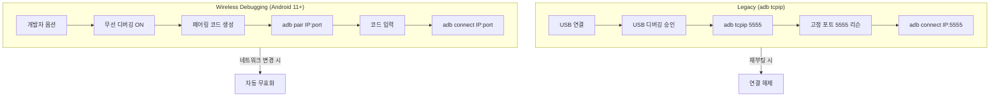
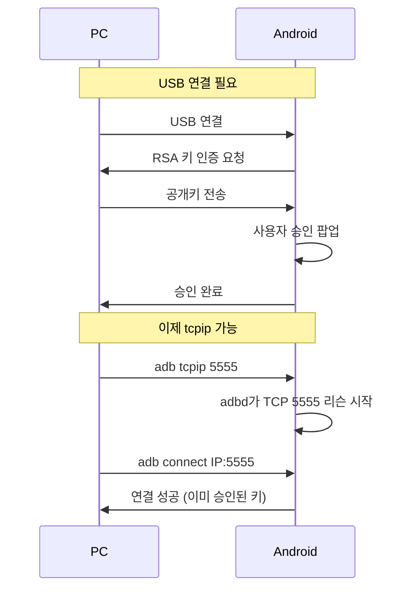
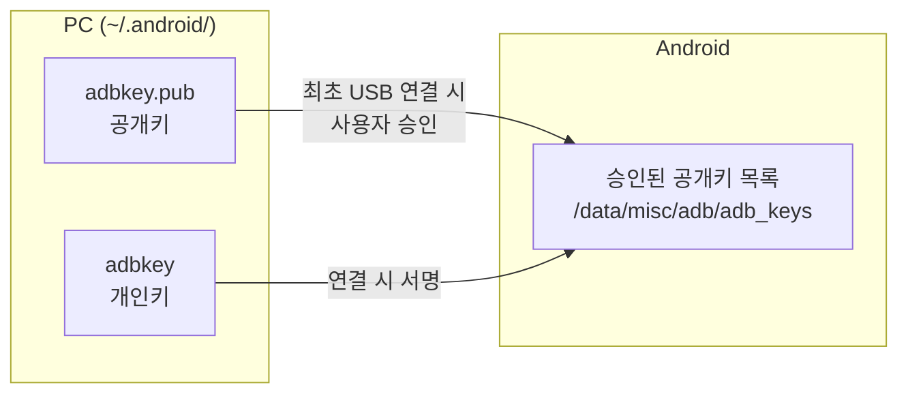
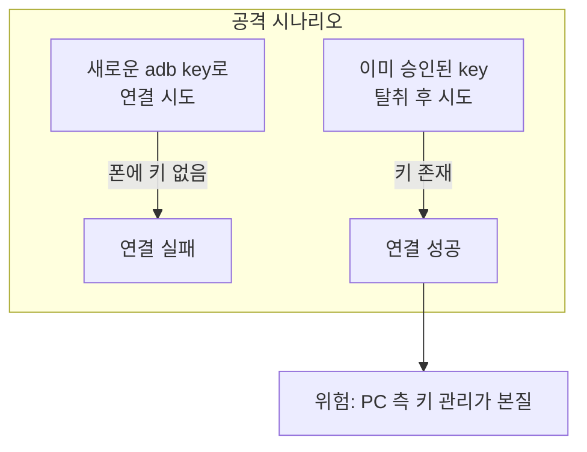
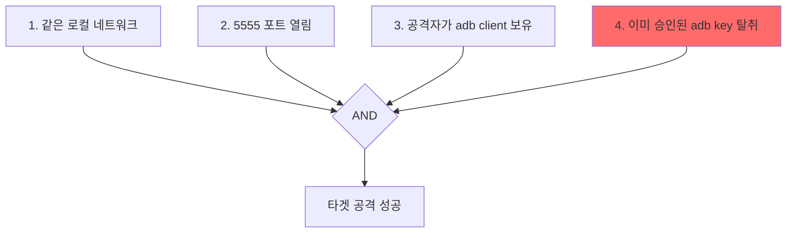
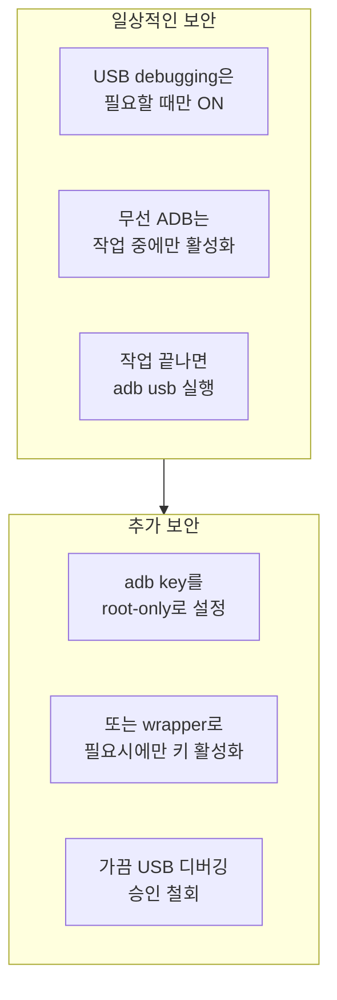

Android 개발을 하다 보면 **무선 ADB (`adb tcpip` / `adb connect`)** 는 한 번 쓰면 다시 케이블로 돌아가기 힘든 기능입니다.

하지만 항상 따라오는 질문이 있습니다.

> "이거… 보안적으로 괜찮은가?"

이 글은 단순 사용법을 넘어, **ADB 무선 디버깅의 내부 동작 방식과 보안 모델을 끝까지 파본 정리**입니다.

## 목차
1. [ADB 무선 디버깅의 두 가지 방식](#1-adb-무선-디버깅의-두-가지-방식)
2. [adb tcpip 포트는 언제 열리는가?](#2-adb-tcpip-포트는-언제-열리는가)
3. [Android IP 주소 알아내는 방법](#3-android-ip-주소-알아내는-방법)
4. [ADB 인증 모델 이해하기](#4-adb-인증-모델-이해하기)
5. [보안적으로 위험한 상황 분석](#5-보안적으로-위험한-상황-분석)
6. [무선 ADB 연결 종료 방법](#6-무선-adb-연결-종료-방법)
7. [ADB Key 관리 전략](#7-adb-key-관리-전략)
8. [현실적인 최종 권장안](#8-현실적인-최종-권장안)

---

## 1. ADB 무선 디버깅의 두 가지 방식

ADB에는 **두 가지 무선 연결 방식**이 있습니다.

### Legacy 방식 (`adb tcpip`)

```bash
adb tcpip 5555
adb connect <IP>:5555
```

- Android 10 이하 기본 방식
- Android 11+에서도 **호환 유지**
- USB로 **최초 1회 인증** 필요
- 이후 `adbd`가 TCP 포트(기본 5555) 리슨

### Wireless Debugging (Android 11+)

Android 11부터 도입된 새로운 방식입니다.

**설정 방법:**
1. 개발자 옵션 → **무선 디버깅** 활성화
2. **페어링 코드로 기기 페어링** 선택
3. PC에서 `adb pair <IP>:<pairing-port>` 실행
4. 6자리 페어링 코드 입력
5. 이후 `adb connect <IP>:<port>` 로 연결

**특징:**
- QR 코드 / 페어링 코드 기반 인증
- 세션 기반 인증 (네트워크 변경 시 자동 무효화)
- 보안적으로 더 강함
- 매번 새로운 포트 번호 할당

### 두 방식의 비교



> **Note:** 샤오미(MIUI / HyperOS)는 핫스팟 ON 시 Wireless Debugging을 비활성화하는 경우가 많아 현실적으로 `adb tcpip`만 가능한 경우가 있습니다.

---

## 2. adb tcpip 포트는 언제 열리는가?

아주 중요한 사실:

> **adb tcpip 포트는 USB로 이미 신뢰된 상태에서만 열 수 있습니다**



**이건 의도된 보안 설계입니다:**

- USB 연결 없이 단말 단독으로 포트 개방 불가
- Wi-Fi만 연결된 상태에서 `adb tcpip` 실행 불가
- USB 연결 + USB debugging 승인 **필수**

---

## 3. Android IP 주소 알아내는 방법

### 방법 1. 설정 화면 (가장 쉬움)

1. **설정 → Wi-Fi** 이동
2. 현재 연결된 네트워크 선택
3. IP 주소 확인

예시:
```
192.168.0.23
10.16.8.147
```

### 방법 2. adb 명령어 (USB 연결 상태)

```bash
# Wi-Fi 연결 시
adb shell ip addr show wlan0

# 핫스팟 사용 중일 때
adb shell ip addr show ap0
```

### 네트워크 인터페이스 정리

| 인터페이스 | 의미 | ADB 연결 가능 |
|:---:|:---:|:---:|
| `wlan0` | Wi-Fi | O |
| `ap0` | 핫스팟 | O |
| `ccmni*`, `rmnet*` | LTE/5G | X |

---

## 4. ADB 인증 모델 이해하기

### RSA 키 기반 인증

ADB는 **항상 RSA 키 기반 인증**을 사용합니다.



**핵심:**
- PC: `~/.android/adbkey` (개인키), `adbkey.pub` (공개키)
- Android: `/data/misc/adb/adb_keys`에 승인된 공개키 저장
- **키가 없으면 연결 자체가 거절됨**

> 포트가 열려 있어도 이미 승인된 PC 키가 없으면 접근 불가합니다.

### PC 허용은 언제 일어나는가?

PC 허용 팝업은 **딱 두 경우**에만 표시됩니다:

1. **USB debugging 최초 연결 시**
2. **Wireless Debugging 페어링 시**

`adb tcpip`를 통한 무선 연결 시에는 **새 PC에 대한 승인 팝업이 절대 뜨지 않습니다.** 이미 승인된 키만 허용됩니다.

### 악성 스크립트 시나리오



**결론:** 보안의 본질은 **PC 측 키 관리**입니다.

---

## 5. 보안적으로 위험한 상황 분석

### 일반적인 카페 Wi-Fi

- Client isolation 대부분 ON
- 같은 SSID여도 단말 간 통신 불가
- **현실적 위험도 낮음**

### 이론적으로 위험해지는 조건

아래 조건이 **모두** 만족되어야 위험합니다:



**4번 조건이 핵심입니다.** 무작위 공격이 아니라 **타겟 공격 수준**의 조건입니다.

### 열린 포트 확인 방법

```bash
# 특정 포트가 열려있는지 확인
nmap -p 5555 <target-ip>

# 또는 netcat으로
nc -zv <target-ip> 5555
```

---

## 6. 무선 ADB 연결 종료 방법

### 가장 확실한 방법

```bash
adb usb
```

이 명령은 adbd를 USB 모드로 전환하여 TCP 리스닝을 중단합니다.

### 대안

| 방법 | 효과 |
|:---|:---:|
| `adb usb` 실행 | 확실함 |
| USB debugging OFF | 확실함 |
| 단말 재부팅 | 확실함 |
| Wi-Fi OFF | **불충분** |
| 비행기 모드 | **불충분** |

> **주의:** Wi-Fi를 끄거나 비행기 모드로 전환해도, 다시 같은 네트워크에 연결하면 포트가 여전히 열려 있을 수 있습니다.

---

## 7. ADB Key 관리 전략

### 기본 키 위치

```
~/.android/
├── adbkey        (개인키)
└── adbkey.pub    (공개키)
```

**참고:** adb는 macOS Keychain이나 Windows Credential Manager를 직접 사용하지 않습니다. `adb --key` 같은 옵션도 없으며, 키는 파일 기반으로만 로드됩니다.

### 전략 1: root-only + sudo adb

adbkey 파일을 root 권한으로만 접근 가능하게 설정:

```bash
# 키 파일을 root 소유로 변경
sudo chown root:wheel ~/.android/adbkey
sudo chmod 600 ~/.android/adbkey

# adb 실행 시 sudo 필요
sudo adb devices
```

**차단되는 것:**
- 유저 권한 악성 스크립트
- npm / pip post-install 스크립트
- IDE 플러그인

**한계:**
- sudo 권한을 가진 코드는 막을 수 없음
- 하지만 이는 잘못된 위협 모델 - root 권한 코드를 막으려면 다른 보안 레이어 필요

### 전략 2: Keychain + wrapper 스크립트

현실적인 우회 설계:

1. adbkey를 암호화해 Keychain에 보관
2. adb 실행 직전에만 키 파일 복원
3. adb 실행 후 즉시 삭제

```bash
#!/bin/bash
# adb-secure wrapper 예시

# Keychain에서 키 복원
security find-generic-password -s "adbkey" -w > ~/.android/adbkey

# adb 실행
/usr/local/bin/adb "$@"

# 키 삭제
rm ~/.android/adbkey
```

**효과:**
- 자동 실행 악성 스크립트 차단
- 무의식적 adb 호출 방지

**한계:**
- 키가 풀린 짧은 시간 동안은 같은 유저 권한 코드 접근 가능

---

## 8. 현실적인 최종 권장안

### 개인 개발자 기준 최적 균형



### 정리

| 항목 | 권장 사항 |
|:---|:---|
| USB debugging | 필요할 때만 ON |
| 무선 ADB | 작업할 때만 `adb tcpip` |
| 작업 종료 | `adb usb` 실행 |
| adb key | root-only 또는 wrapper 사용 |
| 정기 점검 | USB 디버깅 승인 목록 확인 및 철회 |

### 승인된 PC 목록 초기화

**개발자 옵션 → USB 디버깅 승인 철회** 메뉴에서 모든 승인된 PC를 한 번에 철회할 수 있습니다.

---

## 마무리

> **adb tcpip는 위험해서 피해야 할 기능이 아니라, 위협 모델을 정확히 이해하고 쓰면 충분히 안전한 도구입니다.**

보안은 기능을 피하는 것이 아니라, **위험을 이해하고 적절히 관리**하는 것입니다.

## 참고 자료

- [Android Developer - ADB](https://developer.android.com/tools/adb)
- [Android 11 Wireless Debugging](https://developer.android.com/studio/run/device#wireless)
- [ADB Authentication](https://android.googlesource.com/platform/system/core/+/master/adb/OVERVIEW.TXT)
