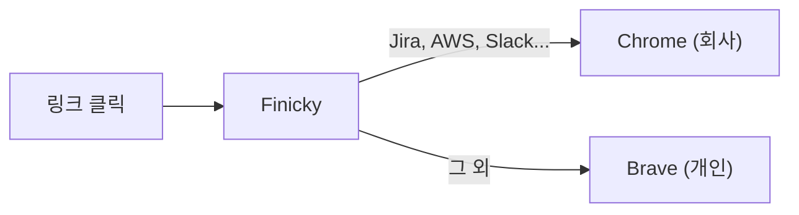

Slack에서 Jira 링크를 클릭했는데 개인 브라우저에서 열려서 다시 회사 Chrome에 URL을 복사해본 적 있으신가요?

회사 브라우저와 개인 브라우저를 분리해서 쓰는 건 좋은 습관이지만, **매번 링크를 열 때마다 브라우저를 골라야 하는 건** 은근히 스트레스입니다.

Finicky를 쓰면, **링크를 클릭하는 것만으로 URL에 따라 올바른 브라우저가 자동으로 열립니다.**

## Finicky란?

[Finicky](https://github.com/johnste/finicky)는 macOS용 오픈소스 브라우저 라우터입니다. 자기 자신을 기본 브라우저로 등록한 뒤, 모든 URL 열기 요청을 가로채서 **규칙에 따라 적절한 브라우저로 전달**합니다.



## 설치

```bash
brew install --cask finicky
```

설치 후 Finicky를 실행하고, **시스템 설정 > 데스크톱 및 Dock > 기본 웹 브라우저**에서 **Finicky**를 선택합니다.

## 설정

`~/.finicky.js` 파일을 생성하고 규칙을 작성합니다. 핸들러는 **위에서부터 순서대로 매칭**되므로, 예외 규칙을 먼저 배치합니다.

```javascript
// ~/.finicky.js
module.exports = {
  defaultBrowser: "Brave Browser",
  handlers: [
    {
      // 예외: Google Photos는 개인 브라우저로
      match: /.*photos\.google\.com.*/,
      browser: "Brave Browser",
    },
    {
      // 회사 관련 사이트 -> Chrome
      match: [
        // Google Workspace
        /.*docs\.google\.com.*/,
        /.*drive\.google\.com.*/,
        /.*meet\.google\.com.*/,
        /.*calendar\.google\.com.*/,
        /.*mail\.google\.com.*/,
        // Atlassian (Jira, Confluence)
        /.*\.atlassian\.net.*/,
        /.*\.atlassian\.com.*/,
        // AWS
        /.*\.console\.aws\.amazon\.com.*/,
        /.*\.signin\.aws\.amazon\.com.*/,
        // Slack (회사 워크스페이스만)
        /.*mycompany\.slack\.com.*/,
        // 사내 서비스
        /.*\.mycompany\.com.*/,
      ],
      browser: "Google Chrome",
    },
  ],
};
```

## 자주 쓰는 패턴

### 특정 도메인 매칭

```javascript
/.*\.mycompany\.com.*/     // mycompany.com의 모든 서브도메인
/.*mycompany\.slack\.com.*/  // 회사 Slack만 (개인 Slack 제외)
```

### 내부 IP 대역

```javascript
/.*10\.50\..*/    // 사내망 IP 대역
/.*192\.168\..*/  // 로컬 네트워크
```

### 예외 처리 (순서 활용)

Finicky는 **첫 번째로 매칭되는 규칙**을 적용합니다. 이를 활용해서 "Google 서비스는 Chrome으로, 단 Google Photos만 개인 브라우저로" 같은 예외를 처리할 수 있습니다.

```javascript
handlers: [
  { match: /.*photos\.google\.com.*/, browser: "Brave Browser" },  // 먼저 매칭
  { match: /.*\.google\.com.*/,       browser: "Google Chrome" },  // 나머지
]
```

## 안전한가요?

- **오픈소스**: GitHub에 소스코드 공개 (4k+ stars)
- **외부 통신 없음**: 로컬에서만 동작하며 URL 데이터를 어디에도 전송하지 않음
- **Homebrew 등록**: `brew install --cask finicky`로 설치 가능
- **동작 원리가 단순**: URL을 받아서 브라우저로 전달하는 것이 전부

## 결론

회사와 개인 브라우저를 분리해서 쓰고 있다면, Finicky 하나로 **"이 링크 어디서 열지?"라는 고민을 완전히 없앨 수 있습니다.** 설정 파일 하나면 끝이고, 한번 세팅하면 이후에는 신경 쓸 것이 없습니다.
